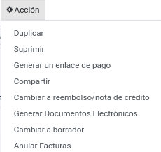
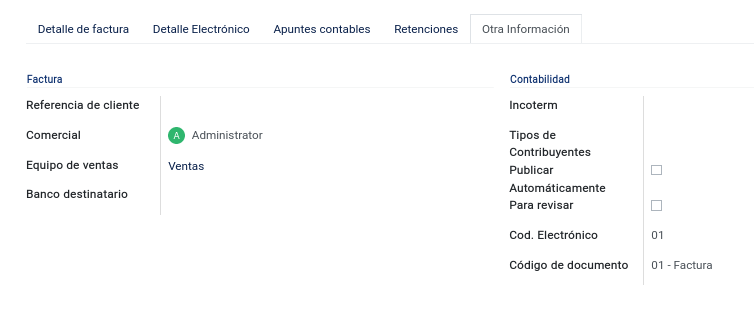
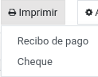
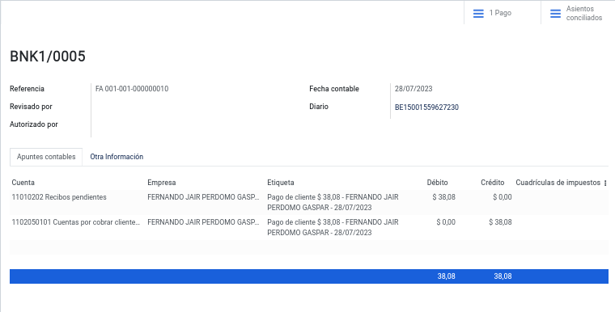
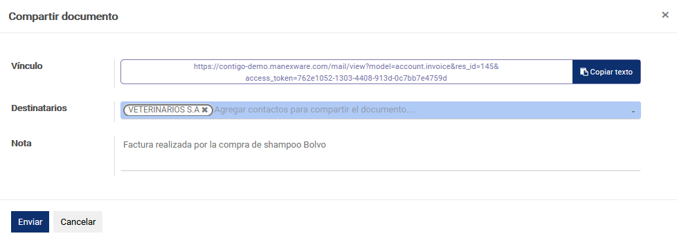

# Manual General Sistema Contigo

## Índice de Contenido
- [Manual General Sistema Contigo](#manual-general-sistema-contigo)
  - [Índice de Contenido](#índice-de-contenido)
  - [1. Prerrequisitos](#1-prerrequisitos)
    - [1.1 Información Básica](#11-información-básica)
    - [1.2 Información de Correo](#12-información-de-correo)
    - [1.3 Archivos de Importación](#13-archivos-de-importación)
  - [2. Configuración Inicial](#2-configuración-inicial)
    - [2.1 Creación de Usuarios](#21-creación-de-usuarios)
  - [3. Primeros Pasos](#3-primeros-pasos)
  - [4. Contabilidad](#4-contabilidad)
  - [5. Algunos de Nuestros Clientes](#5-algunos-de-nuestros-clientes)
  - [6. Contactanos](#6-contactanos)

## 1. Prerrequisitos

### 1.1 Información Básica
- Información de la compañía: RUC del SRI (PDF)
- Firma electrónica formato archivo .p12 y contraseña
- Habilitar emisión de documentos electrónicos en el portal de SRI
- Nombre para el subdominio ejemplo miempresa.manexware.com
- Lista de Usuarios – Nombres completos y correo electrónico 
- Logo de la compañía en formato png

### 1.2 Información de Correo
- Servidor SMTP - ejemplo: smtp.dominio.com
- Puerto SMTP - ejemplo: 465
- Usuario
- Contraseña

### 1.3 Archivos de Importación
- Excel de Contactos
- Excel de Productos

## 2. Configuración Inicial

### 2.1 Creación de Usuarios
__Datos del usuario__: Esta tarea solo puede ser realizada por el administrador, debe dirigirse al módulo de __Ajustes__, seleccionar en el menú la opción __Usuarios y Compañías__ y seguido la opción __Usuarios__.
Para crear un usuario, se debe llenar los campos Nombre, Dirección de email y foto (opcional) con un tamaño máximo de 1024x1024px.

__Activación del usuario__: En la esquina superior del mismo formulario nos encontraremos con un recuadro que indica si el usuario creado ha confirmado su inicio de sesión, caso contrario, se mostrará “nunca se conecta”.

  

Esta barra de estado nos indicará si el usuario no se ha conectado desde su creación, pero en el caso de que se haya conectado, la barra cambiará de “Nunca se conecta” a “Confirmado”.

  

__Permisos de acceso__: Parte fundamental del sistema, que se encarga de la administración de los privilegios del usuario; dependiendo de los permisos concedidos, el usuario realizará o no actividades en el sistema.

__Tiendas__: El sistema permite gestionar las sucursales en que el usuario se encuentra actualmente, para más información de las sucursales revisar la opción __Agencia__.

__Preferencias__: Nos permite seleccionar para cada usuario el idioma, la zona horaria, el medio de entrega de notificaciones, la plantilla de firma y la firma digital(opcional).

__Seguridad de la cuenta__: Nos permite seleccionar la autenticación de dos pasos para proteger la cuenta.

__Acciones__: Nos permite archivar, suprimir, duplicar y cambiar la contraseña de dicho usuario, desactivar la autenticación de dos pasos y también nos permite ayudar al usuario a recuperar su contraseña enviando instrucciones para el restablecimiento de la misma.

  

En caso de cambiar la contraseña se abrirá una ventana emergente, donde se deberá digitar la nueva contraseña y seguidamente guardar los nuevos datos.

En la parte superior, antes de las opciones de crear o editar usuario tenemos una barra que permite “Enviar un correo de invitación”:

  

Al usuario se le enviará por correo una invitación para que ingrese al sistema, si todo sale bien y la invitación se envía con éxito mostrará un mensaje confirmando dicha acción.

__Nota Importante__: Antes de enviar el correo de invitación, primero se debe configurar el correo saliente del sistema; para más información revisar Configuración de __Correo Saliente__.

### 2.2 Plan Contable
Debe dirigirse al módulo de __Contabilidad__, seleccionar el menú de __Configuración__, buscar el apartado de __Contabilidad__ y seleccionar la opción __Plan de Cuentas__.

El plan contable en Ecuador es un conjunto de normas y directrices que regulan la forma en que las entidades deben registrar y presentar sus transacciones financieras y contables. Basado en estándares internacionales adaptados a las regulaciones locales, el plan define cuentas contables, códigos numéricos, reglas de registro y formatos de estados financieros. Su objetivo es estandarizar la información contable para facilitar la comparabilidad y comprensión de los estados financieros por parte de diversos usuarios. Este plan puede actualizarse para reflejar cambios en las normativas y necesidades locales, y es esencial para mantener la precisión e integridad de la información financiera.

Estas cuentas deben estar ordenadas y codificadas de forma sistemática para facilitar la contabilidad.  Además, permite que todas las cuentas y registros sean presentados y visualizados con la finalidad de verificarlos.  De esa forma, se elaboran con facilidad los estados financieros.

El sistema Contigo tiene los datos básicos del plan contable, pero es necesario verificar cuáles son las cuentas contables que utilizará la empresa; en el caso de que se necesite añadir más cuentas contables, se debe seguir la secuencia correspondiente del código.

En el caso de querer visualizar más información respecto a una cuenta en específico, deberá dar clic al botón “Configurar”, de esta manera se abrirá una vista formulario en el cual podrá visualizar tanto el código, el nombre de la cuenta, el tipo de la misma, pero habrá campos adicionales como:

__Tipo__: Aquí se define el tipo de cuenta, ya sean capitales, activos, pasivos; cabe recalcar que las cuentas por cobrar y pagar deberán definirse de manera correcta y darle el respectivo permiso de conciliación.

__Impuestos determinados__: En esta opción se mostrará diferentes porcentajes de impuesto a usar si son compras o ventas.

__Etiquetas__: Ayuda a definir qué tipo de actividad es, ya sea de operaciones, financiera o actividades extraordinarias.

__Diarios permitidos__: Se definen los diarios contables que pueden ser usados dentro de ese plan contable. Si se llena esta opción sólo podrán usar dichas cuentas siempre y cuando el asiento contable posea dicho diario.

__Obsoleto__: De igual manera no es posible eliminar una cuenta una vez que se haya registrado una transacción en ella. Puede hacerla inutilizable deberá marcar el check de __“Obsoleto”__.

__Grupo__: Se define automáticamente, en este apartado se define a qué grupo de cuenta pertenece (grupo previamente creado).

__Centralizado__:  En el caso de que se desee que se muestren los detalles de la cuenta en el libro mayor, deberá marcar esta opción.

El sistema Contigo permite de igual manera visualizar las cuentas según su nivel, el nivel lo define de manera automática siempre y cuando se digite el código de la cuenta contable.

  

Por ejemplo, en la imagen de arriba solo se están visualizando las cuentas nivel 1.

### 2.3 Grupos de cuentas
Debe dirigirse al módulo de __Contabilidad__, seleccionar el menú de __Configuración__, buscar el apartado de __Contabilidad__ y seleccionar la opción __Grupos de Cuentas__.

Los grupos de cuentas sirven para listar múltiples cuentas como subcuentas de una cuenta más grande y, por lo tanto, consolidar reportes como la balanza de comprobación. De forma predeterminada, los grupos se gestionan según el código del grupo.

Para la creación de un grupo de cuentas, se deberá definir el nombre de la misma y el prefijo de esta; dependiendo de los dígitos seleccionados al momento de guardar el registro el sistema enlazará todas las cuentas contables que posean dicho prefijo.

### 2.4 Impuestos
Esta tarea solo puede ser realizada por el administrador, debe dirigirse al módulo de __Contabilidad__, seleccionar el menú de __Configuración__, buscar el apartado de __Contabilidad__ y seleccionar la opción __Impuestos__.

Los impuestos son tributos que cada persona, familia o empresa debe pagar al Estado para costear las necesidades colectivas, contribuyendo así con una parte de sus ingresos.

Al momento de crear un nuevo impuesto es necesario agregar el nombre del impuesto, si se desea se puede añadir un nombre corto y seleccionar el ámbito de este (ventas, compras, ninguno y ajustes).

__Definición__: Esta pestaña nos ayuda a determinar el cálculo del impuesto, su importe, la cuenta de impuestos y la cuenta de impuestos para las notas de crédito.

__Opciones avanzadas__: Esta opción nos permite añadir la etiqueta de factura, el grupo de impuestos, si se debe incluir en el precio, si tiene base imponible y añadir más etiquetas para reconocimiento de este.

__Código de impuestos__: Nos permite ingresar el código base y el código de impuestos para las ventas y compras; de la misma manera el reembolso de ventas y compras con la diferencia del código de devoluciones.     

### 2.5 Información de la compañía 
Esta tarea solo puede ser realizada por el administrador, debe dirigirse al módulo de __Administración__, seleccionar la opción __Compañías__.
Por defecto hay un registro con el nombre de My Company (Rio Tinto Group), es necesario ingresar a dicho registro para poder configurar con los respectivos datos de la empresa.

Proceden a llenar cada uno de los campos con su respectiva información según la empresa, especialmente los campos obligatorios empezando por el nombre de la compañía.

__Información General__: Se debe registrar todos los datos de la compañía y si la compañía posee factura electrónica, llenar en el sistema sus respectivos campos para su posterior utilización.

__Contabilidad__: Nos permite indicar al sistema las retenciones, sustentos tributarios, las cuentas contables y la cuenta de transferencia entre bancos que la empresa utiliza para toda su actividad contable.

__Agencia__
Esta tarea puede ser realizada por el administrador, debe dirigirse al módulo de __Administración__, seleccionar la opción __Agencia__.

### 2.6 Configuración de correo saliente
Nos dirigimos al módulo de __Administración__ y buscamos en el menú __Servidor de Correo Saliente__.

Para crear el servidor de correo saliente, añadimos una descripción de nuestro correo y seleccionamos su prioridad (entre más bajo el número mayor será la prioridad); en la información de la conexión colocamos:

__Servidor SMTP =__ smtp.dominio.com

__Puerto SMTP =__ 465

Por último, se selecciona en seguridad de la conexión SSL/TLS y posteriormente se configura el usuario y la contraseña del correo, se prueba la conexión y listo.

### 2.7 Creación de año fiscal y periodos
Nos dirigimos al módulo de __Contabilidad__, seleccionamos el menú de __Configuración__, buscamos Facturación y seleccionamos __Año Fiscal__.

  

Para crear el año fiscal en curso, colocar en “Nombre” el año, configurar la fecha de inicio y fecha de finalización del año y dar clic en “Crear”.

### 2.8 Configuración de Punto de Emisión
Nos dirigimos al módulo de __Contabilidad__, seleccionamos el menú de __Configuración__, buscamos __Facturación__ y por último seleccionamos __Puntos de Emisión__.

  

Configurar el punto de emisión que viene por defecto, en el punto de emisión requiere introducir un nombre, un código, seleccionar el estado si es activo, la agencia y el ambiente.  Además, se puede enviar el documento por medio electrónico.

### 2.9 Cuentas Bancarias
En el módulo de __Contabilidad__, seleccionamos el menú de __Configuración__, buscamos el apartado de __Bancos__ y escogemos la opción __Agregar una cuenta bancaria__.

  

Para configurar las cuentas bancarias, ingresamos el número de cuenta, el banco correspondiente y el código de identificación bancaria. El banco se asocia a la empresa.

### 2.10 Diarios
En el módulo de __Contabilidad__, seleccionamos el menú de __Configuración__ y posteriormente el apartado de __Contabilidad__ y localizamos __Diarios Contables__.

  

En los diarios ingresamos el nombre, el tipo (venta, compra, banco, efectivo o miscelánea) según corresponda, también nos permite seleccionar el tipo de cuenta deudora o acreedora si aquella cuenta no está registrada, se puede crear o editar.

También se configura el código corto y la secuencia de los asientos. Se define las cuentas de débito y crédito por defecto; también se puede seleccionar el producto, podemos elegir: caja chica, liquidación de gastos o tarjeta de crédito; podemos seleccionar el tipo de producto que está en descuento, si no está registrado nos permite crear y editar, también nos indica si aquella cuenta bancaria corresponde a cuenta corriente o ahorros y guardamos.

## 3. Primeros Pasos
### 3.1 Ingreso al sistema
Nos dirigiremos a la URL del dominio que tenemos en la nube, en nuestro caso será “https://dominio.manexware.com”, al momento de ingresar a dicho dominio aparecerá la siguiente pantalla.

Se coloca tanto el usuario y contraseña, después deberá dar clic en iniciar sesión. Si el usuario existe en el sistema automáticamente le mostrará el menú principal del sistema, en el caso de que el usuario no exista deberá contactar con el __administrador__ encargado.

Para el caso en que el usuario olvide su contraseña, debajo del botón __“Iniciar Sesión"__ se encuentra la opción de __“Recuperar Contraseña” (Reset Password)__.

  

__Recuperar Contraseña__: El proceso de recuperación de contraseña enviará un correo al usuario, a la dirección email previamente configurada.

  

  

Al momento de recibir el correo, se deberá dar clic en __“Cambiar Contraseña”__ y el sistema lo enviara a la pantalla de cambio de clave.

  

Al colocar la nueva contraseña es necesario volver al inicio e ingresar con el usuario y la nueva contraseña que se ha definido.

### 3.2 Preferencias de usuario
Una vez ingresado al sistema, en la esquina superior derecha, se encuentra el ícono de nuestro  usuario, al momento de dar clic en él nos saldrá una serie de opciones: 

  

__Atajo:__ Muestra atajos del teclado que pueden ser utilizados para interactuar con el sistema.

__Preferencias__: Permite seleccionar el idioma, la zona horaria, definir por cuál medio le llegaran las notificaciones a dicho usuario, la posición de la barra de los módulos, la posición del chatter y su firma.

De igual manera se podrá definir en la sección “Seguridad de la cuenta” el cambio de contraseña y si se requiere se podrá utilizar la autenticación de dos pasos.

__Cerrar Sesión__: Nos devuelve al menú de inicio de sesión.

### 3.3 Contactos
Permite añadir cualquier tipo de contactos ya sean clientes o proveedores. En el contacto se puede establecer la imagen o foto que se lo identifica, seleccionar si este corresponde a una persona o compañía, el nombre de la empresa o compañía a la que pertenece, si no está registrada se puede crear o editar, de igual manera se podrá ingresar la dirección, la provincia, la parroquia, etc. Se puede seleccionar el tipo de identificación (cédula, Ruc, pasaporte, o Desconocido/Unknown), una vez que se selecciona cédula o Ruc el sistema indicara que se debe insertar los números de dichos identificadores, se podrá seleccionar si la persona es natural o jurídica, el tipo de sexo, el estado civil, el puesto de trabajo, teléfono, móvil, el correo electrónico, el nombre del sitio web, el título, el idioma, el tipo de cliente si es público o privado, la zona horaria o la etiqueta, ver sus facturas, las cuentas analíticas relacionadas, conciliaciones, opciones de compra y venta y la creación de usuarios.
Para más información revisar el módulo __Contactos__.

### 3.4 Uso de Barra de Filtros
El sistema cuenta con cuatro tipos de filtros y cada uno cumple una función específica.

__Filtro por defecto__: Al momento de ingresar algún carácter en la barra de filtros de manera automática el sistema arrojará una serie de etiquetas que sirven para identificar de manera rápida lo que se está buscando.

__Filtros__: Muestran una serie de etiquetas predefinidas en la programación del sistema, que ayuda al usuario a buscar la información exacta, el filtro se activará si seleccionas cómo filtrar en la búsqueda, dependiendo de lo que selecciones aparecerá una etiqueta en la barra de búsqueda.

  

__Filtros personalizados__: Esta opción permite al usuario añadir diferentes condiciones a la búsqueda o generar nuevos campos de búsqueda, también permite agregar condiciones para un mejor resultado. 

  

  

__Agrupar por__: Permite agrupar la información deseada o relacionada, dependiendo del modo de agrupación que el usuario le indique al sistema.

  

__Agrupar Por personalizados__: Esta opción permite al usuario añadir diferentes condiciones a la búsqueda o generar nuevos campos de búsqueda, también permite agregar condiciones para un mejor resultado.

  

__Favoritos__: Permite guardar una búsqueda personalizada y utilizarla cuando se lo requiera, solamente se añade el nombre de la búsqueda (ya sea una búsqueda por filtro o agrupación) e indicas si deseas utilizar dicha búsqueda por defecto y/o si quieres compartirlo con otros usuarios. 

  

__Número de resultados__: Indica el número total de resultados, este puede modificarse en el caso de realizar tareas que lo requieran.

  

En este ejemplo, le indicamos al sistema que se querrá visualizar los resultados existentes desde el 1 (primero) hasta el 220 (último).

  

### 3.5 Tipos de Vistas
El sistema cuenta con múltiples tipos de vistas, que facilitan la búsqueda de información y el procesamiento visual de la misma. Estas vistas son las siguientes:

__Vista Actividad__: La vista Actividad se usa para mostrar las actividades vinculadas a los registros. Los datos se muestran en un gráfico con los registros que forman las filas y la actividad son las columnas. 
La primera celda de cada fila muestra una tarjeta que representa el registro correspondiente. Al hacer clic en otras celdas, se muestra una descripción detallada de todas las actividades del mismo tipo para el registro.

__Vista Formulario__: Las vistas de formulario se utilizan para mostrar los datos de un solo registro, siendo la vista más usada el sistema.

__Vista Kanban__: La vista Kanban es una visualización de tablero Kanban; muestra registros como "tarjetas", a medio camino entre una vista de lista y una vista de formulario no editable. Los registros pueden agruparse en columnas para su uso en la visualización o manipulación del flujo de trabajo (por ejemplo, tareas o gestión del progreso del trabajo), o desagruparse (usarse simplemente para visualizar registros).

__Vista Lista__: Muestra los múltiples registros en forma de lista.

__Nota__: Si deseas saber en qué tipo de vista estas, dirígete a la esquina superior derecha, pasas el ratón en los diferentes tipos vistas que se muestran y el sistema te arrojará el nombre de la vista.

### 3.6 Acciones
Como su propio nombre indica son procesos que el usuario podrá realizar en uno o múltiples registros, las acciones más comunes son las de Suprimir y Duplicar, dependiendo del módulo en que te encuentres; pueden tener más de una acción en el módulo y éstas nos permitirán realizar actividades de manera más rápida, dependiendo de su función asignada en el sistema.

  

### 3.7 Mensajes de error
Los mensajes de error son parte esencial del sistema, es un medio de ayuda para que los usuarios sepan que lo que están realizando es correcto. 
Aunque los mensajes se dividen dependiendo del tipo de actividad, todos tienen la misma funcionalidad, la de indicar al usuario si la acción está permitida o no; ya sean mensajes de error referentes a permisos de usuario o falta de campos en uno de los formularios e inclusive el tipo de dato que este requiere.

## 4. Conversaciones
### 4.1 Uso y configuración inicial
El módulo de Conversaciones permite unificar todas las comunicaciones de la empresa a través de mensajes, notas y chat. En todas las aplicaciones, puede compartir información, proyectos, archivos, priorizar tareas y mantenerse conectado con colegas y socios. Este módulo le permite mejorar las relaciones, aumentar la productividad y la transparencia al promover una forma conveniente de comunicación. 

A la hora de configurar el usuario en los ajustes debemos elegir cómo nos llegarán las notificaciones del sistema: por correo electrónico o vía Contigo.

  

Para utilizar de manera óptima el módulo de conversaciones es recomendable que la gestión de notificaciones esté manejada por Contigo.
### 4.2 Manejo Apropiado
Los mensajes recibidos de parte de otros usuarios serán mostrados en la parte izquierda del programa, mientras que en la parte derecha se podrá observar dicho mensaje; los mensajes se pueden marcar como por realizar e inclusive nos permitirán etiquetar a los usuarios dentro del sistema.
Al momento de ingresar en bandeja de entrada, nos mostrará todos los mensajes que el usuario ha recibido y habilitará un botón que nos permitirá marcarlos como leído. Si un mensaje está marcado como “por realizar” de manera automática es agregado en destacados. 

### 4.3 Contigo Bot 
La primera vez que inicia sesión en su cuenta, ContigoBot le envía un mensaje solicitando permiso para recibir notificaciones de escritorio para los chats. Si se acepta, recibirá notificaciones automáticas de los mensajes que se le envíen independientemente de dónde se encuentre en Contigo.

  

### 4.4 Interaccion entre usuarios 
Para mencionar a un usuario dentro de un chat o el tipo de charla @ nombre-usuario; para hacer referencia a un canal, escriba # nombre-canal.
Se envía una notificación al usuario mencionado a su bandeja de entrada o por correo electrónico, dependiendo de su configuración.
Mencionar a un usuario en la charla lo configura como seguidor del elemento (si aún no lo está) y enviará un mensaje a su bandeja de entrada. El elemento que contiene la mención también aparecerá en negrita en la vista de lista. Mencionar a un usuario en un canal enviará un mensaje a su bandeja de entrada. No puedes mencionar a un usuario en un canal en el que no esté suscrito.

### 4.5 Canales
Puede utilizar canales para organizar debates entre equipos, departamentos, proyectos o cualquier otro grupo que requiera una comunicación regular. De esta manera, mantendrá a todos al tanto de las últimas novedades.
Canales públicos o privados:
Todo el mundo puede ver un canal público, mientras que un canal privado solo es visible para los usuarios invitados.
Para crear un canal nos dirigiremos en la opción canales y damos clic en el signo +

  

La opción ¿Quién puede seguir las actividades del grupo? le permite controlar qué grupos pueden tener acceso al canal. Tenga en cuenta que permitir que todos sigan un canal privado permite que otros usuarios lo vean y se unan, como lo harían con uno público.
Si elige Solo personas invitadas, vaya a la pestaña Miembros para agregar a sus miembros, o vaya a la página principal de Discusión, seleccione el canal y haga clic en Invitar.

Para el grupo de usuarios seleccionado, la opción Suscribir automáticamente grupos agrega automáticamente a sus miembros como seguidores. En otras palabras, mientras que los Grupos autorizados limitan qué usuarios pueden acceder al canal, los Grupos de suscripción automática agregan automáticamente al usuario como miembro siempre que forme parte del grupo.

La elección de Enviar mensajes por correo electrónico configura el canal para que se comporte como una lista de correo.
Habilitar esta opción le permite moderar este canal, lo que significa que los mensajes deberán ser aprobados antes de enviarse.
### 4.6 Conversación/ canales públicos

### 4.7 Conversación entre Usuarios
Los mensajes directos son mensajes privados que sólo pueden ser vistos por el remitente y el destinatario. Puede enviar mensajes directos a otros usuarios desde el módulo Discusión creando una nueva conversación o seleccionando una existente en la barra lateral. Los mensajes directos se pueden enviar desde cualquier lugar en Contigo usando el icono de burbuja de diálogo en la barra superior. El estado en línea de otros usuarios se muestra a la izquierda de su nombre. Un punto verde indica que un usuario está conectado, un punto naranja que está inactivo y un punto gris que está desconectado.

### 4.8 Enviar Mensaje
De la misma manera que en una conversación entre usuarios dentro de un canal, esta opción nos permitirá enviar a los seguidores asignados del registro un mensaje para indicar cualquier procedimiento, adjunto, entre otros y que los seguidores aprendan a como interactuar con dicho registro.

### 4.9 Poner Adjuntos
Los adjunto son recopilaciones de acciones realizadas en el sistema. Estas se llenan dependiendo de las acciones del usuario en determinados procesos, también es posible generar notas en el sistema para que los restantes de usuarios las vean inclusive se podrá adjuntar imágenes, dichas notas no serán posibles de eliminar, ya que es un registro de las actividades realizadas por los usuarios del sistema.

### 4.10 Planificar actividad
La planificación de actividades es la manera perfecta de mantenerse al día con su trabajo. Recuerde lo que debe hacerse y programe las próximas actividades a realizar. Tus actividades están disponibles en cualquier lugar de Contigo. Es fácil administrar sus prioridades.
Varios tipos de actividades genéricas están disponibles de forma predeterminada en Contigo (por ejemplo, llamada, correo electrónico, reunión, etc.). Las actividades están planificadas para días específicos. Si necesita establecer un horario, elija el tipo de actividad Reunión. Al programar uno, el calendario simplemente se abrirá para permitirle seleccionar un intervalo de tiempo.

  

Si el usuario registrado tiene alguna actividad pendiente a realizar, este podrá observar en el icono de reloj que se encuentra en la parte superior derecha.

  

  

Si la actividad se encuentra en una fecha posterior, se marcará como futuro, si la actividad está programada para el mismo día esta nos marcará como hoy, pero si la actividad se encuentra atrasada nos marcará como atrasado.

### 4.11 Adjuntos
El sistema nos permite adjuntar todo tipo de archivos, para que los adjuntos se suban o se descarguen de forma rápida es recomendable que el archivo a adjuntar sea ligero. Dependiendo del número de adjuntos en la nota dentro del registro, dicho número se verá reflejado en el icono de clic de la parte superior derecha.

  

### 4.12 Seguidores
Podremos añadir seguidores en nuestro registro, de forma tal que ellos puedan tener acceso para ver la información, notas, adjuntos y otros datos; de igual manera que en los adjuntos, el sistema nos mostrará en la parte superior derecha el número de seguidores, permitiéndonos añadir a más usuarios y también a eliminarlos.

  

## 5.Contactos
### 5.1 Contactos
Nos dirigimos al módulo de Contactos, opción Contactos.

En contactos se puede añadir a un nuevo contacto o editarlo ,seguido de  la imagen o foto que lo identifica, seleccionar si este corresponde a una persona o compañía, el nombre de la empresa o compañía a la que pertenece, podemos ingresar la dirección, la provincia, la parroquia, etc. Se puede seleccionar el tipo de identificación (cédula, Ruc, pasaporte, placa o consumidor final), una vez que se selecciona cedula o Ruc nos indica que debemos ingresar los números de dichos identificadores, podemos seleccionar si la persona es natural o jurídica, el tipo de sexo, el estado civil, el puesto de trabajo, teléfono, móvil, el correo electrónico, el nombre del sitio web, el título, el idioma, el tipo de cliente si es público o privado, la zona horaria o la etiqueta, guardar.

En la parte superior se encuentra una serie de opciones que muestran:La reuniones planificadas,oportunidades de ventas, el total de ventas realizadas, el total facturado,el número de tickets,saldos y pagos para conciliar. Si se desea saber más al respecto, al momento de hacer clic en una de estas opciones el sistema lo enviará a dicha vista para su análisis respectivo.

  

Contactos y direcciones:Podrá añadir contactos relacionados al existente y podrá especificar si es un contacto, dirección de factura, dirección de envió, otras direcciones y direcciones privadas.

  

Notas internas: Podrá generar una nota para guardar información respecto a dicho usuario.

  

Ventas y Compras: Parte fundamental de la creación de contactos, es la que nos permite especificar datos relevantes para los procesos contables.

Facturación: Permite ingresar las cuentas y asientos contables que el contacto creado específica.

Información Adicional: Permite agregar información , cómo agregar línea, que aparece en las facturas.

### 5.2 configuracion
### 5.2.1 Etiquetas de Contacto
Nos dirigimos al módulo de Contactos, dirigirse al menú de Configuración y buscar la opción Etiquetas de Contacto. 

Esta opción nos permite generar etiquetas a los clientes, la función de la etiqueta es la de identificar de manera rápida a un cliente por algún tipo de atributo. 

Las etiquetas creadas solo aparecerán en los contactos si están marcadas como activas, caso contrario no aparecerá dicha etiqueta y la categoría padre es una etiqueta creada anteriormente en el sistema que derivará más etiquetas.

### 5.2.2 Títulos de contacto
Seleccionar el módulo de Contactos, dirigirse al menú de Configuración y buscar la opción Títulos de contacto.

Esta opción nos permite la creación de títulos profesionales o formalidades con su abreviatura para posteriores utilizaciones.

### 5.2.3 Industrias
Seleccionar el módulo de __Contactos__, dirigirse al menú de __Configuración__ y buscar la opción __Industrias.__

Esta opción nos muestra cada una de las industrias actualmente existentes.

Dentro de este apartado, se encuentra el botón gráfico para exportar todo los datos:

  

### 5.2.4 Localización / Países
Seleccionar el módulo de __Contactos__, dirigirse al menú de __Configuración__ y buscar en __Localización__ la opción __Países.__

Nos permite la creación, edición y eliminación de los países. Por defecto el sistema mostrará todos los países existentes actualmente, con sus respectivos datos. Un país está conformado por 8 datos importantes que son el nombre del país, la bandera del país, la moneda, el código del país, en nuestro caso también estará el código ecuatoriano, código de la llamada del país, la etiqueta del IVA, por último, pero no menos importante sus estados o también conocidos como provincias en el caso de Ecuador.

Nota: Es importante añadir los estados a los países que más utilicen, ya que nos ayudará a identificar de manera precisa las ubicaciones que se emplean en los módulos de __Contactos__ y __Contabilidad.__

Dentro de este apartado, se encuentra el botón gráfico para exportar todo los datos:

  

### 5.2.5 Localización / Provincia
Seleccionar el módulo de __Contactos__, seleccionar el menú de __Configuración__ y buscar en __Localización__ la opción __Provincias.__

De igual manera que en la creación de países, se debe ingresar el nombre de la provincia, el código de ésta, el país y las ciudades de dicha provincia.

Nota: Es recomendable crear las ciudades en esta opción. Al momento de ingresar a esta opción el sistema mostrará de manera descendente las provincias según el código de provincia. Si se desea buscar las provincias de un país específico es recomendable utilizar el filtro de la parte superior (Para más información revisar Filtros).

Dentro de este apartado, se encuentra el botón gráfico para exportar todo los datos:

  

### 5.2.6 Localización / Grupo de paises 
Seleccionar el módulo de __Contactos__, dirigirse al menú de __Configuración__ y buscar en __Localización__ la opción __Grupo de países__.

Nos permite agrupar países para la formación de “continentes” en el sistema e inclusive añadir alguna tarifa pre creada en el sistema.

También permite realizar dos  acciones tales como:

__Duplicar:__ Clona el registro

__Suprimir:__ Elimina el registro

  

Dentro de este apartado, se encuentra el botón gráfico para exportar todo los datos:

  

### 5.2.7 Localización / Ciudades
Seleccionar el módulo de __Contactos__, dirigirse al menú de __Configuración__ y buscar en __Localización__ la opción __Ciudades__.

Al igual que países y provincias, podremos crear, editar y eliminar las ciudades en esta opción del sistema.

También permite realizar dos  acciones tales como:

__Duplicar:__ Clona el registro

__Suprimir:__ Elimina el registro

  

Dentro de este apartado, se encuentra el botón gráfico para exportar todo los datos:

  

### 5.2.8 Localización / Parroquias

Seleccionar el módulo de __Contactos__, dirigirse al menú de __Configuración__ y buscar en __Localización__ la opción __Parroquias.__

Es una subclasificación de las ciudades, sirven para complementar datos referentes a la ubicación, en este caso el sistema cuenta con todas las parroquias de las ciudades del Ecuador.

Dentro de este apartado, se encuentra el botón gráfico para exportar todo los datos:

  

### 5.2.9 Cuentas Bancarias / Bancos
Seleccionar el módulo de __Contactos__, seleccionar el menú de __Configuración__ y buscar en __Cuentas Bancarias__ la opción __Bancos__.

Esta opción permite crear, editar y eliminar Bancos en el sistema, estos bancos son de vital importancia crearlos ya que están estrictamente relacionados a nuestra contabilidad.  Al momento de crear un banco, los datos más relevantes son el nombre del banco y el código de identificación bancaria (BIC/SWIFT).

Al igual que en anteriores apartados, se le permite al usuario descargar un archivo excel de estos datos ingresados:

  

### 5.2.10 Cuentas Bancarias / Cuentas Bancarias

Seleccionar el módulo de __Contactos__, dirigirse al menú de __Configuración__ y buscar en __Cuentas Bancarias__ la opción __Cuentas Bancarias.__
Esta opción permite la creación, edición y eliminación de cuentas bancarias, al momento de crearla se deberá colocar el tipo de cuenta (Ahorros, Corriente o Virtual), el número de cuenta, el titular, el banco, el nombre del titular o contacto, correo y nos da a elegir si se mostrará en facturas o no.

También el usuario podrá archivar, duplicar o suprimir el registro:

  

De igual manera, el sistema permite la descarga de un archivo xlsx (excel) para la visualización de los registros:

  

### 5.2.11 Tipo de Identificación
Seleccionar el módulo de __Contactos__, dirigirse al menú de __Configuración__ y buscar en __Cuentas Bancarias__ la opción __Tipo de Identificación.__
Esta opción permite visualizar los formatos de documentos, con opciones a archivarlos, exportarlos, desarchivarlos, marcar la casilla para cambiar el estado a activo e inactivos.

Permite exportar los documentos,archivarlos y desarchivarlos:

  

## 6. Contabilidad

### 6.1 Clientes
#### 6.1.1 Facturas/Clientes
Seleccionar el módulo de __Contabilidad__, dirigirse al menú de __Clientes__ y buscar la opción __Facturas.__

Una factura es un documento de carácter mercantil que indica una compraventa de un bien o servicio y que, entre otras cosas, debe incluir toda la información de la operación.
Al momento de seleccionar la pestaña, el sistema  permitirá crear facturas, eliminarlas, etc.

Se procede a llenar los campos obligatorios (campos de color azul), se selecciona al cliente, se llena la fecha de la factura; en el caso de la fecha de vencimiento, se puede establecer utilizando una fecha específica o un término; luego se selecciona el tipo de descuento (Porcentaje o Cantidad), en el caso que se quiera realizar un descuento a todos los productos de la factura, se procede a llenar el campo de descuento global y se aplicará dicho descuento a los productos ingresados.

Las líneas de factura, sirven para agregar los productos a la factura, para agregar un producto dar clic en __Agregar línea__, automáticamente se puede seleccionar un producto que esté en el sistema y al momento de añadirlo en la línea se cargarán por defecto los datos del producto como la descripción, el tipo de cuenta (se puede seleccionar otro tipo si se desea), el impuesto que por defecto es IVA 12% o código 401, el precio dependerá del producto (para más información revisar __Productos__), en el caso que un producto tenga un descuento específico, se lo puede añadir en la línea, indica la cantidad de dicho producto y el subtotal dependerá del resultado de: cantidad * precio del producto - descuento + impuestos.

  

Al momento de completar las líneas de factura, el sistema le mostrará los cálculos realizados para la obtención del total a cobrar.

Por defecto la forma de pago se genera automáticamente como “Sin utilización del sistema financiero”, si desea especificar otra forma de pago, deberá escoger manualmente.

Si se desea ingresar algún tipo de dato adicional, se lo podrá realizar en la parte de “Información Adicional”, para agregar un dato adicional dar clic en agregar línea y llenar el campo nombre y el campo descripción.

La factura se rige por los siguientes estados: __Borrador__ y __Publicado__

  

Para cambiar el estado de la factura, se debe hacer lo siguiente: Se debe dirigir a la esquina superior izquierda, donde se encontrará con los siguientes botones.

__Confirmar:__ Permite cambiar el estado a Publicado, al momento de que la factura esté en este estado no se podrá realizar ediciones en las líneas de factura y mostrará una serie de opciones que serán detalladas a continuación:

__Generar Edoc:__ Al momento de dar clic en esta opción se generará el documento electrónico de la factura.
(imagenporinsertar)

__Ride:__ Al dar click aparecerá el documento factura completa.

  

__Enviar e imprimir:__ Esta opción visualizará el documento ya procesado dentro del sistema para enviar e imprimir.

__Vista Previa:__ Este botón muestra en pantalla cómo se verá la factura, podremos descargar dicha previsualización en formato PDF o enviarla a imprimir.  Para poder previsualizar la factura se deberá tener llenos los siguientes campos: Fecha de la factura, RUC del cliente, secuencia interna de la factura, tipo de comprobante y la forma de pago.

  

__Añadir nota de crédito:__ Esta opción le permite crear créditos de forma rápida y sencilla. Se recomienda utilizar este método al ingresar facturas al sistema, ya que optimiza el tiempo dentro del proceso de creación de notas de crédito. El proceso es fácil. Seleccione el método de crédito y la fecha de cancelación.

  

__Crear nota de débito:__ Esta opción le permite crear deditos de forma rápida y sencilla. Se recomienda utilizar este método al ingresar en el  sistema, ya que optimiza el tiempo dentro del proceso de creación de notas de débito. El proceso es fácil. Seleccione el método de débito y la fecha de la nota de débito.

  

__Agregar Retención:__  Para añadir una retención a la factura, se debe dar clic en esta opción, se llenan los campos obligatorios como el número de documento, la fecha, periodo fiscal, el número de autorización, el diario, cliente y el detalle de la retención.

Al momento de guardar la retención, se generará un pago pendiente el cual mostrará en los valores totales de la factura un ítem llamado “créditos pendientes”, dicho ítem nos mostrará todos los valores de pago pendientes y se  dará la opción de añadir dicho pago al monto total de la factura; en el caso de que se le añada el pago, el monto total de la factura se sumará con el valor pendiente dando como resultado un monto total diferente.

  

__Anular Facturas:__ Permite la anulación de la factura enviando la misma a un estado adicional llamado Anulado, dicho estado sólo aparecerá si se anuló la factura.

  

  

Cuando la factura está en este estado, solo mostrará los siguientes botones: “Generar Edoc”, “Ride”, “ Vista Previa” y “Restablecer a Borrador”.  
Si se desea reactivar dicha factura se debe hacer clic en “Restablecer a borrador”, en ese momento el sistema cambiará de estado anulado a borrador, es el mismo estado que tienen las facturas al momento de recién creadas; luego se procederá a modificar los datos existentes y después se valida cuando esté completada.

  

Se añadirá a nuestras facturas creadas los términos y condiciones en la sección final del documento, solo se podrá editar dicho término si la factura se encuentra en estado de borrador.

  

__Compartir:__ Esta acción se permitirá enviar el documento a uno o más de los destinatarios designados, dichos destinatarios deben tener definido el correo en su perfil de contacto.Compartir: Esta acción se permitirá enviar el documento a uno o más de los destinatarios designados, dichos destinatarios deben tener definido el correo en su perfil de contacto.

  

  

#### 6.1.2 Notas de Credito
En el módulo de Contabilidad, seleccionar el menú Clientes y luego la opción Notas de Crédito.
Una nota de crédito es un documento legal que se utiliza en transacciones de compraventa donde interviene un descuento posterior a la emisión de la factura, una anulación total, un cobro de un gasto incurrido de más o la devolución de bienes.
Para la correcta creación de una nota de crédito, es recomendable realizarla a través de la factura (para más información revisar “Factura Clientes”).
El sistema permitirá la edición del documento, al momento de editarlo es necesario llenar los campos obligatorios que existen en el mismo, la vista que proyectará el sistema es casi idéntica a la factura con la diferencia que se debe especificar el número de documento tributario para poder generar la nota; también es idéntica a la de nota de débito. La nota de crédito podremos validarla, previsualizarla, cancelarla, registrar pagos, etc.

  

  

  

  

Se sabe que es una nota de crédito porque en la pestaña “Otra Información” existe el “Tipo de comprobante” que indica “Nota de Crédito”.

  

Entre otras se encontrara  lo que es el botón de __“imprimir”:__ 

  

__Facturas:__ La factura es un documento que indicará una compraventa de un producto que se ha registrado en la compra.

  

Se presenta un boton de __acciones__:

  

__Duplicar:__ Duplica la información de la nota de crédito ya creada en el sistema.

__Suprimir:__ Se eliminará el documento dentro de la nota de crédito. 

__Generar un enlace de pago:__ Los enlaces de pago no son más que una url que podemos enviar al cliente a través de cualquier medio y al clicar en él, el consumidor accede directamente a la página final de pago de nuestro producto o servicio.

  

__Compartir:__ Consiste en un enlace o URL único o abierto, que se genera para cada compra y que puedes compartir con tu cliente a través de diferentes canales como correo electrónico, mensajes de texto, entre otros.

  

__Cambiar a reembolso/nota de crédito:__ 

  

#### 6.1.3 Facturas de Reembolso de Gastos
En el módulo de __Contabilidad__, seleccionar el menú __Clientes__ y luego la opción __Facturas de Reembolso de Gastos.__

Las facturas de reembolso de gastos son deducibles del Impuesto a la Renta y, el IVA pagado, constituye crédito tributario.

Para solicitar el reembolso, el intermediario deberá emitir una factura con el concepto de reembolso de gastos, en la cual se detallarán los comprobantes de venta con el motivo del reembolso.

Además, quien solicita el reembolso debe adjuntar los originales de los comprobantes por los que se pide el reembolso.  Los comprobantes de venta deben estar a nombre del intermediario. Esta factura por reembolso no está sujeta a retenciones en la fuente de Impuesto a la Renta ni de IVA.

En el caso de que el intermediario del reembolso sea un empleado en relación de dependencia con la empresa, éste podrá emitir una liquidación de compra de bienes y prestación de servicios en sustitución de la factura por el reembolso.

  

  

  

#### 6.1.4 Notas de Débito
En el módulo de __Contabilidad__, seleccionar en el menú __Clientes__ la opción __Notas de Débito.__

La nota de débito es un documento que se le enviará al comprador o cliente para avisarle que ha aumentado la cantidad de su deuda por algún motivo. Con este documento se le avisará que se le ha cargado, o que debe una cantidad de dinero por el concepto que se especifica en la nota.  Al contrario que la nota de crédito es la notificación a un comprador de que se le debe cobrar más dinero.

El sistema permitirá la edición del documento; al momento de editarlo es necesario llenar los campos obligatorios que existen en el mismo, la vista que proyectará el sistema es casi idéntica a la factura con la diferencia que se debe especificar el número de documento tributario que se generará  en  la nota; también es idéntica a la de nota de crédito.  La nota de débito se podrá validar, previsualizar, cancelarla, registrar pagos, etc.

  

Sabemos que es una nota de crédito porque en la pestaña “Otra Información” existe el “Tipo de comprobante” que indica “Nota de Débito”.

  

#### 6.1.5  Retenciones Ventas
En el módulo de __Contabilidad__, seleccionar el menú __Clientes__ y la opción __Retención Ventas.__

La retención es la cantidad que se retiene de un sueldo, salario u otra percepción para el pago de un impuesto, de deudas en virtud de embargo, es decir, te retienen ahora para asegurar el pago del impuesto.  Para la correcta creación de una retención ventas, es recomendable realizarla a través de la factura (para más información revisar Factura Clientes).

Al momento de editar una retención de venta, se deben llenar los campos obligatorios, el número de la retención, la empresa, el documento de origen, el número de autorización, la fecha de vencimiento de dicha autorización, el diario, el comprobante, la fecha de emisión y el responsable de dicha retención.

__Detalle de retención:__ Llenar el año fiscal y el impuesto ya sea IVA o RENTA; la base del impuesto se llenará de manera automática, el valor porcentual y el valor retenido.

__Información Extra:__ Seleccionar el tipo de comprobante. En la esquina superior izquierda, debajo de la opción Guardar nos aparecerá una barra para poder Validar .

#### 6.1.6 Detalle de Retención en Ventas
En el módulo de __Contabilidad__, seleccionar en el menú la opción __Detalle de Retención Ventas.__
Como su propio nombre lo indica, muestra todas las retenciones en ventas de los clientes a una vista sencilla.

#### 6.1.7 Pagos
En el módulo de __Contabilidad__, seleccionar el menú __Clientes__ y luego la opción __Pagos.__

Un pago es lo que una persona o entidad realiza para poder cancelar o suprimir una obligación que se tenía contraída.  El pago puede efectuarse mediante la entrega de un bien, servicio o activo financiero a cambio de otro bien, servicio o activo financiero.

Se recomienda  realizar los pagos a través de las opciones que se dará las facturas, notas de crédito y notas de débito dentro del sistema de contigo.

__Seleccionar el tipo de pago:__ “Enviar dinero”, “Recibir dinero” o “Transferencia interna”; llenar la fecha de pago, la circular de este, la fecha del depósito, el tipo de empresa (que por defecto está en seleccionado cliente), la empresa y la cantidad.
Por último, el sistema permite ingresar las líneas de contrapartida.

También el sistema permitirá imprimir el recibo de pago, el comprobante de pago y el cheque este último siempre y cuando el pago sea en cheques.

En el momento de seleccionar al cliente, si existen pagos pendientes el sistema de manera automática nos mostrará el número de pagos pendientes y la cantidad de estos.

  

En el caso de que se desee cancelar el asiento para volver a realizarlo, es necesario configurar el diario para que permita la cancelación de pagos (para más información dirigirse a Diarios).

  

Al momento de realizar un pago en cheque es necesario primero configurar la chequera en el sistema (para más información revisar __Chequeras__ ), la opción de cheques sólo aparecerá si el pago es __enviar dinero__ o una __transferencia interna__ y se selecciona la opción de cheques.

Se procederá a llenar el punto de emisión correspondiente, la ciudad y la fecha del depósito, si se deja la fecha de depósito en blanco el sistema utilizará la fecha de pago como fecha de depósito.

Imprimir: El sistema nos permitirá realizar los siguientes reportes ,“recibo de pago”, “cheque”.

  

  

  

__Acciones:__ La opción de pagos cuenta con las opciones duplicar, suprimir y enviar recibo por correo electrónico.

  

En la parte superior encontraremos dos botones:

  

__Factura:__

  

  

__Asiento contables:__

  

__Nota:__ En el caso de que se necesite crear un pago con múltiples facturas, primero se debe visualizar que las facturas estén en estado Abierto.

Se seleccionan las facturas del mismo cliente, por consiguiente, se debe dirigir en la opción Acción y seleccionar Registrar Pago.

  

Después de dar clic en la opción Registrar Pago, se debe llenar el formulario seleccionando la cantidad, el diario de pago, la fecha del pago y seleccionar en la opción grupo de facturas; al finalizar dar clic en el botón Validar.

Para terminar de registrar el pago, se debe editar el nuevo formulario que el sistema mostrar, que es el mismo formulario de pagos, pero con la diferencia que es un pago de múltiples facturas.

  

#### 6.1.8 Vehìculo
Estos campos son útiles para llevar un registro organizado de los vehículos y sus propietarios, así como para proporcionar una forma de identificar y comunicarse con las personas asociadas con los vehículos en caso de necesidad.

#### 6.1.9 Guías de Remisión
En el módulo de Contabilidad, seleccionar en el menú Clientes la opción Guías de Remisión.

Este documento sirve para sustentar el traslado de mercaderías dentro de la nación. De esta forma habrá constancia de que es un traslado legal.
La función de este documento es identificar actividades que se puedan estar realizando fuera del marco legal y además tener un control tributario, que garantice que no se evadan los tributos.

Al momento de generar una nueva guía se debe: 

    • Configurar primero el punto de emisión (ver Punto de Emisión), seleccionar el transportista (ver Contactos), el destinatario (ver Contactos) y la factura (ver Factura en el menú de Clientes).
    • Se llenarán todos los campos obligatorios y los que se considere necesario llenar.
    • Al momento de seleccionar el destinatario automáticamente se cargarán los datos de este en las siguientes columnas: Identificación, teléfono, cédula y correo.
    • Al momento de seleccionar la factura, automáticamente se cargarán en ítems de guía, los datos de la factura de igual manera en Detalle electrónico.

#### 6.1.10 Productos
En el módulo de __Contabilidad__, seleccionar en el menú __Clientes__ la opción __Productos.__

Un producto es una opción elegible, viable y repetible que la oferta pone a disposición de la demanda, para satisfacer una necesidad o atender un deseo a través de su uso o consumo. 
La diferencia entre un producto cliente y un proveedor es que el producto cliente puede ser vendido.

Se podrá añadir una imagen o foto que identifica el producto, el nombre del producto y si el producto puede ser vendido o puede ser comprado.	

En la esquina superior derecha podremos observar tres recuadros: Precio extra, Entrada y Salida, y Unidades vendidos la primera nos permite ver todos los movimientos que ha tenido dicho producto en la empresa, mientras que la segunda nos permite archivar y desarchivar el producto; en el caso de que se archive este producto no aparecerá en las compras o ventas hasta que se desarchive.

  

__Información General:__ Se permitirá ingresar detalles específicos del producto y también dejará notas para una mejor referencia como el tipo de producto, referencia interna, código de barras, categoría del producto (si se desea añadir una nueva categoría, el sistema le permitirá crearla desde el ítem de selección), el precio de venta, precio al por mayor, el impuesto a cliente y el costo; también se podrá añadir una nota interna.

__Compra:__ Esta opción sólo aparecerá si está marcado ‘Puede ser Comprado’ y especificará el número de impuesto del proveedor para futuras facturas.

__Inventario:__ Permitirá ingresar cómo será la operación y logística de dicho producto, agregar descripción para pedidos de entrega y recepciones.

__Contabilidad:__ Permite seleccionar la cuenta de ingreso (A cobrar) y la cuenta de gastos (A pagar) de dicho producto.

También el sistema permitirá imprimir en este caso la etiqueta del producto y el código de barra del producto. 

  

#### 6.1.11 Clientes
En el módulo de __Contabilidad__, seleccionar en el menú de __Clientes__ la opción __Clientes.__

Automáticamente se abrirá la vista de Clientes que es igual a la vista de Contactos (para más información dirigirse a Contactos), por defecto se añadirá un filtro con el nombre de ‘Clientes’. Dicho contacto aparecerá en la opción de cliente si y sólo si está marcada la opción en Ventas y Compras el ítem de ‘Es Cliente’.

### 6.2 Proveedores

#### 6.2.1 Facturas/Proveedores
En el módulo de __Contabilidad__, seleccionar en el menú de __Proveedores__ la opción __Facturas.__

Una factura es un documento de carácter mercantil que indicará una compraventa de un bien o servicio y que, entre otras cosas, debe incluir toda la información de la operación.
Al momento de seleccionar la pestaña, se permitirá crear facturas, eliminarlas, etc.

Se procedera a llenar los campos obligatorios (campos de color azul), es importante añadir el número de la factura, el número de la autorización, la fecha de vencimiento de la autorización, el tipo de comprobante que por defecto es “Factura”, seleccionar el diario correspondiente, el proveedor,  la fecha de la factura; en el caso de la fecha de vencimiento esta se colocará automáticamente dependiendo del plazo de pago (en este caso el plazo es de 2 meses, por lo tanto, del 1 de julio se le suman esos 2 meses dando como resultado final 30 de agosto); el punto de emisión que se encuentra en la vista corresponde solamente a las retenciones que se realizarán en las facturas agregadas y el digito cambiará según la secuencia establecida.

Las líneas de factura, sirven para agregar los productos a la factura, para agregar un producto dar clic en “Agregar línea”, automáticamente puedes seleccionar un producto que esté en el sistema y al momento de añadirlo en la línea se cargarán por defecto los datos del producto como la descripción del mismo, el tipo de cuenta (se puede seleccionar otro tipo si se desea), el impuesto (que por defecto es IVA 12% o código 500 si el producto cuenta con retención); es necesario añadir la línea según el número de retención aplicado en dicho producto, en este caso el código de la retención es 303, el precio dependerá del producto (para más información revisar __Productos__), si en el caso de que un producto tenga un descuento específico se lo puede añadir en la línea, indicas la cantidad de dicho producto y el subtotal dependerá de la suma de : cantidad + precio del producto + descuento + impuestos.

  

En el caso de que la factura exceda los mil dólares, el sistema le notificará que se debe crear una forma de pago para dicha factura, esta se encuentra la parte inferior, para ingresar una forma de pago se debe hacer clic en agregar línea, se selecciona la forma de dicho pago para esa factura, el total, los plazos y la unidad de tiempo.

  

La factura se rige por los siguientes estados: “Borrador”, “Publicado”.

  

Para cambiar el estado de la factura, se deberá hacer lo siguiente: se dirige a la esquina superior izquierda, donde nos encontraremos con los siguientes botones.

  

__Confirmar:__  Antes de validar la factura del proveedor es necesario hacer clic en esta opción, ya que nos ayuda a guardar el cálculo de los impuestos y añade las líneas correspondientes en retenciones.

__Cancelar:__  Permitirá suspender el proceso de guardar el registro del documento.

__Imprimir:__ Esta opción nos permite realizar el reporte de la factura realizada.

  

  

__Comprobante:__ Imprime un archivo PDF que muestra los datos de los asientos contables.

(fotopendiente)

__Registrar pago:__ Esta opción permitirá realizar el pago de dicha factura, al momento de hacer clic en el botón “Registrar pago” se abrirá una ventana emergente, para completar el pago se deberá llenar los siguientes campos: la cantidad a pagar que debe ser igual al monto total de la factura, la fecha de pago, la fecha del depósito, el circular, el diario de pago que se derivará a tres opciones (Banco, Efectivo y Retenciones Clientes) y la cuenta contable, aunque este campo sólo aparecerá si el diario de pago es banco o efectivo.
Pero en el caso de que el diario de pago sea bancos o retenciones clientes, aparecerá en la vista el tipo de método de pago del cual se podrá seleccionar de manera manual o cheque.

Al momento de registrar el pago tenemos lo que es el campo de cuenta contable de pago que se dará  ayuda indicando a qué cuenta contable se está dirigiendo la factura, pero en el caso de que el pago de la factura se derive a diferentes cuentas contables, se tendrá en la parte de abajo el ítem de líneas de contrapartida, que permitirá agregar dichas cuentas contables al pago de la factura.

En el caso de que el pago en las líneas de contrapartida no sea igual al valor total del pago facturado, la diferencia del mismo pago será tomada por la cuenta contable de pago que se encuentra en la parte superior.

Al momento de guardar la retención, se generará un pago pendiente el cual mostrará en los valores totales de la factura un ítem llamado créditos pendientes, dicho ítem que se mostrará todos los valores de pago pendientes y nos dará la opción de añadir dicho pago al monto total de la factura, en el caso de que se le añada el pago, el monto total de la factura se sumará con el valor pendiente dando como resultado un monto total diferente.

  

__Agregar nota de crédito:__ Esta opción permite la creación de notas de crédito de manera rápida y sencilla, si la factura está ingresada al sistema es recomendable utilizar este método, ya que permite la optimización del tiempo dentro del proceso de creación de notas de crédito. El proceso es simple: se selecciona el método de crédito (en este caso es el número de la factura) y la fecha de la nota de crédito.

  

  

__Cancelar:__  Permite la cancelación de la factura enviando la misma en un estado adicional llamado cancelado, dicho estado sólo aparecerá si se canceló la factura.

  

Cuando la factura está en este estado, solo mostrará los siguientes botones: “Documento Electrónico”, “ Previsualizar” y “Cambiar a Borrador”.  
Si se desea reactivar dicha factura se debe hacer clic en “Cambiar a borrador”, en ese momento el sistema cambiará de estado cancelado a borrador, es el mismo estado que tienen las facturas al momento de recién creadas; luego se procede a modificar los datos existentes y después de válida cuando esté completada.

  

__Nota:__ Cuando la factura se encuentra en los estados “Validado” o “Cancelado”, nos mostrará dentro de la vista de la factura los siguientes botones.

  

La primera opción mostrará las retenciones creadas que correspondan a dicha factura.

La segunda opción va a aparecer para los clientes que estén usando el módulo de inventario, sirve para crear un movimiento de inventario para reducir o aumentar el stock.

__Compartir:__ Esta acción nos permite enviar el documento a uno o más de los destinatarios designados, dichos destinatarios deben tener registrado su correo electrónico en su perfil de contacto.

  

__Procesar XML:__ Esta opción permitirá procesar datos de un documento con extensión XML al sistema; primero se debe subir el archivo y después de que el archivo esté cargado, de manera automática el sistema llenará los campos con los datos del XML. Si el proveedor no existe, creará de manera automática los datos de este y los utilizará a la vez en el documento.

  

#### 6.2.2 Notas de Crédito
En el módulo de __Contabilidad__, seleccionar en el menú __Proveedores__ la opción __Notas de Crédito.__

Una nota de crédito es un documento legal que se utiliza en transacciones de compraventa donde interviene un descuento posterior a la emisión de la factura, una anulación total, un cobro de un gasto incurrido de más o la devolución de bienes.

Para la correcta creación de una nota de crédito, es recomendable realizarla a través de la factura (para más información revisar Factura Proveedores).
El sistema permitirá la edición del documento, al momento de editarlo es necesario llenar los campos obligatorios que existen en el mismo, la vista que proyectará el sistema es casi idéntica a la factura con la diferencia que se debe especificar el número de documento tributario para poder generar la nota;  también es idéntica a la de nota de débito. La nota de crédito podremos validarla, previsualizarla, cancelarla, registrar pagos, etc.

#### 6.2.3 Retenciones Compras

En el módulo de __Contabilidad__, seleccionar en el menú __Proveedores__ la opción __Retenciones Compras.__

La retención es la cantidad que se retiene de un sueldo, salario u otra percepción para el pago de un impuesto, de deudas en virtud de embargo, es decir, te retienen ahora para asegurar el pago del impuesto. Para la correcta creación de una retención ventas, es recomendable realizarla a través de la factura (para más información revisar Factura Proveedores).

Al momento de editar una retención de compra, se deben llenar los campos obligatorios, como colocar el número de la retención, la empresa, el documento de origen, el número de autorización, la fecha de vencimiento de dicha autorización, el diario, el comprobante la fecha de emisión y el responsable de dicha retención.

__Detalle de retención:__  Llenar con el año fiscal, el impuesto ya sea IVA o RENTA, la base del impuesto se llenará de manera automática, el valor porcentual y el valor retenido.

__Información Extra:__  Seleccionar el tipo de comprobante. 

En la esquina superior izquierda, debajo de la opción Guardar nos aparecerá una barra para poder validar , y generar el documento electrónico.

  

#### 6.2.4 Detalle de Retenciones en Compras
En el módulo de __Contabilidad__, seleccionar en el menú __Proveedores__ la opción __Detalle de Retenciones Compras.__

Como su propio nombre lo indica, muestra todas las retenciones en compras de los proveedores a una vista sencilla.

#### 6.2.5 Liquidaciones de Compras
En el módulo de __Contabilidad__, seleccionar el menú __Proveedores__ y luego la opción __Liquidaciones de Compras.__

La Liquidación de compra es un comprobante de pago emitido por las personas naturales o jurídicas, sociedades conyugales, sucesiones indivisas, sociedades de hecho u otros entes colectivos por las adquisiciones que efectúen a personas naturales productoras y/o acopiadoras de productos primarios derivados de la actividad agropecuaria, pesca artesanal y extracción de madera, de productos silvestres, minería aurífera artesanal, artesanía, desperdicios y desechos metálicos, desechos de papel y desperdicios de caucho, siempre que estas personas no otorguen comprobantes de pago por carecer de número de RUC.

El sistema permitirá la creación y edición del documento, al momento de generar una nueva liquidación es necesario llenar los campos obligatorios que existen en el mismo, la vista que proyectará el sistema es casi idéntica a la factura con la diferencia que se debe especificar el tipo de documento, que en este caso será una liquidación de compra, si se selecciona otro tipo aparecerán unos datos que se deberán llenar; estos son el número de documento tributario, el número de la autorización y la fecha del mismo para poder generar el documento. Podrá validar la liquidación de compra, previsualizar, cancelar, registrar pagos, generar notas de créditos, etc.

#### 6.2.6 Pagos
En el módulo de __Contabilidad__, seleccionar en el menú __Proveedores__ la opción __Pagos.__

Un pago es lo que una persona o entidad realiza para poder cancelar o suprimir una obligación que se tenía contraída.  El pago puede efectuarse mediante la entrega de un bien, servicio o activo financiero a cambio de otro bien, servicio o activo financiero.

Es recomendable realizar los pagos a través de las opciones que dan las facturas, notas de crédito y notas de débito dentro del sistema de contigo.

Seleccionar el tipo de pago ya sea enviar dinero, recibir dinero o transferencia interna; llenar la fecha de pago, la circular de este, la fecha de depósito, el tipo de empresa que, por defecto está tiene seleccionado “Cliente”, la empresa y la cantidad.

Por último, el sistema permite ingresar las líneas de contrapartida.

También el sistema permitirá imprimir el recibo de pago, el comprobante de pago y el cheque, este último siempre y cuando el pago sea en cheques.

En el momento de seleccionar al cliente, si existen pagos pendientes el sistema de manera automática nos mostrará el número de pagos pendientes y la cantidad de estos.

__Desglose de pago:__ Consiste en detallar el gasto total, lo cual permitirá realizar un seguimiento de los gastos se deberá cancelar la proporción del impuesto que tuvo vigente de aquel año.

  

Para realizar un pago en cheque es necesario primero configurar la cuenta bancaria y chequera en el sistema (para más información revisar __Cuentas Bancarias__  y __Chequeras__ ), la opción de cheques sólo aparecerá si el pago es __enviar dinero__ o una __transferencia interna__ y se selecciona la opción de cheques.

Se procede a llenar el punto de emisión correspondiente, la ciudad y la fecha del depósito, si se deja la fecha de depósito en blanco el sistema utilizará la fecha de pago como fecha de depósito.

__Imprimir:__ El sistema permitirá realizar los siguientes reportes.

  

  

__Recibo de pago:__ El recibo de pago es la transacción realizada donde se especificará la cantidad que el cliente ha comprado.

  

__Cheque:__ Específica en diseño de cuanto es el  monto.

  

__Acciones:__ La opción de pagos cuenta con las opciones de duplicar, suprimir y enviar recibo por correo.

  

#### 6.2.7 Productos
En el módulo de __Contabilidad__, seleccionar en el menú __Clientes__ la opción __Productos.__

Un producto es una opción elegible, viable y repetible que la oferta pone a disposición de la demanda, para satisfacer una necesidad o atender un deseo a través de su uso o consumo.  La diferencia entre un producto cliente y un producto proveedor es que el producto cliente puede ser vendido.

Se puede añadir una imagen o foto que identifica el producto, el nombre del producto y si el producto puede ser vendido o puede ser comprado.

En la esquina superior derecha podremos observar 6 recuadros: precios extra, a mano , previsto, entrada y salida, regla de reabastecer.

  

__Información General:__ Permitir ingresar detalles específicos del producto y también dejar notas para una mejor referencia como el tipo de producto, referencia interna, código de barras, categoría del producto (si se desea añadir una nueva categoría, el sistema le permitirá crearla desde el ítem de selección), el precio de venta, precio al por mayor, el impuesto al cliente y el costo; también se podrá añadir una nota interna.	

  

__Compra:__ Esta opción sólo aparecerá si está marcado ‘Puede ser Comprado’ y especifica el número de impuesto del proveedor para futuras facturas.

  

__Inventario:__ Nos permite ingresar cómo será la operación y logística de dicho producto, agregar descripción para pedidos de entrega y recepciones.

  

__Contabilidad:__ Permite seleccionar la cuenta de ingreso (A cobrar) y la cuenta de gastos (A pagar) de dicho producto.

  

También el sistema en la parte superior en las izquierda nos permite imprimir en este caso la etiqueta del producto , actualización de cantidad y reabastecer .

  

#### 6.2.8 Proveedores

Seleccionar el módulo de __Contabilidad__, dirigirse al menú de __Proveedores__ y buscar la opción __Proveedores.__

Automáticamente se abrirá la vista de Proveedores que es igual a la vista de Contactos (para más información dirigirse a Contactos), por defecto se añadirá un filtro con el nombre de ‘Proveedor’.  Dicho contacto aparecerá en la opción de cliente si y sólo si está marcada la opción en Ventas y Compras el ítem de ‘Es Proveedor’.

En la parte superior encontrarás en boton “Accion”:

  

__Archivar:__ En esta opción al momento de dar click te aparecera si desea guardar (aceptar o cancelar) 

  

__Mandar mensaje de texto SMS:__ Permite enviar mensajes de texto tanto al destinatario .

  

__Libro mayor:__ Permite registrar los datos o movimientos de cuentas que se han realizado con el cliente.

  

En la parte inferior podrás encontrar los siguientes botones Ver ,Exportar a PDF ,Exportar a XLSX y Cancelar.

__Extracto-Cliente:__ Permite realizar registro de forma detallada de las cuentas con mayor facilidad para el usuario.

  

En la parte inferior podrás encontrar los siguientes botones Ver ,Exportar a PDF ,Exportar a XLSX y Cancelar.

__Otorgar acceso al portal:__ Permite seleccionar los contactos  dentro del sistema ya registrada el contacto, correo electrónico,etc. Y luego de terminar de llenar correctamente se podrá dar acceso al portal.

  

### 6.3 Contabilidad
#### 6.3.1 Documentos Electrónicos / Carga de Documentos Electrónicos
Nos dirigimos al módulo de __Contabilidad__, posteriormente seleccionar __Contabilidad__ y buscar en __Documentos Electrónicos__ la opción __Carga de Documentos Electrónicos.__

Esta opción permite generar los diferentes documentos electrónicos que hayan emitido.

### 6.4 Informes
#### 6.4.1 Administración / Análisis de Facturas

### 6.5 Configuracion
#### 6.5.1 Contabilidad / Plan de Cuentas

### 6.6 Opciones del menu 

### 6.7 Algunos de nuestros clientes

## 7. Contactanos
