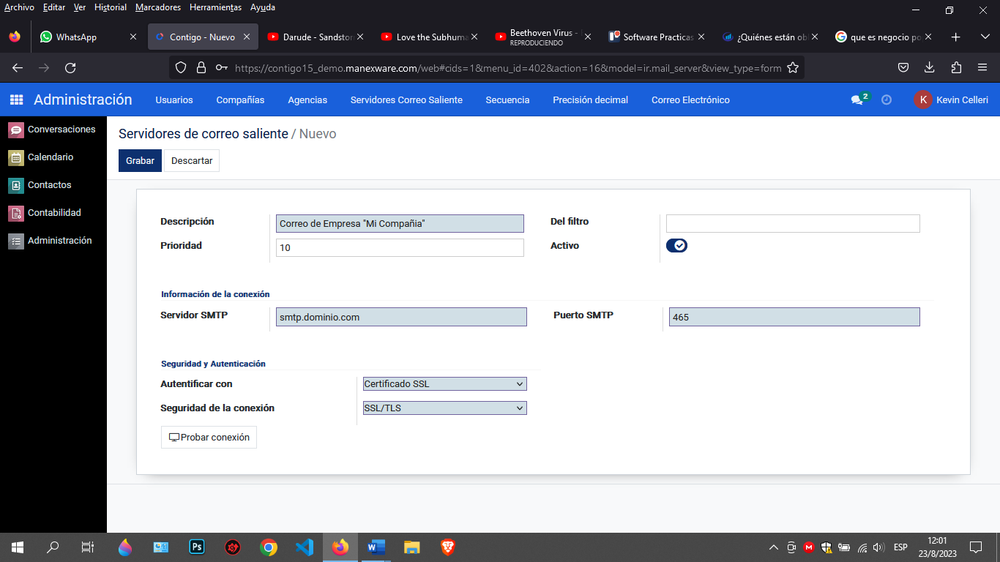
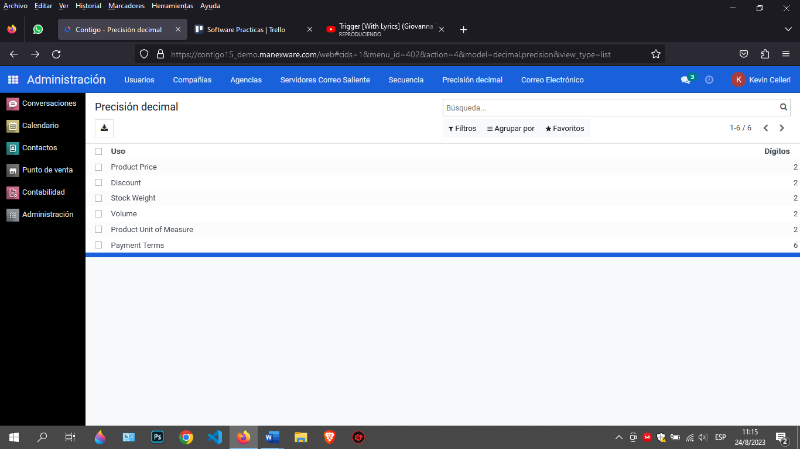
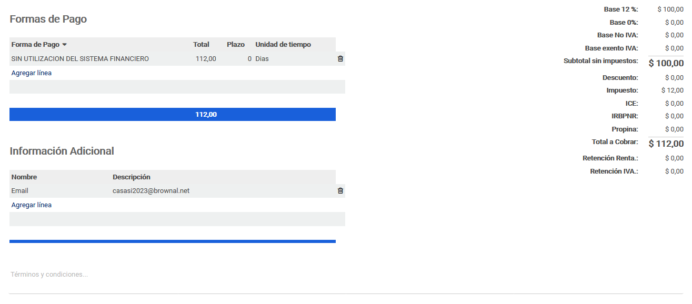
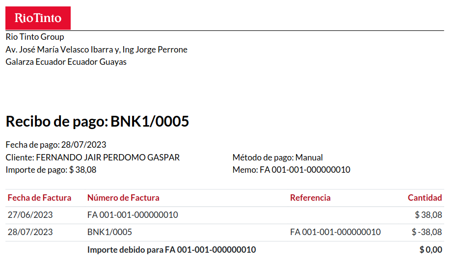
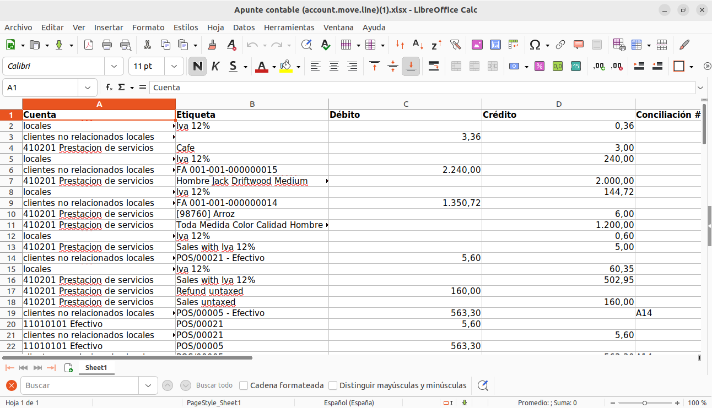
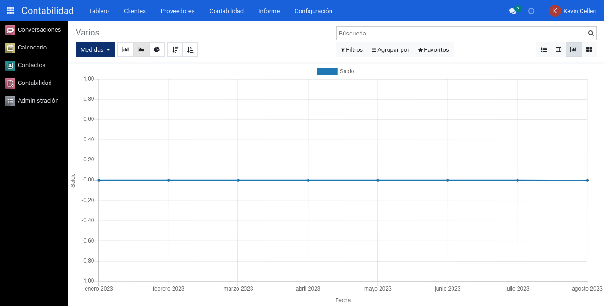
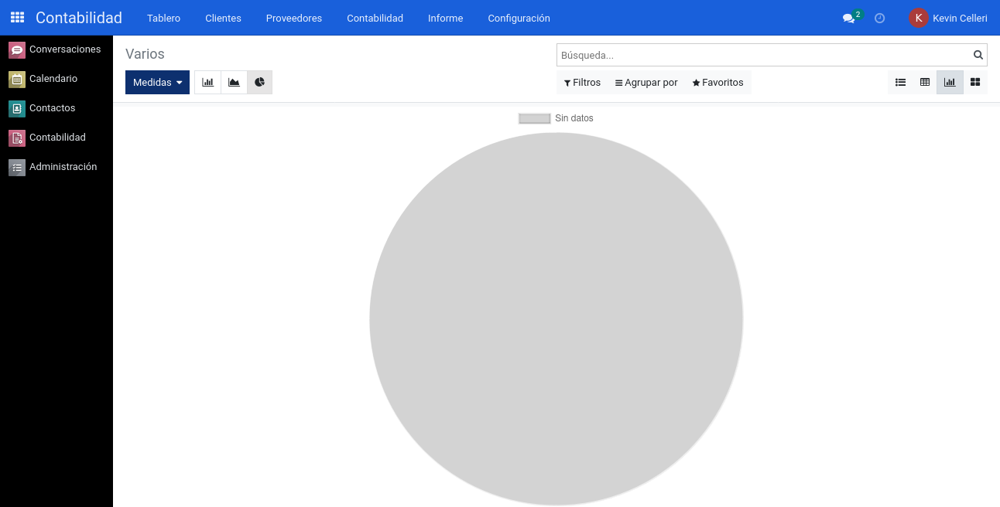
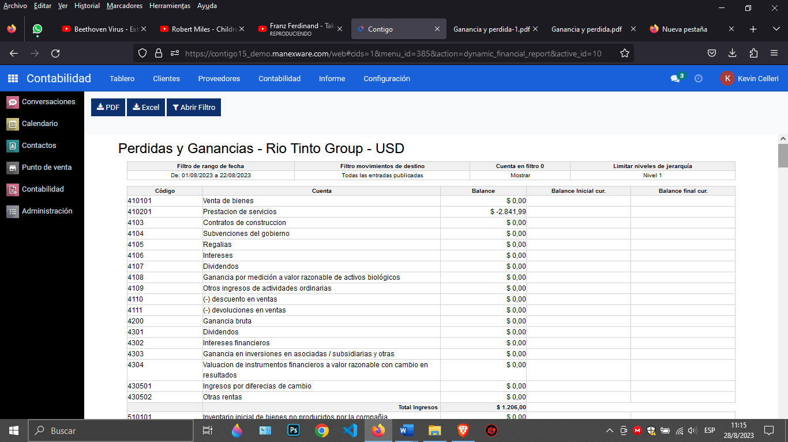
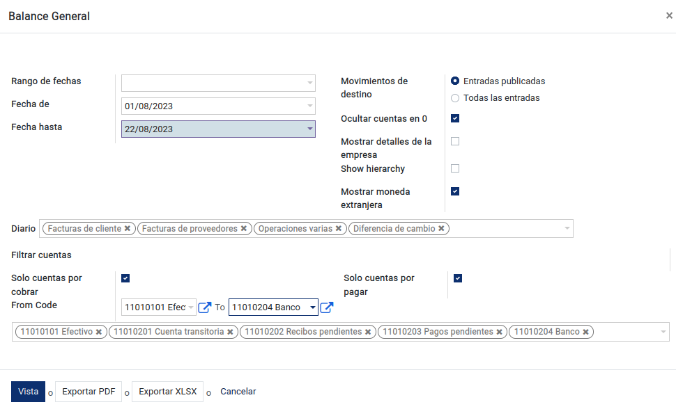

# Manual General Sistema Contigo

## Índice de Contenido
- [Manual General Sistema Contigo](#manual-general-sistema-contigo)
  - [Índice de Contenido](#índice-de-contenido)
  - [1. Prerrequisitos](#1-prerrequisitos)
    - [1.1 Información Básica](#11-información-básica)
    - [1.2 Información de Correo](#12-información-de-correo)
    - [1.3 Archivos de Importación](#13-archivos-de-importación)
  - [2. Configuración Inicial](#2-configuración-inicial)
    - [2.1 Creación de Usuarios](#21-creación-de-usuarios)
    - [2.2 Plan Contable](#22-plan-contable)
    - [2.3 Grupos de cuentas](#23-grupos-de-cuentas)
    - [2.4 Impuestos](#24-impuestos)
    - [2.5 Información de la compañía](#25-información-de-la-compañía)
    - [2.6 Configuración de correo saliente](#26-configuración-de-correo-saliente)
    - [2.7 Creación de año fiscal y periodos](#27-creación-de-año-fiscal-y-periodos)
    - [2.8 Configuración de Punto de Emisión](#28-configuración-de-punto-de-emisión)
    - [2.9 Cuentas Bancarias](#29-cuentas-bancarias)
    - [2.10 Diarios](#210-diarios)
  - [3. Primeros Pasos](#3-primeros-pasos)
    - [3.1 Ingreso al sistema](#31-ingreso-al-sistema)
    - [3.2 Preferencias de usuario](#32-preferencias-de-usuario)
    - [3.3 Contactos](#33-contactos)
    - [3.4 Uso de Barra de Filtros](#34-uso-de-barra-de-filtros)
    - [3.5 Tipos de Vistas](#35-tipos-de-vistas)
    - [3.6 Acciones](#36-acciones)
    - [3.7 Mensajes de error](#37-mensajes-de-error)
  - [4. Conversaciones](#4-conversaciones)
    - [4.1 Uso y configuración inicial](#41-uso-y-configuración-inicial)
    - [4.2 Manejo Apropiado](#42-manejo-apropiado)
    - [4.3 Contigo Bot](#43-contigo-bot)
    - [4.4 Interaccion entre usuarios](#44-interaccion-entre-usuarios)
    - [4.5 Canales](#45-canales)
    - [4.6 Conversación/ canales públicos](#46-conversación-canales-públicos)
    - [4.7 Conversación entre Usuarios](#47-conversación-entre-usuarios)
    - [4.8 Enviar Mensaje](#48-enviar-mensaje)
    - [4.9 Poner Adjuntos](#49-poner-adjuntos)
    - [4.10 Planificar actividad](#410-planificar-actividad)
    - [4.11 Adjuntos](#411-adjuntos)
    - [4.12 Seguidores](#412-seguidores)
  - [5.Contactos](#5contactos)
    - [5.1 Contactos](#51-contactos)
    - [5.2 configuracion](#52-configuracion)
    - [5.2.1 Etiquetas de Contacto](#521-etiquetas-de-contacto)
    - [5.2.2 Títulos de contacto](#522-títulos-de-contacto)
    - [5.2.3 Industrias](#523-industrias)
    - [5.2.4 Localización / Países](#524-localización--países)
    - [5.2.5 Localización / Provincia](#525-localización--provincia)
    - [5.2.6 Localización / Grupo de paises](#526-localización--grupo-de-paises)
    - [5.2.7 Localización / Ciudades](#527-localización--ciudades)
    - [5.2.8 Localización / Parroquias](#528-localización--parroquias)
    - [5.2.9 Cuentas Bancarias / Bancos](#529-cuentas-bancarias--bancos)
    - [5.2.10 Cuentas Bancarias / Cuentas Bancarias](#5210-cuentas-bancarias--cuentas-bancarias)
    - [5.2.11 Tipo de Identificación](#5211-tipo-de-identificación)
  - [6. Contabilidad](#6-contabilidad)
    - [6.1 Clientes](#61-clientes)
      - [6.1.1 Facturas/Clientes](#611-facturasclientes)
      - [6.1.2 Notas de Credito](#612-notas-de-credito)
      - [6.1.3 Facturas de Reembolso de Gastos](#613-facturas-de-reembolso-de-gastos)
      - [6.1.4 Notas de Débito](#614-notas-de-débito)
      - [6.1.5  Retenciones Ventas](#615--retenciones-ventas)
      - [6.1.6 Detalle de Retención en Ventas](#616-detalle-de-retención-en-ventas)
      - [6.1.7 Pagos](#617-pagos)
      - [6.1.8 Vehìculo](#618-vehìculo)
      - [6.1.9 Guías de Remisión](#619-guías-de-remisión)
      - [6.1.10 Productos](#6110-productos)
      - [6.1.11 Clientes](#6111-clientes)
    - [6.2 Proveedores](#62-proveedores)
      - [6.2.1 Facturas/Proveedores](#621-facturasproveedores)
      - [6.2.2 Notas de Crédito](#622-notas-de-crédito)
      - [6.2.3 Retenciones Compras](#623-retenciones-compras)
      - [6.2.4 Detalle de Retenciones en Compras](#624-detalle-de-retenciones-en-compras)
      - [6.2.5 Liquidaciones de Compras](#625-liquidaciones-de-compras)
      - [6.2.6 Pagos](#626-pagos)
      - [6.2.7 Productos](#627-productos)
      - [6.2.8 Proveedores](#628-proveedores)
    - [6.3 Contabilidad](#63-contabilidad)
      - [6.3.1 Documentos Electrónicos / Carga de Documentos Electrónicos](#631-documentos-electrónicos--carga-de-documentos-electrónicos)
      - [6.3.2 Conciliaciones / Conciliación Bancarias](#632-conciliaciones--conciliación-bancarias)
      - [6.3.3 Asientos Contables / Asientos contables](#633-asientos-contables--asientos-contables)
      - [6.3.4 Asientos Contables / Apuntes contables](#634-asientos-contables--apuntes-contables)
      - [6.3.5 Acciones / Conciliación](#635-acciones--conciliación)
      - [6.3.6 Acciones / Fecha de bloqueo](#636-acciones--fecha-de-bloqueo)
      - [6.3.7 Gestión de Chequeras / Chequeras](#637-gestión-de-chequeras--chequeras)
      - [6.3.8 Gestión de Chequeras / Cheques de Proveedores](#638-gestión-de-chequeras--cheques-de-proveedores)
      - [6.3.9 Diarios Contables /Ventas](#639-diarios-contables-ventas)
      - [6.3.10 Diarios Contables /Compras](#6310-diarios-contables-compras)
      - [6.3.11 Diarios Contables /Banco y Efectivo](#6311-diarios-contables-banco-y-efectivo)
      - [6.3.12 Diarios Contables /Varios](#6312-diarios-contables-varios)
    - [6.4 Informes](#64-informes)
      - [6.4.1 Administración / Análisis de Facturas](#641-administración--análisis-de-facturas)
      - [6.4.2 Administración / Cuentas por Pagar](#642-administración--cuentas-por-pagar)
      - [6.4.3 Administración / Cuentas por Cobrar](#643-administración--cuentas-por-cobrar)
      - [6.4.4 Administración / Información de Ventas](#644-administración--información-de-ventas)
      - [6.4.5 Administración / Información de Compras](#645-administración--información-de-compras)
      - [6.4.6 Informes de Contabilidad OCA/Libro mayor](#646-informes-de-contabilidad-ocalibro-mayor)
      - [6.4.7 Informes de Contabilidad OCA/Libro diario](#647-informes-de-contabilidad-ocalibro-diario)
      - [6.4.8 Informes de Contabilidad OCA/Balance de Sumas y Saldos](#648-informes-de-contabilidad-ocabalance-de-sumas-y-saldos)
      - [6.4.9 Informes de Contabilidad OCA/Pérdidas y Ganancias](#649-informes-de-contabilidad-ocapérdidas-y-ganancias)
      - [6.4.10 Informes de Contabilidad OCA/Balance General](#6410-informes-de-contabilidad-ocabalance-general)
      - [6.4.11 Informes de Contabilidad OCA/Partidas abiertas](#6411-informes-de-contabilidad-ocapartidas-abiertas)
      - [6.4.12 Informes de Contabilidad OCA/Calidad de la deuda](#6412-informes-de-contabilidad-ocacalidad-de-la-deuda)
      - [6.4.13 Informes de Contabilidad OCA/Informe de Impuestos](#6413-informes-de-contabilidad-ocainforme-de-impuestos)
      - [6.4.14 Reportes Financieros/Plan Contable](#6414-reportes-financierosplan-contable)
      - [6.4.15 SRI/Generar y Exportar A.T.S.](#6415-srigenerar-y-exportar-ats)
    - [6.5 Configuracion](#65-configuracion)
      - [6.5.1 Contabilidad / Plan de Cuentas](#651-contabilidad--plan-de-cuentas)
      - [6.5.2 Contabilidad / Impuestos](#652-contabilidad--impuestos)
      - [6.5.3 Contabilidad / Posiciones Fiscales](#653-contabilidad--posiciones-fiscales)
      - [6.5.4 Contabilidad / Grupos de Diarios](#654-contabilidad--grupos-de-diarios)
      - [6.5.5 Contabilidad / Diarios Contables](#655-contabilidad--diarios-contables)
      - [6.5.6 Contabilidad /Monedas](#656-contabilidad-monedas)
      - [6.5.7  Facturación / Incoterms](#657--facturación--incoterms)
      - [6.5.8 Contabilidad / Tipos de Cuentas](#658-contabilidad--tipos-de-cuentas)
      - [6.5.9 Contabilidad / Etiquetas de cuenta](#659-contabilidad--etiquetas-de-cuenta)
      - [6.5.10 Contabilidad / Grupos de cuentas](#6510-contabilidad--grupos-de-cuentas)
      - [6.5.11 Contabilidad / Grupos de impuestos](#6511-contabilidad--grupos-de-impuestos)
      - [6.5.12 Bancos / Agregar una cuenta bancaria](#6512-agregar-una-cuenta-bancaria)
      - [6.5.13 Bancos / Modelos de Conciliación](#6513-modelos-de-conciliacion)
      - [6.5.14 Contabilidad / Sustento de Comprobantes](#6514-sustento-de-comprobante)
      - [6.5.15 Contabilidad / Tipos de Documentos](#6515-tipos-de-documentos)
      - [6.5.16 Facturación / Puntos de Emisión](#6516-puntos-de-emision)
      - [6.5.17 Facturación/ Periodos](#6517-periodos)
      - [6.5.18 Facturación / Año Fiscal](#6518-año-fiscal)
      - [6.5.19 Facturación/ Payment Methods SRI (Métodos de Pago SRI)](#6519-metodos-de-pago-sri)
      - [6.5.20 Facturación / Plazos de Pago](#6520-plazos-de-pago)
      - [6.5.21 Administración / Categoría de Productos](#6521-categoria-de-productos)
      - [6.5.22 Administración / Modos de pago](#6522-modos-de-pago)
      - [6.5.23 Administración / Métodos de pago](#6523-metodos-de-pago)
  - [7. Algunos de Nuestros Clientes](#67-algunos-de-nuestros-clientes)
  - [8. Contactanos](#8-contactos)

## 1. Prerrequisitos

### 1.1 Información Básica
- Información de la compañía: RUC del SRI (PDF)
- Firma electrónica formato archivo .p12 y contraseña
- Habilitar emisión de documentos electrónicos en el portal de SRI
- Nombre para el subdominio ejemplo miempresa.manexware.com
- Lista de Usuarios – Nombres completos y correo electrónico 
- Logo de la compañía en formato png

### 1.2 Información de Correo
- Servidor SMTP - ejemplo: smtp.dominio.com
- Puerto SMTP - ejemplo: 465
- Usuario
- Contraseña

### 1.3 Archivos de Importación
- Excel de Contactos
- Excel de Productos

## 2. Configuración Inicial

### 2.1 Creación de Usuarios
__Datos del usuario__: Esta tarea solo puede ser realizada por el administrador, debe dirigirse al módulo de __Ajustes__, seleccionar en el menú la opción __Usuarios y Compañías__ y seguido la opción __Usuarios__.
Para crear un usuario, se debe llenar los campos Nombre, Dirección de email y foto (opcional) con un tamaño máximo de 1024x1024px.

__Activación del usuario__: En la esquina superior del mismo formulario nos encontraremos con un recuadro que indica si el usuario creado ha confirmado su inicio de sesión, caso contrario, se mostrará “nunca se conecta”.

  

Esta barra de estado nos indicará si el usuario no se ha conectado desde su creación, pero en el caso de que se haya conectado, la barra cambiará de “Nunca se conecta” a “Confirmado”.

  

__Permisos de acceso__: Parte fundamental del sistema, que se encarga de la administración de los privilegios del usuario; dependiendo de los permisos concedidos, el usuario realizará o no actividades en el sistema.

__Tiendas__: El sistema permite gestionar las sucursales en que el usuario se encuentra actualmente, para más información de las sucursales revisar la opción __Agencia__.

__Preferencias__: Nos permite seleccionar para cada usuario el idioma, la zona horaria, el medio de entrega de notificaciones, la plantilla de firma y la firma digital(opcional).

__Seguridad de la cuenta__: Nos permite seleccionar la autenticación de dos pasos para proteger la cuenta.

__Acciones__: Nos permite archivar, suprimir, duplicar y cambiar la contraseña de dicho usuario, desactivar la autenticación de dos pasos y también nos permite ayudar al usuario a recuperar su contraseña enviando instrucciones para el restablecimiento de la misma.

  

En caso de cambiar la contraseña se abrirá una ventana emergente, donde se deberá digitar la nueva contraseña y seguidamente guardar los nuevos datos.

En la parte superior, antes de las opciones de crear o editar usuario tenemos una barra que permite “Enviar un correo de invitación”:

  

Al usuario se le enviará por correo una invitación para que ingrese al sistema, si todo sale bien y la invitación se envía con éxito mostrará un mensaje confirmando dicha acción.

__Nota Importante__: Antes de enviar el correo de invitación, primero se debe configurar el correo saliente del sistema; para más información revisar Configuración de __Correo Saliente__.

### 2.2 Plan Contable
Debe dirigirse al módulo de __Contabilidad__, seleccionar el menú de __Configuración__, buscar el apartado de __Contabilidad__ y seleccionar la opción __Plan de Cuentas__.

El plan contable en Ecuador es un conjunto de normas y directrices que regulan la forma en que las entidades deben registrar y presentar sus transacciones financieras y contables. Basado en estándares internacionales adaptados a las regulaciones locales, el plan define cuentas contables, códigos numéricos, reglas de registro y formatos de estados financieros. Su objetivo es estandarizar la información contable para facilitar la comparabilidad y comprensión de los estados financieros por parte de diversos usuarios. Este plan puede actualizarse para reflejar cambios en las normativas y necesidades locales, y es esencial para mantener la precisión e integridad de la información financiera.

Estas cuentas deben estar ordenadas y codificadas de forma sistemática para facilitar la contabilidad.  Además, permite que todas las cuentas y registros sean presentados y visualizados con la finalidad de verificarlos.  De esa forma, se elaboran con facilidad los estados financieros.

El sistema Contigo tiene los datos básicos del plan contable, pero es necesario verificar cuáles son las cuentas contables que utilizará la empresa; en el caso de que se necesite añadir más cuentas contables, se debe seguir la secuencia correspondiente del código.

En el caso de querer visualizar más información respecto a una cuenta en específico, deberá dar clic al botón “Configurar”, de esta manera se abrirá una vista formulario en el cual podrá visualizar tanto el código, el nombre de la cuenta, el tipo de la misma, pero habrá campos adicionales como:

__Tipo__: Aquí se define el tipo de cuenta, ya sean capitales, activos, pasivos; cabe recalcar que las cuentas por cobrar y pagar deberán definirse de manera correcta y darle el respectivo permiso de conciliación.

__Impuestos determinados__: En esta opción se mostrará diferentes porcentajes de impuesto a usar si son compras o ventas.

__Etiquetas__: Ayuda a definir qué tipo de actividad es, ya sea de operaciones, financiera o actividades extraordinarias.

__Diarios permitidos__: Se definen los diarios contables que pueden ser usados dentro de ese plan contable. Si se llena esta opción sólo podrán usar dichas cuentas siempre y cuando el asiento contable posea dicho diario.

__Obsoleto__: De igual manera no es posible eliminar una cuenta una vez que se haya registrado una transacción en ella. Puede hacerla inutilizable deberá marcar el check de __“Obsoleto”__.

__Grupo__: Se define automáticamente, en este apartado se define a qué grupo de cuenta pertenece (grupo previamente creado).

__Centralizado__:  En el caso de que se desee que se muestren los detalles de la cuenta en el libro mayor, deberá marcar esta opción.

El sistema Contigo permite de igual manera visualizar las cuentas según su nivel, el nivel lo define de manera automática siempre y cuando se digite el código de la cuenta contable.

  

Por ejemplo, en la imagen de arriba solo se están visualizando las cuentas nivel 1.

### 2.3 Grupos de cuentas
Debe dirigirse al módulo de __Contabilidad__, seleccionar el menú de __Configuración__, buscar el apartado de __Contabilidad__ y seleccionar la opción __Grupos de Cuentas__.

Los grupos de cuentas sirven para listar múltiples cuentas como subcuentas de una cuenta más grande y, por lo tanto, consolidar reportes como la balanza de comprobación. De forma predeterminada, los grupos se gestionan según el código del grupo.

Para la creación de un grupo de cuentas, se deberá definir el nombre de la misma y el prefijo de esta; dependiendo de los dígitos seleccionados al momento de guardar el registro el sistema enlazará todas las cuentas contables que posean dicho prefijo.

### 2.4 Impuestos
Esta tarea solo puede ser realizada por el administrador, debe dirigirse al módulo de __Contabilidad__, seleccionar el menú de __Configuración__, buscar el apartado de __Contabilidad__ y seleccionar la opción __Impuestos__.

Los impuestos son tributos que cada persona, familia o empresa debe pagar al Estado para costear las necesidades colectivas, contribuyendo así con una parte de sus ingresos.

Al momento de crear un nuevo impuesto es necesario agregar el nombre del impuesto, si se desea se puede añadir un nombre corto y seleccionar el ámbito de este (ventas, compras, ninguno y ajustes).

__Definición__: Esta pestaña nos ayuda a determinar el cálculo del impuesto, su importe, la cuenta de impuestos y la cuenta de impuestos para las notas de crédito.

__Opciones avanzadas__: Esta opción nos permite añadir la etiqueta de factura, el grupo de impuestos, si se debe incluir en el precio, si tiene base imponible y añadir más etiquetas para reconocimiento de este.

__Código de impuestos__: Nos permite ingresar el código base y el código de impuestos para las ventas y compras; de la misma manera el reembolso de ventas y compras con la diferencia del código de devoluciones.     

### 2.5 Información de la compañía 
Esta tarea solo puede ser realizada por el administrador, debe dirigirse al módulo de __Administración__, seleccionar la opción __Compañías__.
Por defecto hay un registro con el nombre de My Company (Rio Tinto Group), es necesario ingresar a dicho registro para poder configurar con los respectivos datos de la empresa.

Proceden a llenar cada uno de los campos con su respectiva información según la empresa, especialmente los campos obligatorios empezando por el nombre de la compañía.

__Información General__: Se debe registrar todos los datos de la compañía y si la compañía posee factura electrónica, llenar en el sistema sus respectivos campos para su posterior utilización.

__Contabilidad__: Nos permite indicar al sistema las retenciones, sustentos tributarios, las cuentas contables y la cuenta de transferencia entre bancos que la empresa utiliza para toda su actividad contable.

__Agencia__
Esta tarea puede ser realizada por el administrador, debe dirigirse al módulo de __Administración__, seleccionar la opción __Agencia__.

### 2.6 Configuración de correo saliente
Nos dirigimos al módulo de __Administración__ y buscamos en el menú __Servidor de Correo Saliente__.

Para crear el servidor de correo saliente, añadimos una descripción de nuestro correo y seleccionamos su prioridad (entre más bajo el número mayor será la prioridad); en la información de la conexión colocamos:

__Servidor SMTP =__ smtp.dominio.com

__Puerto SMTP =__ 465

Por último, se selecciona en seguridad de la conexión SSL/TLS y posteriormente se configura el usuario y la contraseña del correo, se prueba la conexión y listo.

### 2.7 Creación de año fiscal y periodos
Nos dirigimos al módulo de __Contabilidad__, seleccionamos el menú de __Configuración__, buscamos Facturación y seleccionamos __Año Fiscal__.

  

Para crear el año fiscal en curso, colocar en “Nombre” el año, configurar la fecha de inicio y fecha de finalización del año y dar clic en “Crear”.

### 2.8 Configuración de Punto de Emisión
Nos dirigimos al módulo de __Contabilidad__, seleccionamos el menú de __Configuración__, buscamos __Facturación__ y por último seleccionamos __Puntos de Emisión__.

  

Configurar el punto de emisión que viene por defecto, en el punto de emisión requiere introducir un nombre, un código, seleccionar el estado si es activo, la agencia y el ambiente.  Además, se puede enviar el documento por medio electrónico.

### 2.9 Cuentas Bancarias
En el módulo de __Contabilidad__, seleccionamos el menú de __Configuración__, buscamos el apartado de __Bancos__ y escogemos la opción __Agregar una cuenta bancaria__.

  

Para configurar las cuentas bancarias, ingresamos el número de cuenta, el banco correspondiente y el código de identificación bancaria. El banco se asocia a la empresa.

### 2.10 Diarios
En el módulo de __Contabilidad__, seleccionamos el menú de __Configuración__ y posteriormente el apartado de __Contabilidad__ y localizamos __Diarios Contables__.

  

En los diarios ingresamos el nombre, el tipo (venta, compra, banco, efectivo o miscelánea) según corresponda, también nos permite seleccionar el tipo de cuenta deudora o acreedora si aquella cuenta no está registrada, se puede crear o editar.

También se configura el código corto y la secuencia de los asientos. Se define las cuentas de débito y crédito por defecto; también se puede seleccionar el producto, podemos elegir: caja chica, liquidación de gastos o tarjeta de crédito; podemos seleccionar el tipo de producto que está en descuento, si no está registrado nos permite crear y editar, también nos indica si aquella cuenta bancaria corresponde a cuenta corriente o ahorros y guardamos.

## 3. Primeros Pasos
### 3.1 Ingreso al sistema
Nos dirigiremos a la URL del dominio que tenemos en la nube, en nuestro caso será “https://dominio.manexware.com”, al momento de ingresar a dicho dominio aparecerá la siguiente pantalla.

Se coloca tanto el usuario y contraseña, después deberá dar clic en iniciar sesión. Si el usuario existe en el sistema automáticamente le mostrará el menú principal del sistema, en el caso de que el usuario no exista deberá contactar con el __administrador__ encargado.

Para el caso en que el usuario olvide su contraseña, debajo del botón __“Iniciar Sesión"__ se encuentra la opción de __“Recuperar Contraseña” (Reset Password)__.

  

__Recuperar Contraseña__: El proceso de recuperación de contraseña enviará un correo al usuario, a la dirección email previamente configurada.

  

  

Al momento de recibir el correo, se deberá dar clic en __“Cambiar Contraseña”__ y el sistema lo enviara a la pantalla de cambio de clave.

  

Al colocar la nueva contraseña es necesario volver al inicio e ingresar con el usuario y la nueva contraseña que se ha definido.

### 3.2 Preferencias de usuario
Una vez ingresado al sistema, en la esquina superior derecha, se encuentra el ícono de nuestro  usuario, al momento de dar clic en él nos saldrá una serie de opciones: 

  

__Atajo:__ Muestra atajos del teclado que pueden ser utilizados para interactuar con el sistema.

__Preferencias__: Permite seleccionar el idioma, la zona horaria, definir por cuál medio le llegaran las notificaciones a dicho usuario, la posición de la barra de los módulos, la posición del chatter y su firma.

De igual manera se podrá definir en la sección “Seguridad de la cuenta” el cambio de contraseña y si se requiere se podrá utilizar la autenticación de dos pasos.

__Cerrar Sesión__: Nos devuelve al menú de inicio de sesión.

### 3.3 Contactos
Permite añadir cualquier tipo de contactos ya sean clientes o proveedores. En el contacto se puede establecer la imagen o foto que se lo identifica, seleccionar si este corresponde a una persona o compañía, el nombre de la empresa o compañía a la que pertenece, si no está registrada se puede crear o editar, de igual manera se podrá ingresar la dirección, la provincia, la parroquia, etc. Se puede seleccionar el tipo de identificación (cédula, Ruc, pasaporte, o Desconocido/Unknown), una vez que se selecciona cédula o Ruc el sistema indicara que se debe insertar los números de dichos identificadores, se podrá seleccionar si la persona es natural o jurídica, el tipo de sexo, el estado civil, el puesto de trabajo, teléfono, móvil, el correo electrónico, el nombre del sitio web, el título, el idioma, el tipo de cliente si es público o privado, la zona horaria o la etiqueta, ver sus facturas, las cuentas analíticas relacionadas, conciliaciones, opciones de compra y venta y la creación de usuarios.
Para más información revisar el módulo __Contactos__.

### 3.4 Uso de Barra de Filtros
El sistema cuenta con cuatro tipos de filtros y cada uno cumple una función específica.

__Filtro por defecto__: Al momento de ingresar algún carácter en la barra de filtros de manera automática el sistema arrojará una serie de etiquetas que sirven para identificar de manera rápida lo que se está buscando.

__Filtros__: Muestran una serie de etiquetas predefinidas en la programación del sistema, que ayuda al usuario a buscar la información exacta, el filtro se activará si seleccionas cómo filtrar en la búsqueda, dependiendo de lo que selecciones aparecerá una etiqueta en la barra de búsqueda.

  

__Filtros personalizados__: Esta opción permite al usuario añadir diferentes condiciones a la búsqueda o generar nuevos campos de búsqueda, también permite agregar condiciones para un mejor resultado. 

  

  

__Agrupar por__: Permite agrupar la información deseada o relacionada, dependiendo del modo de agrupación que el usuario le indique al sistema.

  

__Agrupar Por personalizados__: Esta opción permite al usuario añadir diferentes condiciones a la búsqueda o generar nuevos campos de búsqueda, también permite agregar condiciones para un mejor resultado.

  

__Favoritos__: Permite guardar una búsqueda personalizada y utilizarla cuando se lo requiera, solamente se añade el nombre de la búsqueda (ya sea una búsqueda por filtro o agrupación) e indicas si deseas utilizar dicha búsqueda por defecto y/o si quieres compartirlo con otros usuarios. 

  

__Número de resultados__: Indica el número total de resultados, este puede modificarse en el caso de realizar tareas que lo requieran.

  

En este ejemplo, le indicamos al sistema que se querrá visualizar los resultados existentes desde el 1 (primero) hasta el 220 (último).

  

### 3.5 Tipos de Vistas
El sistema cuenta con múltiples tipos de vistas, que facilitan la búsqueda de información y el procesamiento visual de la misma. Estas vistas son las siguientes:

__Vista Actividad__: La vista Actividad se usa para mostrar las actividades vinculadas a los registros. Los datos se muestran en un gráfico con los registros que forman las filas y la actividad son las columnas. 
La primera celda de cada fila muestra una tarjeta que representa el registro correspondiente. Al hacer clic en otras celdas, se muestra una descripción detallada de todas las actividades del mismo tipo para el registro.

__Vista Formulario__: Las vistas de formulario se utilizan para mostrar los datos de un solo registro, siendo la vista más usada el sistema.

__Vista Kanban__: La vista Kanban es una visualización de tablero Kanban; muestra registros como "tarjetas", a medio camino entre una vista de lista y una vista de formulario no editable. Los registros pueden agruparse en columnas para su uso en la visualización o manipulación del flujo de trabajo (por ejemplo, tareas o gestión del progreso del trabajo), o desagruparse (usarse simplemente para visualizar registros).

__Vista Lista__: Muestra los múltiples registros en forma de lista.

__Nota__: Si deseas saber en qué tipo de vista estas, dirígete a la esquina superior derecha, pasas el ratón en los diferentes tipos vistas que se muestran y el sistema te arrojará el nombre de la vista.

### 3.6 Acciones
Como su propio nombre indica son procesos que el usuario podrá realizar en uno o múltiples registros, las acciones más comunes son las de Suprimir y Duplicar, dependiendo del módulo en que te encuentres; pueden tener más de una acción en el módulo y éstas nos permitirán realizar actividades de manera más rápida, dependiendo de su función asignada en el sistema.

  

### 3.7 Mensajes de error
Los mensajes de error son parte esencial del sistema, es un medio de ayuda para que los usuarios sepan que lo que están realizando es correcto. 
Aunque los mensajes se dividen dependiendo del tipo de actividad, todos tienen la misma funcionalidad, la de indicar al usuario si la acción está permitida o no; ya sean mensajes de error referentes a permisos de usuario o falta de campos en uno de los formularios e inclusive el tipo de dato que este requiere.

## 4. Conversaciones
### 4.1 Uso y configuración inicial
El módulo de Conversaciones permite unificar todas las comunicaciones de la empresa a través de mensajes, notas y chat. En todas las aplicaciones, puede compartir información, proyectos, archivos, priorizar tareas y mantenerse conectado con colegas y socios. Este módulo le permite mejorar las relaciones, aumentar la productividad y la transparencia al promover una forma conveniente de comunicación. 

A la hora de configurar el usuario en los ajustes debemos elegir cómo nos llegarán las notificaciones del sistema: por correo electrónico o vía Contigo.

  

Para utilizar de manera óptima el módulo de conversaciones es recomendable que la gestión de notificaciones esté manejada por Contigo.
### 4.2 Manejo Apropiado
Los mensajes recibidos de parte de otros usuarios serán mostrados en la parte izquierda del programa, mientras que en la parte derecha se podrá observar dicho mensaje; los mensajes se pueden marcar como por realizar e inclusive nos permitirán etiquetar a los usuarios dentro del sistema.
Al momento de ingresar en bandeja de entrada, nos mostrará todos los mensajes que el usuario ha recibido y habilitará un botón que nos permitirá marcarlos como leído. Si un mensaje está marcado como “por realizar” de manera automática es agregado en destacados. 

### 4.3 Contigo Bot 
La primera vez que inicia sesión en su cuenta, ContigoBot le envía un mensaje solicitando permiso para recibir notificaciones de escritorio para los chats. Si se acepta, recibirá notificaciones automáticas de los mensajes que se le envíen independientemente de dónde se encuentre en Contigo.

  

### 4.4 Interaccion entre usuarios 
Para mencionar a un usuario dentro de un chat o el tipo de charla @ nombre-usuario; para hacer referencia a un canal, escriba # nombre-canal.
Se envía una notificación al usuario mencionado a su bandeja de entrada o por correo electrónico, dependiendo de su configuración.
Mencionar a un usuario en la charla lo configura como seguidor del elemento (si aún no lo está) y enviará un mensaje a su bandeja de entrada. El elemento que contiene la mención también aparecerá en negrita en la vista de lista. Mencionar a un usuario en un canal enviará un mensaje a su bandeja de entrada. No puedes mencionar a un usuario en un canal en el que no esté suscrito.

### 4.5 Canales
Puede utilizar canales para organizar debates entre equipos, departamentos, proyectos o cualquier otro grupo que requiera una comunicación regular. De esta manera, mantendrá a todos al tanto de las últimas novedades.
Canales públicos o privados:
Todo el mundo puede ver un canal público, mientras que un canal privado solo es visible para los usuarios invitados.
Para crear un canal nos dirigiremos en la opción canales y damos clic en el signo +

  

La opción ¿Quién puede seguir las actividades del grupo? le permite controlar qué grupos pueden tener acceso al canal. Tenga en cuenta que permitir que todos sigan un canal privado permite que otros usuarios lo vean y se unan, como lo harían con uno público.
Si elige Solo personas invitadas, vaya a la pestaña Miembros para agregar a sus miembros, o vaya a la página principal de Discusión, seleccione el canal y haga clic en Invitar.

Para el grupo de usuarios seleccionado, la opción Suscribir automáticamente grupos agrega automáticamente a sus miembros como seguidores. En otras palabras, mientras que los Grupos autorizados limitan qué usuarios pueden acceder al canal, los Grupos de suscripción automática agregan automáticamente al usuario como miembro siempre que forme parte del grupo.

La elección de Enviar mensajes por correo electrónico configura el canal para que se comporte como una lista de correo.
Habilitar esta opción le permite moderar este canal, lo que significa que los mensajes deberán ser aprobados antes de enviarse.
### 4.6 Conversación/ canales públicos

### 4.7 Conversación entre Usuarios
Los mensajes directos son mensajes privados que sólo pueden ser vistos por el remitente y el destinatario. Puede enviar mensajes directos a otros usuarios desde el módulo Discusión creando una nueva conversación o seleccionando una existente en la barra lateral. Los mensajes directos se pueden enviar desde cualquier lugar en Contigo usando el icono de burbuja de diálogo en la barra superior. El estado en línea de otros usuarios se muestra a la izquierda de su nombre. Un punto verde indica que un usuario está conectado, un punto naranja que está inactivo y un punto gris que está desconectado.

### 4.8 Enviar Mensaje
De la misma manera que en una conversación entre usuarios dentro de un canal, esta opción nos permitirá enviar a los seguidores asignados del registro un mensaje para indicar cualquier procedimiento, adjunto, entre otros y que los seguidores aprendan a como interactuar con dicho registro.

### 4.9 Poner Adjuntos
Los adjunto son recopilaciones de acciones realizadas en el sistema. Estas se llenan dependiendo de las acciones del usuario en determinados procesos, también es posible generar notas en el sistema para que los restantes de usuarios las vean inclusive se podrá adjuntar imágenes, dichas notas no serán posibles de eliminar, ya que es un registro de las actividades realizadas por los usuarios del sistema.

### 4.10 Planificar actividad
La planificación de actividades es la manera perfecta de mantenerse al día con su trabajo. Recuerde lo que debe hacerse y programe las próximas actividades a realizar. Tus actividades están disponibles en cualquier lugar de Contigo. Es fácil administrar sus prioridades.
Varios tipos de actividades genéricas están disponibles de forma predeterminada en Contigo (por ejemplo, llamada, correo electrónico, reunión, etc.). Las actividades están planificadas para días específicos. Si necesita establecer un horario, elija el tipo de actividad Reunión. Al programar uno, el calendario simplemente se abrirá para permitirle seleccionar un intervalo de tiempo.

  

Si el usuario registrado tiene alguna actividad pendiente a realizar, este podrá observar en el icono de reloj que se encuentra en la parte superior derecha.

  

  

Si la actividad se encuentra en una fecha posterior, se marcará como futuro, si la actividad está programada para el mismo día esta nos marcará como hoy, pero si la actividad se encuentra atrasada nos marcará como atrasado.

### 4.11 Adjuntos
El sistema nos permite adjuntar todo tipo de archivos, para que los adjuntos se suban o se descarguen de forma rápida es recomendable que el archivo a adjuntar sea ligero. Dependiendo del número de adjuntos en la nota dentro del registro, dicho número se verá reflejado en el icono de clic de la parte superior derecha.

  

### 4.12 Seguidores
Podremos añadir seguidores en nuestro registro, de forma tal que ellos puedan tener acceso para ver la información, notas, adjuntos y otros datos; de igual manera que en los adjuntos, el sistema nos mostrará en la parte superior derecha el número de seguidores, permitiéndonos añadir a más usuarios y también a eliminarlos.

  

## 5.Contactos
### 5.1 Contactos
Nos dirigimos al módulo de Contactos, opción Contactos.

En contactos se puede añadir a un nuevo contacto o editarlo ,seguido de  la imagen o foto que lo identifica, seleccionar si este corresponde a una persona o compañía, el nombre de la empresa o compañía a la que pertenece, podemos ingresar la dirección, la provincia, la parroquia, etc. Se puede seleccionar el tipo de identificación (cédula, Ruc, pasaporte, placa o consumidor final), una vez que se selecciona cedula o Ruc nos indica que debemos ingresar los números de dichos identificadores, podemos seleccionar si la persona es natural o jurídica, el tipo de sexo, el estado civil, el puesto de trabajo, teléfono, móvil, el correo electrónico, el nombre del sitio web, el título, el idioma, el tipo de cliente si es público o privado, la zona horaria o la etiqueta, guardar.

En la parte superior se encuentra una serie de opciones que muestran:La reuniones planificadas,oportunidades de ventas, el total de ventas realizadas, el total facturado,el número de tickets,saldos y pagos para conciliar. Si se desea saber más al respecto, al momento de hacer clic en una de estas opciones el sistema lo enviará a dicha vista para su análisis respectivo.

  

Contactos y direcciones:Podrá añadir contactos relacionados al existente y podrá especificar si es un contacto, dirección de factura, dirección de envió, otras direcciones y direcciones privadas.

  

Notas internas: Podrá generar una nota para guardar información respecto a dicho usuario.

  

Ventas y Compras: Parte fundamental de la creación de contactos, es la que nos permite especificar datos relevantes para los procesos contables.

Facturación: Permite ingresar las cuentas y asientos contables que el contacto creado específica.

Información Adicional: Permite agregar información , cómo agregar línea, que aparece en las facturas.

### 5.2 configuracion
### 5.2.1 Etiquetas de Contacto
Nos dirigimos al módulo de Contactos, dirigirse al menú de Configuración y buscar la opción Etiquetas de Contacto. 

Esta opción nos permite generar etiquetas a los clientes, la función de la etiqueta es la de identificar de manera rápida a un cliente por algún tipo de atributo. 

Las etiquetas creadas solo aparecerán en los contactos si están marcadas como activas, caso contrario no aparecerá dicha etiqueta y la categoría padre es una etiqueta creada anteriormente en el sistema que derivará más etiquetas.

### 5.2.2 Títulos de contacto
Seleccionar el módulo de Contactos, dirigirse al menú de Configuración y buscar la opción Títulos de contacto.

Esta opción nos permite la creación de títulos profesionales o formalidades con su abreviatura para posteriores utilizaciones.

### 5.2.3 Industrias
Seleccionar el módulo de __Contactos__, dirigirse al menú de __Configuración__ y buscar la opción __Industrias.__

Esta opción nos muestra cada una de las industrias actualmente existentes.

Dentro de este apartado, se encuentra el botón gráfico para exportar todo los datos:

  

### 5.2.4 Localización / Países
Seleccionar el módulo de __Contactos__, dirigirse al menú de __Configuración__ y buscar en __Localización__ la opción __Países.__

Nos permite la creación, edición y eliminación de los países. Por defecto el sistema mostrará todos los países existentes actualmente, con sus respectivos datos. Un país está conformado por 8 datos importantes que son el nombre del país, la bandera del país, la moneda, el código del país, en nuestro caso también estará el código ecuatoriano, código de la llamada del país, la etiqueta del IVA, por último, pero no menos importante sus estados o también conocidos como provincias en el caso de Ecuador.

Nota: Es importante añadir los estados a los países que más utilicen, ya que nos ayudará a identificar de manera precisa las ubicaciones que se emplean en los módulos de __Contactos__ y __Contabilidad.__

Dentro de este apartado, se encuentra el botón gráfico para exportar todo los datos:

  

### 5.2.5 Localización / Provincia
Seleccionar el módulo de __Contactos__, seleccionar el menú de __Configuración__ y buscar en __Localización__ la opción __Provincias.__

De igual manera que en la creación de países, se debe ingresar el nombre de la provincia, el código de ésta, el país y las ciudades de dicha provincia.

Nota: Es recomendable crear las ciudades en esta opción. Al momento de ingresar a esta opción el sistema mostrará de manera descendente las provincias según el código de provincia. Si se desea buscar las provincias de un país específico es recomendable utilizar el filtro de la parte superior (Para más información revisar Filtros).

Dentro de este apartado, se encuentra el botón gráfico para exportar todo los datos:

  

### 5.2.6 Localización / Grupo de paises 
Seleccionar el módulo de __Contactos__, dirigirse al menú de __Configuración__ y buscar en __Localización__ la opción __Grupo de países__.

Nos permite agrupar países para la formación de “continentes” en el sistema e inclusive añadir alguna tarifa pre creada en el sistema.

También permite realizar dos  acciones tales como:

__Duplicar:__ Clona el registro

__Suprimir:__ Elimina el registro

  

Dentro de este apartado, se encuentra el botón gráfico para exportar todo los datos:

  

### 5.2.7 Localización / Ciudades
Seleccionar el módulo de __Contactos__, dirigirse al menú de __Configuración__ y buscar en __Localización__ la opción __Ciudades__.

Al igual que países y provincias, podremos crear, editar y eliminar las ciudades en esta opción del sistema.

También permite realizar dos  acciones tales como:

__Duplicar:__ Clona el registro

__Suprimir:__ Elimina el registro

  

Dentro de este apartado, se encuentra el botón gráfico para exportar todo los datos:

  

### 5.2.8 Localización / Parroquias

Seleccionar el módulo de __Contactos__, dirigirse al menú de __Configuración__ y buscar en __Localización__ la opción __Parroquias.__

Es una subclasificación de las ciudades, sirven para complementar datos referentes a la ubicación, en este caso el sistema cuenta con todas las parroquias de las ciudades del Ecuador.

Dentro de este apartado, se encuentra el botón gráfico para exportar todo los datos:

  

### 5.2.9 Cuentas Bancarias / Bancos
Seleccionar el módulo de __Contactos__, seleccionar el menú de __Configuración__ y buscar en __Cuentas Bancarias__ la opción __Bancos__.

Esta opción permite crear, editar y eliminar Bancos en el sistema, estos bancos son de vital importancia crearlos ya que están estrictamente relacionados a nuestra contabilidad.  Al momento de crear un banco, los datos más relevantes son el nombre del banco y el código de identificación bancaria (BIC/SWIFT).

Al igual que en anteriores apartados, se le permite al usuario descargar un archivo excel de estos datos ingresados:

  

### 5.2.10 Cuentas Bancarias / Cuentas Bancarias

Seleccionar el módulo de __Contactos__, dirigirse al menú de __Configuración__ y buscar en __Cuentas Bancarias__ la opción __Cuentas Bancarias.__
Esta opción permite la creación, edición y eliminación de cuentas bancarias, al momento de crearla se deberá colocar el tipo de cuenta (Ahorros, Corriente o Virtual), el número de cuenta, el titular, el banco, el nombre del titular o contacto, correo y nos da a elegir si se mostrará en facturas o no.

También el usuario podrá archivar, duplicar o suprimir el registro:

  

De igual manera, el sistema permite la descarga de un archivo xlsx (excel) para la visualización de los registros:

  

### 5.2.11 Tipo de Identificación
Seleccionar el módulo de __Contactos__, dirigirse al menú de __Configuración__ y buscar en __Cuentas Bancarias__ la opción __Tipo de Identificación.__
Esta opción permite visualizar los formatos de documentos, con opciones a archivarlos, exportarlos, desarchivarlos, marcar la casilla para cambiar el estado a activo e inactivos.

Permite exportar los documentos,archivarlos y desarchivarlos:

  

## 6.Administraccion

### 6.1 Usuarios
Los usuarios del sistema o usuarios cliente son personas que se conectan al sistema para hacer uso de los servicios que éste les proporciona. Dentro de los usuarios del sistema podemos distinguir diferentes perfiles o niveles de usuario, y dependiendo de dicho nivel poseerá más o menos privilegios en su estancia dentro del sistema Contigo.
Es necesario indicar que rol o función tendrán los usuarios, porque dependerá de los mismos para la correcta navegación del sistema.
Un usuario consta de 3 datos que permitirán el reconocimiento del mismo dentro del sistema contable Contigo, los cuales son: Nombre del usuario, correo electrónico y una contraseña dada por el sistema.
__Importante:__ Para generar usuarios dentro del sistema, es recomendable hacerlo dentro del módulo de Contactos (Para más información revise el manual __Contigo General__).

Es importante definir los Permisos de acceso, la tienda (Agencias) en donde se encuentra laborando y las preferencias de usuario (El mismo usuario puede configurar sus preferencias dentro del sistema).

Permisos de acceso: El usuario debe tener permisos para acceder a los diferentes módulos que existen dentro del sistema y también para poder ver o interactuar con la información presente en los mismos. Se pueden asignar los permisos cuando se cree un usuario y dependiendo de los permisos asignados para dicho usuario, el sistema le indicará a qué acciones puede realizar en el mismo, tales como las ventas, la contabilidad, el inventario, otros, además de las opciones técnicas, los derechos extras y una última opción de otro que contiene creación de contacto.

Tiendas: Permite identificar las tiendas/agencias en las cuales se encuentra el usuario y en las tiendas que tiene permitido trabajar.

Preferencias: Permite una serie de configuraciones dentro del sistema, como el idioma, la zona horaria, notificación (Manejar por correos electrónicos o Manejar en Odoo), firma de correo electrónico y por último una firma digital.

Cuando seleccione firma de firma digital, le va a aparecer una ventana que dice adopte su firma, si no tiene una firma guardada en la computadora seleccione “Dibujar”, si ya posee una firma en la computadora seleccione “Cargar” para subir el archivo que contiene una firma  y si está seguro de su decisión presione “Aprobar y firmar”.

Importante: Para asignar una contraseña y restablecer la misma, se requiere seguir los siguientes procesos.
1.- Asignación de contraseña por medio del administrador: Esta opción permite al administrador del sistema establecer o asignar la contraseña de usuario. Para que está acción se ejecute; el usuario debe dirigirse en la parte superior del sistema e identificar el botón de Acción, presionarlo después de eso saldrán tres opciones elija la opción que dice “Cambiar la contraseña”.

  

El sistema mostrará un formulario simple, el cual consta del correo del usuario en la parte izquierda y el espacio para la nueva contraseña en la parte derecha. Cuando se haya ingresado la nueva contraseña, se procede a confirmar (Cambiar la contraseña).

Nota: Este proceso se recomienda utilizarlo si es necesario que el usuario ingrese de manera urgente al sistema, caso contrario se recomienda que los usuarios sigan el paso 3.

2. – Enviar instrucciones de restablecimiento de contraseña: Esta opción permite enviar al correo del usuario una dirección web que lo redirigirá al sistema.

  

  

3.- Cambiar contraseña: Si el usuario no posee ninguna contraseña o no recuerda la misma, es preferible que utilice esta opción. En la página de inicio de sesión debajo de Iniciar Sesión aparecerá la opción Cambiar Contraseña de la cual se deben seguir los pasos indicados por el sistema para la obtención de la nueva contraseña.

  

### 6.1 Compañias

La opción de “Compañías” permite el ingreso de datos que se mostrará dentro del sistema, dependiendo de cómo se configure, se habilitan o deshabilitan opciones que se reflejarán en un manejo diferente en el sistema. Por defecto hay un registro con el nombre de My Company (Mi Compañía), es necesario ingresar a dicho registro para poder configurar con los respectivos datos de la empresa.
Se procede a llenar los campos con su respectiva información según la empresa, especialmente los campos obligatorios empezando por el nombre de la compañía.

  

  

Información General: Se debe registrar todos los datos de la compañía y si la compañía posee factura electrónica, llenar en el sistema sus respectivos campos para su posterior utilización.

Contabilidad: Permite indicar al sistema las retenciones, sustentos tributarios, las cuentas contables y la cuenta de transferencia entre bancos que la empresa utiliza para toda su actividad contable.

El sistema muestra opciones que afectarán a otros módulos como:
Contabilidad
__Verificación de correo:__ Si esta opción está marcada, los contactos dentro del sistema estarán obligados a llenar el campo de Correo electrónico, esta verificación de correo sirve al momento de generar un documento electrónico de un contacto seleccionado.

__Agente de retención:__ Esta opción determinará si la compañía posee un agente de retención.

__Obligado a contabilidad (Cont. Especial):__ Se deberá llenar si la compañía está obligada a llevar contabilidad, caso contrario no lo seleccione.

__Contribuyente Régimen RIMPE (Negocio Popular):__ Se deberá llenar si es un negocio popular, caso contrario no lo seleccione.

__Número de resolución de agente de retención:__ Se deberá llenar esta opción si se posee agente de retención, caso contrario dejar en blanco.

__Obligar identificación contactos:__ Si esta opción está marcada, los contactos dentro del sistema estarán obligados a llenar los campos Tipo ID y Cedula/Ruc.

__Retenciones__
Para utilizar correctamente los siguientes apartados, se requiere ya tener configurado las siguientes retenciones:
Ret. IVA Bienes
Ret. Renta Bienes
Ret. IVA Servicios
Ret. Renta Servicios

Cuentas Contables. – Permite enlazar las cuentas de ingreso y gastos a los elementos del plan contable.

Anticipos. – Permite configurar las cuentas de anticipos para clientes y proveedores.

Conciliaciones Bancarias. – Permite la configuración de dos cuentas, las cuales sirven para realizar los pagos no registrados o no identificados en el sistema y así obtener cuadre de la conciliación.

Firmas Asientos Contable. - Al momento de guardar un asiento, dependiendo de los usuarios seleccionados en esta opción; el mismo aparecerá en el registro y posteriores.

Bancos. - Se tiene que poner el número de la cuenta de transferencias interbancarias.

### 6.2 Agencias

Establecimiento comercial creado por una empresa o una sociedad, que goza de cierta autonomía con relación a la empresa o sociedad creadora, sin ser jurídicamente distinta de ella.
En esta opción se procede con la creación de las diferentes agencias o sucursales que se desee manejar en el sistema.  Se puede tener sucursales principales o padres y secundarias.

En el campo __Sucursal Padre__ se selecciona el nombre de una sucursal previamente creada, esto nos permite diferenciar cual es la sucursal principal y cuáles son las secundarias, dependientes de la principal.

### 6.3 Servidores Correo Saliente
Un servidor de correo saliente es un servidor que se ocupa de enviar correos desde su buzón de correo. Para crear el servidor de correo saliente, se añade una descripción de nuestro correo y seleccionamos su prioridad (entre más bajo el número mayor será la prioridad); en la información de la conexión colocamos:
Servidor SMTP = smtp.dominio.com
Puerto SMTP = 465
Por último, se selecciona en seguridad de la conexión SSL/TLS y posteriormente se configura el usuario y la contraseña del correo, se prueba la conexión y listo.

### 6.4 Secuencia
Aquí es donde se encuentran los códigos de secuencia creados por el propio usuario, con un código de secuencia, nombre, el prefijo, tamaño de frecuencia, próximo número, pasó y por último la implementación.

Estas son creadas por el nombre, el código de secuencia, la implementación (para saber si es Estandar o es sin hueco) y ver si está activo caso contrario no se va a seleccionar el activo.

__Secuencia:__
En secuencia se tienen que llenar unos datos más:
Prefijo: Cual será el valor del prefijo para la secuencia
Sufijo: Su valor de sufijo
Utilizar subsecuencias por date-range: Si va a desear utilizar subsecuencias por date-range selecciónelo le va a aparecer una tabla para agregar desde una fecha hasta que fecha, caso contrario no seleccione la opción.
Tamaño de secuencia: Cuando 0 se van agregar a la izquierda del número
Paso: El número siguiente de la secuencia será incrementado por esté número.
Próximo número: Es el próximo número que se utilizará, este número puede incrementarse frecuentemente por lo que el valor mostrado puede ya estar obsoleto

### 6.5 Precisión decimal
La precisión decimal permite indicar al sistema cuál será la referencia de los diferentes datos numéricos y los decimales de los mismos. Por ejemplo:
El sistema muestra una precisión decimal llamada Precio Producto el cual solo será utilizada al momento de registrar el precio de un producto, si el digito ingresado como precio es de ‘5.789’ el sistema lo mostrará como ‘5.79’ ya que aplica redondeo y el número de dígitos decimales son dos.

### 6.6 Correo Electrónico
En el correo electrónico se van a mostrar los mensajes que han sido enviados por el usuario o el sistema, estos están conformados por la fecha, asunto, y el usuario. 

Cuando presione en un mensaje va a ser llevado a la página del mensaje mostrando el contenido del asunto, por quien está hecho, desde donde es, hasta donde va a ser enviado, a qué empresa va a ser llevado, el destinatario en copia carbón, si llega “responder a” en caso de existir un inconveniente con el mensaje, fecha planeada de envío para saber cuando fue enviado o debió haber sido enviado.

Si se presiona en editar, se podrá editar el contenido del mensaje y las opciones ya dichas

Contenido: Aquí se muestra que contiene el mensaje

Adjuntos: Se asocian un documento mediante el modelo/res_id y al mensaje mediante este campo.

Razón del fallo: Aquí se muestra la razón del fallo de la entrega de correo del porque no fue enviado

## 7. Contabilidad

### 7.1 Clientes
#### 7.1.1 Facturas/Clientes
Seleccionar el módulo de __Contabilidad__, dirigirse al menú de __Clientes__ y buscar la opción __Facturas.__

Una factura es un documento de carácter mercantil que indica una compraventa de un bien o servicio y que, entre otras cosas, debe incluir toda la información de la operación.
Al momento de seleccionar la pestaña, el sistema  permitirá crear facturas, eliminarlas, etc.

Se procede a llenar los campos obligatorios (campos de color azul), se selecciona al cliente, se llena la fecha de la factura; en el caso de la fecha de vencimiento, se puede establecer utilizando una fecha específica o un término; luego se selecciona el tipo de descuento (Porcentaje o Cantidad), en el caso que se quiera realizar un descuento a todos los productos de la factura, se procede a llenar el campo de descuento global y se aplicará dicho descuento a los productos ingresados.

Las líneas de factura, sirven para agregar los productos a la factura, para agregar un producto dar clic en __Agregar línea__, automáticamente se puede seleccionar un producto que esté en el sistema y al momento de añadirlo en la línea se cargarán por defecto los datos del producto como la descripción, el tipo de cuenta (se puede seleccionar otro tipo si se desea), el impuesto que por defecto es IVA 12% o código 401, el precio dependerá del producto (para más información revisar __Productos__), en el caso que un producto tenga un descuento específico, se lo puede añadir en la línea, indica la cantidad de dicho producto y el subtotal dependerá del resultado de: cantidad * precio del producto - descuento + impuestos.

  

Al momento de completar las líneas de factura, el sistema le mostrará los cálculos realizados para la obtención del total a cobrar.

Por defecto la forma de pago se genera automáticamente como “Sin utilización del sistema financiero”, si desea especificar otra forma de pago, deberá escoger manualmente.

Si se desea ingresar algún tipo de dato adicional, se lo podrá realizar en la parte de “Información Adicional”, para agregar un dato adicional dar clic en agregar línea y llenar el campo nombre y el campo descripción.

La factura se rige por los siguientes estados: __Borrador__ y __Publicado__

  

Para cambiar el estado de la factura, se debe hacer lo siguiente: Se debe dirigir a la esquina superior izquierda, donde se encontrará con los siguientes botones.

__Confirmar:__ Permite cambiar el estado a Publicado, al momento de que la factura esté en este estado no se podrá realizar ediciones en las líneas de factura y mostrará una serie de opciones que serán detalladas a continuación:

__Generar Edoc:__ Al momento de dar clic en esta opción se generará el documento electrónico de la factura.
(imagenporinsertar)

__Ride:__ Al dar click aparecerá el documento factura completa.

  

__Enviar e imprimir:__ Esta opción visualizará el documento ya procesado dentro del sistema para enviar e imprimir.

__Vista Previa:__ Este botón muestra en pantalla cómo se verá la factura, podremos descargar dicha previsualización en formato PDF o enviarla a imprimir.  Para poder previsualizar la factura se deberá tener llenos los siguientes campos: Fecha de la factura, RUC del cliente, secuencia interna de la factura, tipo de comprobante y la forma de pago.

  

__Añadir nota de crédito:__ Esta opción le permite crear créditos de forma rápida y sencilla. Se recomienda utilizar este método al ingresar facturas al sistema, ya que optimiza el tiempo dentro del proceso de creación de notas de crédito. El proceso es fácil. Seleccione el método de crédito y la fecha de cancelación.

  

__Crear nota de débito:__ Esta opción le permite crear deditos de forma rápida y sencilla. Se recomienda utilizar este método al ingresar en el  sistema, ya que optimiza el tiempo dentro del proceso de creación de notas de débito. El proceso es fácil. Seleccione el método de débito y la fecha de la nota de débito.

  

__Agregar Retención:__  Para añadir una retención a la factura, se debe dar clic en esta opción, se llenan los campos obligatorios como el número de documento, la fecha, periodo fiscal, el número de autorización, el diario, cliente y el detalle de la retención.

Al momento de guardar la retención, se generará un pago pendiente el cual mostrará en los valores totales de la factura un ítem llamado “créditos pendientes”, dicho ítem nos mostrará todos los valores de pago pendientes y se  dará la opción de añadir dicho pago al monto total de la factura; en el caso de que se le añada el pago, el monto total de la factura se sumará con el valor pendiente dando como resultado un monto total diferente.

  

__Anular Facturas:__ Permite la anulación de la factura enviando la misma a un estado adicional llamado Anulado, dicho estado sólo aparecerá si se anuló la factura.

  

  

Cuando la factura está en este estado, solo mostrará los siguientes botones: “Generar Edoc”, “Ride”, “ Vista Previa” y “Restablecer a Borrador”.  
Si se desea reactivar dicha factura se debe hacer clic en “Restablecer a borrador”, en ese momento el sistema cambiará de estado anulado a borrador, es el mismo estado que tienen las facturas al momento de recién creadas; luego se procederá a modificar los datos existentes y después se valida cuando esté completada.

  

Se añadirá a nuestras facturas creadas los términos y condiciones en la sección final del documento, solo se podrá editar dicho término si la factura se encuentra en estado de borrador.

  

__Compartir:__ Esta acción se permitirá enviar el documento a uno o más de los destinatarios designados, dichos destinatarios deben tener definido el correo en su perfil de contacto.Compartir: Esta acción se permitirá enviar el documento a uno o más de los destinatarios designados, dichos destinatarios deben tener definido el correo en su perfil de contacto.

  

  

#### 7.1.2 Notas de Credito
En el módulo de Contabilidad, seleccionar el menú Clientes y luego la opción Notas de Crédito.
Una nota de crédito es un documento legal que se utiliza en transacciones de compraventa donde interviene un descuento posterior a la emisión de la factura, una anulación total, un cobro de un gasto incurrido de más o la devolución de bienes.
Para la correcta creación de una nota de crédito, es recomendable realizarla a través de la factura (para más información revisar “Factura Clientes”).
El sistema permitirá la edición del documento, al momento de editarlo es necesario llenar los campos obligatorios que existen en el mismo, la vista que proyectará el sistema es casi idéntica a la factura con la diferencia que se debe especificar el número de documento tributario para poder generar la nota; también es idéntica a la de nota de débito. La nota de crédito podremos validarla, previsualizarla, cancelarla, registrar pagos, etc.

  

  

  

  

Se sabe que es una nota de crédito porque en la pestaña “Otra Información” existe el “Tipo de comprobante” que indica “Nota de Crédito”.

  

Entre otras se encontrara  lo que es el botón de __“imprimir”:__ 

  

__Facturas:__ La factura es un documento que indicará una compraventa de un producto que se ha registrado en la compra.

  

Se presenta un boton de __acciones__:

  

__Duplicar:__ Duplica la información de la nota de crédito ya creada en el sistema.

__Suprimir:__ Se eliminará el documento dentro de la nota de crédito. 

__Generar un enlace de pago:__ Los enlaces de pago no son más que una url que podemos enviar al cliente a través de cualquier medio y al clicar en él, el consumidor accede directamente a la página final de pago de nuestro producto o servicio.

  

__Compartir:__ Consiste en un enlace o URL único o abierto, que se genera para cada compra y que puedes compartir con tu cliente a través de diferentes canales como correo electrónico, mensajes de texto, entre otros.

  

__Cambiar a reembolso/nota de crédito:__ 

  

#### 7.1.3 Facturas de Reembolso de Gastos
En el módulo de __Contabilidad__, seleccionar el menú __Clientes__ y luego la opción __Facturas de Reembolso de Gastos.__

Las facturas de reembolso de gastos son deducibles del Impuesto a la Renta y, el IVA pagado, constituye crédito tributario.

Para solicitar el reembolso, el intermediario deberá emitir una factura con el concepto de reembolso de gastos, en la cual se detallarán los comprobantes de venta con el motivo del reembolso.

Además, quien solicita el reembolso debe adjuntar los originales de los comprobantes por los que se pide el reembolso.  Los comprobantes de venta deben estar a nombre del intermediario. Esta factura por reembolso no está sujeta a retenciones en la fuente de Impuesto a la Renta ni de IVA.

En el caso de que el intermediario del reembolso sea un empleado en relación de dependencia con la empresa, éste podrá emitir una liquidación de compra de bienes y prestación de servicios en sustitución de la factura por el reembolso.

  

  

  

#### 7.1.4 Notas de Débito
En el módulo de __Contabilidad__, seleccionar en el menú __Clientes__ la opción __Notas de Débito.__

La nota de débito es un documento que se le enviará al comprador o cliente para avisarle que ha aumentado la cantidad de su deuda por algún motivo. Con este documento se le avisará que se le ha cargado, o que debe una cantidad de dinero por el concepto que se especifica en la nota.  Al contrario que la nota de crédito es la notificación a un comprador de que se le debe cobrar más dinero.

El sistema permitirá la edición del documento; al momento de editarlo es necesario llenar los campos obligatorios que existen en el mismo, la vista que proyectará el sistema es casi idéntica a la factura con la diferencia que se debe especificar el número de documento tributario que se generará  en  la nota; también es idéntica a la de nota de crédito.  La nota de débito se podrá validar, previsualizar, cancelarla, registrar pagos, etc.

  

Sabemos que es una nota de crédito porque en la pestaña “Otra Información” existe el “Tipo de comprobante” que indica “Nota de Débito”.

  

#### 7.1.5  Retenciones Ventas
En el módulo de __Contabilidad__, seleccionar el menú __Clientes__ y la opción __Retención Ventas.__

La retención es la cantidad que se retiene de un sueldo, salario u otra percepción para el pago de un impuesto, de deudas en virtud de embargo, es decir, te retienen ahora para asegurar el pago del impuesto.  Para la correcta creación de una retención ventas, es recomendable realizarla a través de la factura (para más información revisar Factura Clientes).

Al momento de editar una retención de venta, se deben llenar los campos obligatorios, el número de la retención, la empresa, el documento de origen, el número de autorización, la fecha de vencimiento de dicha autorización, el diario, el comprobante, la fecha de emisión y el responsable de dicha retención.

__Detalle de retención:__ Llenar el año fiscal y el impuesto ya sea IVA o RENTA; la base del impuesto se llenará de manera automática, el valor porcentual y el valor retenido.

__Información Extra:__ Seleccionar el tipo de comprobante. En la esquina superior izquierda, debajo de la opción Guardar nos aparecerá una barra para poder Validar .

#### 7.1.6 Detalle de Retención en Ventas
En el módulo de __Contabilidad__, seleccionar en el menú la opción __Detalle de Retención Ventas.__
Como su propio nombre lo indica, muestra todas las retenciones en ventas de los clientes a una vista sencilla.

#### 7.1.7 Pagos
En el módulo de __Contabilidad__, seleccionar el menú __Clientes__ y luego la opción __Pagos.__

Un pago es lo que una persona o entidad realiza para poder cancelar o suprimir una obligación que se tenía contraída.  El pago puede efectuarse mediante la entrega de un bien, servicio o activo financiero a cambio de otro bien, servicio o activo financiero.

Se recomienda  realizar los pagos a través de las opciones que se dará las facturas, notas de crédito y notas de débito dentro del sistema de contigo.

__Seleccionar el tipo de pago:__ “Enviar dinero”, “Recibir dinero” o “Transferencia interna”; llenar la fecha de pago, la circular de este, la fecha del depósito, el tipo de empresa (que por defecto está en seleccionado cliente), la empresa y la cantidad.
Por último, el sistema permite ingresar las líneas de contrapartida.

También el sistema permitirá imprimir el recibo de pago, el comprobante de pago y el cheque este último siempre y cuando el pago sea en cheques.

En el momento de seleccionar al cliente, si existen pagos pendientes el sistema de manera automática nos mostrará el número de pagos pendientes y la cantidad de estos.

  

En el caso de que se desee cancelar el asiento para volver a realizarlo, es necesario configurar el diario para que permita la cancelación de pagos (para más información dirigirse a Diarios).

  

Al momento de realizar un pago en cheque es necesario primero configurar la chequera en el sistema (para más información revisar __Chequeras__ ), la opción de cheques sólo aparecerá si el pago es __enviar dinero__ o una __transferencia interna__ y se selecciona la opción de cheques.

Se procederá a llenar el punto de emisión correspondiente, la ciudad y la fecha del depósito, si se deja la fecha de depósito en blanco el sistema utilizará la fecha de pago como fecha de depósito.

Imprimir: El sistema nos permitirá realizar los siguientes reportes ,“recibo de pago”, “cheque”.

  

  

  

__Acciones:__ La opción de pagos cuenta con las opciones duplicar, suprimir y enviar recibo por correo electrónico.

  

En la parte superior encontraremos dos botones:

  

__Factura:__

  

  

__Asiento contables:__

  

__Nota:__ En el caso de que se necesite crear un pago con múltiples facturas, primero se debe visualizar que las facturas estén en estado Abierto.

Se seleccionan las facturas del mismo cliente, por consiguiente, se debe dirigir en la opción Acción y seleccionar Registrar Pago.

  

Después de dar clic en la opción Registrar Pago, se debe llenar el formulario seleccionando la cantidad, el diario de pago, la fecha del pago y seleccionar en la opción grupo de facturas; al finalizar dar clic en el botón Validar.

Para terminar de registrar el pago, se debe editar el nuevo formulario que el sistema mostrar, que es el mismo formulario de pagos, pero con la diferencia que es un pago de múltiples facturas.

  

#### 7.1.8 Vehìculo
Estos campos son útiles para llevar un registro organizado de los vehículos y sus propietarios, así como para proporcionar una forma de identificar y comunicarse con las personas asociadas con los vehículos en caso de necesidad.

#### 7.1.9 Guías de Remisión
En el módulo de Contabilidad, seleccionar en el menú Clientes la opción Guías de Remisión.

Este documento sirve para sustentar el traslado de mercaderías dentro de la nación. De esta forma habrá constancia de que es un traslado legal.
La función de este documento es identificar actividades que se puedan estar realizando fuera del marco legal y además tener un control tributario, que garantice que no se evadan los tributos.

Al momento de generar una nueva guía se debe: 

    • Configurar primero el punto de emisión (ver Punto de Emisión), seleccionar el transportista (ver Contactos), el destinatario (ver Contactos) y la factura (ver Factura en el menú de Clientes).
    • Se llenarán todos los campos obligatorios y los que se considere necesario llenar.
    • Al momento de seleccionar el destinatario automáticamente se cargarán los datos de este en las siguientes columnas: Identificación, teléfono, cédula y correo.
    • Al momento de seleccionar la factura, automáticamente se cargarán en ítems de guía, los datos de la factura de igual manera en Detalle electrónico.

#### 7.1.10 Productos
En el módulo de __Contabilidad__, seleccionar en el menú __Clientes__ la opción __Productos.__

Un producto es una opción elegible, viable y repetible que la oferta pone a disposición de la demanda, para satisfacer una necesidad o atender un deseo a través de su uso o consumo. 
La diferencia entre un producto cliente y un proveedor es que el producto cliente puede ser vendido.

Se podrá añadir una imagen o foto que identifica el producto, el nombre del producto y si el producto puede ser vendido o puede ser comprado.	

En la esquina superior derecha podremos observar tres recuadros: Precio extra, Entrada y Salida, y Unidades vendidos la primera nos permite ver todos los movimientos que ha tenido dicho producto en la empresa, mientras que la segunda nos permite archivar y desarchivar el producto; en el caso de que se archive este producto no aparecerá en las compras o ventas hasta que se desarchive.

  

__Información General:__ Se permitirá ingresar detalles específicos del producto y también dejará notas para una mejor referencia como el tipo de producto, referencia interna, código de barras, categoría del producto (si se desea añadir una nueva categoría, el sistema le permitirá crearla desde el ítem de selección), el precio de venta, precio al por mayor, el impuesto a cliente y el costo; también se podrá añadir una nota interna.

__Compra:__ Esta opción sólo aparecerá si está marcado ‘Puede ser Comprado’ y especificará el número de impuesto del proveedor para futuras facturas.

__Inventario:__ Permitirá ingresar cómo será la operación y logística de dicho producto, agregar descripción para pedidos de entrega y recepciones.

__Contabilidad:__ Permite seleccionar la cuenta de ingreso (A cobrar) y la cuenta de gastos (A pagar) de dicho producto.

También el sistema permitirá imprimir en este caso la etiqueta del producto y el código de barra del producto. 

  

#### 7.1.11 Clientes
En el módulo de __Contabilidad__, seleccionar en el menú de __Clientes__ la opción __Clientes.__

Automáticamente se abrirá la vista de Clientes que es igual a la vista de Contactos (para más información dirigirse a Contactos), por defecto se añadirá un filtro con el nombre de ‘Clientes’. Dicho contacto aparecerá en la opción de cliente si y sólo si está marcada la opción en Ventas y Compras el ítem de ‘Es Cliente’.

### 7.2 Proveedores

#### 7.2.1 Facturas/Proveedores
En el módulo de __Contabilidad__, seleccionar en el menú de __Proveedores__ la opción __Facturas.__

Una factura es un documento de carácter mercantil que indicará una compraventa de un bien o servicio y que, entre otras cosas, debe incluir toda la información de la operación.
Al momento de seleccionar la pestaña, se permitirá crear facturas, eliminarlas, etc.

Se procedera a llenar los campos obligatorios (campos de color azul), es importante añadir el número de la factura, el número de la autorización, la fecha de vencimiento de la autorización, el tipo de comprobante que por defecto es “Factura”, seleccionar el diario correspondiente, el proveedor,  la fecha de la factura; en el caso de la fecha de vencimiento esta se colocará automáticamente dependiendo del plazo de pago (en este caso el plazo es de 2 meses, por lo tanto, del 1 de julio se le suman esos 2 meses dando como resultado final 30 de agosto); el punto de emisión que se encuentra en la vista corresponde solamente a las retenciones que se realizarán en las facturas agregadas y el digito cambiará según la secuencia establecida.

Las líneas de factura, sirven para agregar los productos a la factura, para agregar un producto dar clic en “Agregar línea”, automáticamente puedes seleccionar un producto que esté en el sistema y al momento de añadirlo en la línea se cargarán por defecto los datos del producto como la descripción del mismo, el tipo de cuenta (se puede seleccionar otro tipo si se desea), el impuesto (que por defecto es IVA 12% o código 500 si el producto cuenta con retención); es necesario añadir la línea según el número de retención aplicado en dicho producto, en este caso el código de la retención es 303, el precio dependerá del producto (para más información revisar __Productos__), si en el caso de que un producto tenga un descuento específico se lo puede añadir en la línea, indicas la cantidad de dicho producto y el subtotal dependerá de la suma de : cantidad + precio del producto + descuento + impuestos.

  

En el caso de que la factura exceda los mil dólares, el sistema le notificará que se debe crear una forma de pago para dicha factura, esta se encuentra la parte inferior, para ingresar una forma de pago se debe hacer clic en agregar línea, se selecciona la forma de dicho pago para esa factura, el total, los plazos y la unidad de tiempo.

  

La factura se rige por los siguientes estados: “Borrador”, “Publicado”.

  

Para cambiar el estado de la factura, se deberá hacer lo siguiente: se dirige a la esquina superior izquierda, donde nos encontraremos con los siguientes botones.

  

__Confirmar:__  Antes de validar la factura del proveedor es necesario hacer clic en esta opción, ya que nos ayuda a guardar el cálculo de los impuestos y añade las líneas correspondientes en retenciones.

__Cancelar:__  Permitirá suspender el proceso de guardar el registro del documento.

__Imprimir:__ Esta opción nos permite realizar el reporte de la factura realizada.

  

  

__Comprobante:__ Imprime un archivo PDF que muestra los datos de los asientos contables.

(fotopendiente)

__Registrar pago:__ Esta opción permitirá realizar el pago de dicha factura, al momento de hacer clic en el botón “Registrar pago” se abrirá una ventana emergente, para completar el pago se deberá llenar los siguientes campos: la cantidad a pagar que debe ser igual al monto total de la factura, la fecha de pago, la fecha del depósito, el circular, el diario de pago que se derivará a tres opciones (Banco, Efectivo y Retenciones Clientes) y la cuenta contable, aunque este campo sólo aparecerá si el diario de pago es banco o efectivo.
Pero en el caso de que el diario de pago sea bancos o retenciones clientes, aparecerá en la vista el tipo de método de pago del cual se podrá seleccionar de manera manual o cheque.

Al momento de registrar el pago tenemos lo que es el campo de cuenta contable de pago que se dará  ayuda indicando a qué cuenta contable se está dirigiendo la factura, pero en el caso de que el pago de la factura se derive a diferentes cuentas contables, se tendrá en la parte de abajo el ítem de líneas de contrapartida, que permitirá agregar dichas cuentas contables al pago de la factura.

En el caso de que el pago en las líneas de contrapartida no sea igual al valor total del pago facturado, la diferencia del mismo pago será tomada por la cuenta contable de pago que se encuentra en la parte superior.

Al momento de guardar la retención, se generará un pago pendiente el cual mostrará en los valores totales de la factura un ítem llamado créditos pendientes, dicho ítem que se mostrará todos los valores de pago pendientes y nos dará la opción de añadir dicho pago al monto total de la factura, en el caso de que se le añada el pago, el monto total de la factura se sumará con el valor pendiente dando como resultado un monto total diferente.

  

__Agregar nota de crédito:__ Esta opción permite la creación de notas de crédito de manera rápida y sencilla, si la factura está ingresada al sistema es recomendable utilizar este método, ya que permite la optimización del tiempo dentro del proceso de creación de notas de crédito. El proceso es simple: se selecciona el método de crédito (en este caso es el número de la factura) y la fecha de la nota de crédito.

  

  

__Cancelar:__  Permite la cancelación de la factura enviando la misma en un estado adicional llamado cancelado, dicho estado sólo aparecerá si se canceló la factura.

  

Cuando la factura está en este estado, solo mostrará los siguientes botones: “Documento Electrónico”, “ Previsualizar” y “Cambiar a Borrador”.  
Si se desea reactivar dicha factura se debe hacer clic en “Cambiar a borrador”, en ese momento el sistema cambiará de estado cancelado a borrador, es el mismo estado que tienen las facturas al momento de recién creadas; luego se procede a modificar los datos existentes y después de válida cuando esté completada.

  

__Nota:__ Cuando la factura se encuentra en los estados “Validado” o “Cancelado”, nos mostrará dentro de la vista de la factura los siguientes botones.

  

La primera opción mostrará las retenciones creadas que correspondan a dicha factura.

La segunda opción va a aparecer para los clientes que estén usando el módulo de inventario, sirve para crear un movimiento de inventario para reducir o aumentar el stock.

__Compartir:__ Esta acción nos permite enviar el documento a uno o más de los destinatarios designados, dichos destinatarios deben tener registrado su correo electrónico en su perfil de contacto.

  

__Procesar XML:__ Esta opción permitirá procesar datos de un documento con extensión XML al sistema; primero se debe subir el archivo y después de que el archivo esté cargado, de manera automática el sistema llenará los campos con los datos del XML. Si el proveedor no existe, creará de manera automática los datos de este y los utilizará a la vez en el documento.

  

#### 7.2.2 Notas de Crédito
En el módulo de __Contabilidad__, seleccionar en el menú __Proveedores__ la opción __Notas de Crédito.__

Una nota de crédito es un documento legal que se utiliza en transacciones de compraventa donde interviene un descuento posterior a la emisión de la factura, una anulación total, un cobro de un gasto incurrido de más o la devolución de bienes.

Para la correcta creación de una nota de crédito, es recomendable realizarla a través de la factura (para más información revisar Factura Proveedores).
El sistema permitirá la edición del documento, al momento de editarlo es necesario llenar los campos obligatorios que existen en el mismo, la vista que proyectará el sistema es casi idéntica a la factura con la diferencia que se debe especificar el número de documento tributario para poder generar la nota;  también es idéntica a la de nota de débito. La nota de crédito podremos validarla, previsualizarla, cancelarla, registrar pagos, etc.

#### 7.2.3 Retenciones Compras

En el módulo de __Contabilidad__, seleccionar en el menú __Proveedores__ la opción __Retenciones Compras.__

La retención es la cantidad que se retiene de un sueldo, salario u otra percepción para el pago de un impuesto, de deudas en virtud de embargo, es decir, te retienen ahora para asegurar el pago del impuesto. Para la correcta creación de una retención ventas, es recomendable realizarla a través de la factura (para más información revisar Factura Proveedores).

Al momento de editar una retención de compra, se deben llenar los campos obligatorios, como colocar el número de la retención, la empresa, el documento de origen, el número de autorización, la fecha de vencimiento de dicha autorización, el diario, el comprobante la fecha de emisión y el responsable de dicha retención.

__Detalle de retención:__  Llenar con el año fiscal, el impuesto ya sea IVA o RENTA, la base del impuesto se llenará de manera automática, el valor porcentual y el valor retenido.

__Información Extra:__  Seleccionar el tipo de comprobante. 

En la esquina superior izquierda, debajo de la opción Guardar nos aparecerá una barra para poder validar , y generar el documento electrónico.

  

#### 7.2.4 Detalle de Retenciones en Compras
En el módulo de __Contabilidad__, seleccionar en el menú __Proveedores__ la opción __Detalle de Retenciones Compras.__

Como su propio nombre lo indica, muestra todas las retenciones en compras de los proveedores a una vista sencilla.

#### 7.2.5 Liquidaciones de Compras
En el módulo de __Contabilidad__, seleccionar el menú __Proveedores__ y luego la opción __Liquidaciones de Compras.__

La Liquidación de compra es un comprobante de pago emitido por las personas naturales o jurídicas, sociedades conyugales, sucesiones indivisas, sociedades de hecho u otros entes colectivos por las adquisiciones que efectúen a personas naturales productoras y/o acopiadoras de productos primarios derivados de la actividad agropecuaria, pesca artesanal y extracción de madera, de productos silvestres, minería aurífera artesanal, artesanía, desperdicios y desechos metálicos, desechos de papel y desperdicios de caucho, siempre que estas personas no otorguen comprobantes de pago por carecer de número de RUC.

El sistema permitirá la creación y edición del documento, al momento de generar una nueva liquidación es necesario llenar los campos obligatorios que existen en el mismo, la vista que proyectará el sistema es casi idéntica a la factura con la diferencia que se debe especificar el tipo de documento, que en este caso será una liquidación de compra, si se selecciona otro tipo aparecerán unos datos que se deberán llenar; estos son el número de documento tributario, el número de la autorización y la fecha del mismo para poder generar el documento. Podrá validar la liquidación de compra, previsualizar, cancelar, registrar pagos, generar notas de créditos, etc.

#### 7.2.6 Pagos
En el módulo de __Contabilidad__, seleccionar en el menú __Proveedores__ la opción __Pagos.__

Un pago es lo que una persona o entidad realiza para poder cancelar o suprimir una obligación que se tenía contraída.  El pago puede efectuarse mediante la entrega de un bien, servicio o activo financiero a cambio de otro bien, servicio o activo financiero.

Es recomendable realizar los pagos a través de las opciones que dan las facturas, notas de crédito y notas de débito dentro del sistema de contigo.

Seleccionar el tipo de pago ya sea enviar dinero, recibir dinero o transferencia interna; llenar la fecha de pago, la circular de este, la fecha de depósito, el tipo de empresa que, por defecto está tiene seleccionado “Cliente”, la empresa y la cantidad.

Por último, el sistema permite ingresar las líneas de contrapartida.

También el sistema permitirá imprimir el recibo de pago, el comprobante de pago y el cheque, este último siempre y cuando el pago sea en cheques.

En el momento de seleccionar al cliente, si existen pagos pendientes el sistema de manera automática nos mostrará el número de pagos pendientes y la cantidad de estos.

__Desglose de pago:__ Consiste en detallar el gasto total, lo cual permitirá realizar un seguimiento de los gastos se deberá cancelar la proporción del impuesto que tuvo vigente de aquel año.

  

Para realizar un pago en cheque es necesario primero configurar la cuenta bancaria y chequera en el sistema (para más información revisar __Cuentas Bancarias__  y __Chequeras__ ), la opción de cheques sólo aparecerá si el pago es __enviar dinero__ o una __transferencia interna__ y se selecciona la opción de cheques.

Se procede a llenar el punto de emisión correspondiente, la ciudad y la fecha del depósito, si se deja la fecha de depósito en blanco el sistema utilizará la fecha de pago como fecha de depósito.

__Imprimir:__ El sistema permitirá realizar los siguientes reportes.

  

  

__Recibo de pago:__ El recibo de pago es la transacción realizada donde se especificará la cantidad que el cliente ha comprado.

  

__Cheque:__ Específica en diseño de cuanto es el  monto.

  

__Acciones:__ La opción de pagos cuenta con las opciones de duplicar, suprimir y enviar recibo por correo.

  

#### 7.2.7 Productos
En el módulo de __Contabilidad__, seleccionar en el menú __Clientes__ la opción __Productos.__

Un producto es una opción elegible, viable y repetible que la oferta pone a disposición de la demanda, para satisfacer una necesidad o atender un deseo a través de su uso o consumo.  La diferencia entre un producto cliente y un producto proveedor es que el producto cliente puede ser vendido.

Se puede añadir una imagen o foto que identifica el producto, el nombre del producto y si el producto puede ser vendido o puede ser comprado.

En la esquina superior derecha podremos observar 6 recuadros: precios extra, a mano , previsto, entrada y salida, regla de reabastecer.

  

__Información General:__ Permitir ingresar detalles específicos del producto y también dejar notas para una mejor referencia como el tipo de producto, referencia interna, código de barras, categoría del producto (si se desea añadir una nueva categoría, el sistema le permitirá crearla desde el ítem de selección), el precio de venta, precio al por mayor, el impuesto al cliente y el costo; también se podrá añadir una nota interna.	

  

__Compra:__ Esta opción sólo aparecerá si está marcado ‘Puede ser Comprado’ y especifica el número de impuesto del proveedor para futuras facturas.

  

__Inventario:__ Nos permite ingresar cómo será la operación y logística de dicho producto, agregar descripción para pedidos de entrega y recepciones.

  

__Contabilidad:__ Permite seleccionar la cuenta de ingreso (A cobrar) y la cuenta de gastos (A pagar) de dicho producto.

  

También el sistema en la parte superior en las izquierda nos permite imprimir en este caso la etiqueta del producto , actualización de cantidad y reabastecer .

  

#### 7.2.8 Proveedores

Seleccionar el módulo de __Contabilidad__, dirigirse al menú de __Proveedores__ y buscar la opción __Proveedores.__

Automáticamente se abrirá la vista de Proveedores que es igual a la vista de Contactos (para más información dirigirse a Contactos), por defecto se añadirá un filtro con el nombre de ‘Proveedor’.  Dicho contacto aparecerá en la opción de cliente si y sólo si está marcada la opción en Ventas y Compras el ítem de ‘Es Proveedor’.

En la parte superior encontrarás en boton “Accion”:

  

__Archivar:__ En esta opción al momento de dar click te aparecera si desea guardar (aceptar o cancelar) 

  

__Mandar mensaje de texto SMS:__ Permite enviar mensajes de texto tanto al destinatario .

  

__Libro mayor:__ Permite registrar los datos o movimientos de cuentas que se han realizado con el cliente.

  

En la parte inferior podrás encontrar los siguientes botones Ver ,Exportar a PDF ,Exportar a XLSX y Cancelar.

__Extracto-Cliente:__ Permite realizar registro de forma detallada de las cuentas con mayor facilidad para el usuario.

  

En la parte inferior podrás encontrar los siguientes botones Ver ,Exportar a PDF ,Exportar a XLSX y Cancelar.

__Otorgar acceso al portal:__ Permite seleccionar los contactos  dentro del sistema ya registrada el contacto, correo electrónico,etc. Y luego de terminar de llenar correctamente se podrá dar acceso al portal.

  

### 7.3 Contabilidad
#### 7.3.1 Documentos Electrónicos / Carga de Documentos Electrónicos
Nos dirigimos al módulo de __Contabilidad__, posteriormente seleccionar __Contabilidad__ y buscar en __Documentos Electrónicos__ la opción __Carga de Documentos Electrónicos.__

Esta opción permite generar los diferentes documentos electrónicos que hayan emitido.

1) Dirigirse al SRI y descargar el archivo de documento a cargarse.

2) Cargar dicho archivo (Subir Archivo) y dar clic en Cargar.

3) Los documentos cargados, se generarán en estado borrador para su respectiva revisión, para visualizar los documentos generados se debe hacer clic en “Ver Documentos”; de manera automática se abrirá una vista en “Análisis de Facturas”.

Cada documento generado por este medio se registrará según su tipo, por ejemplo: Si los documentos generados son Facturas, estas se podrán visualizar en Facturas Proveedor; de igual manera con los diferentes tipos de documentos.

#### 7.3.2 Conciliaciones / Conciliación Bancarias
Ingresar al módulo de __Contabilidad__, posteriormente seleccionar __Contabilidad__ y buscar en __Bancos__ la opción __Conciliación Bancaria.__

La conciliación bancaria es una comparación que se hace entre los apuntes contables que lleva una empresa de su cuenta corriente (o cuenta de bancos) y los ajustes que el propio banco realiza sobre la misma cuenta. Se trata de un proceso que permite comparar los valores que la empresa tiene registrados de una cuenta de ahorros o cuenta corriente con los valores que el banco le suministra por medio del estado de cuenta, que suele recibirse cada mes.

Se puede seleccionar el tipo del diario al que pertenece la conciliación, la fecha inicial, la fecha final, el tipo, también podemos ingresar el saldo anterior, los ingresos, egresos e inmediatamente calcula el saldo actual.

__Nota:__ En la parte superior tenemos la opción de “Confirmar todos”, “Borrar no conciliados”, “Calcular”, y “Cancelar todos”,”Confirmar”.

__Confirmar:__ Confirma el asiento y el estado cambia de borrador a cerrado.

  

__Confirmar todos:__ Confirma todos los asientos que se encuentran dentro de la conciliación.

__Borrar no conciliados:__  Elimina los asientos que no se encuentran confirmados.

__Calcular:__  Calcula los valores de los libros, bancos y diferencias (calcula sólo los asientos que están confirmados).

__Conciliar líneas:__  Abre una vista en donde muestra todos los asientos para su respectiva revisión (práctico cuando hay múltiples registros).

En la parte superior izquierda, tendremos una barra con la opción de confirmar dicha conciliación, sólo aparecerá dicha conciliación si y sólo si está confirmada.

  

__Importante:__ Para realizar una correcta conciliación, es necesario:

    • Añadir las líneas de asientos a conciliar.
    • Confirmar dichos asientos (en el caso de que todas las líneas estén correctas, es recomendable dar clic en “Confirmar todos”).
    • Borrar las líneas no conciliadas (dar clic en “Borrar no conciliados”).
    • Calcular dicha conciliación (dar clic en “Calcular”).
    • Si todo está correcto, se procede a confirmar la conciliación (dar clic en “Confirmar”).
En la parte inferior tenemos varias opciones:

__Cuentas:__ Permite agregar líneas en el diario de asientos contables.

__D/C no incluidos-Banco:__ Detalla los depósitos y créditos no incluidos por el Banco.

  

__Cheques G/NC:__ Detalla los cheques girados y no cobrados.

__Débitos no registrados-Banco:__ Detalla los débitos no registrados por el Banco

  

__D/OC no incluidos-Libros:__ Detalla los depósitos y otros créditos no incluidos en Libros.

__Débitos no registrados-Libros:__ Detalla los débitos no registrados en los Libros.

#### 7.3.3 Asientos Contables / Asientos contables

Ingresar al módulo de __Contabilidad__, posteriormente seleccionar __Contabilidad__ y buscar en __Varios__  la opción __Asientos Contables.__

Un asiento contable es la anotación en el libro de contabilidad que refleja los movimientos económicos de una persona o empresa, además, se realiza cada vez que una empresa contabiliza una entrada o salida relacionada con su actividad.

El sistema Contigo genera de manera automática los asientos contables correspondientes a los diferentes documentos emitidos por la entidad. Si un documento se encuentra en un estado borrador, el asiento se generará como no asentado.

__Publicar automáticamente reversión de:__ Al marcar la casilla lo que hará es que el asiento contable se valide automáticamente en la fecha.

__Para revisar:__ Al marcar esta casilla este asiento queda para revisión.

__Tipos de contribuyentes:__ Son posiciones fiscales. Su valor viene por defecto.

__Asiento de reversión:__  Permite revertir el asiento seleccionado.

El sistema nos permite realizar las siguientes acciones:

  

__Duplicar:__  Duplica el asiento seleccionado.

__Suprimir:__ Elimina el asiento seleccionado.

__Generar enlace de pago:__ Genera un enlace para una forma de pago.

__Compartir:__ Permite compartir un enlace que dirige a la página del asiento contable.

__Cambiar a reembolso:__ Esta opción permite

__Generar Documentos Electrónicos:__ Esta opción permite

__Cambiar a borrador:__ Permite cambiar el estado del documento (publicado-borrador).

__Anular facturas:__ Permite anular facturas referentes/enlazadas a ese asiento.

#### 7.3.4 Asientos Contables / Apuntes contables

Ingresar al módulo de __Contabilidad__, posteriormente seleccionar __Contabilidad__ y buscar en __Varios__ la opción __Apuntes Contables.__

Un apunte contable es aquella anotación que detalla cualquier movimiento comercial o económico que modifique el patrimonio de una persona o empresa.

En contabilidad, se utilizan los apuntes contables para registrar cada una de las operaciones que realiza una empresa. Cada apunte contable supone un registro contable en el libro diario, y después un registro en el libro mayor.

El sistema Contigo genera los apuntes contables según el asiento contable.

El sistema permite realizar las siguientes acciones:

  

__Suprimir:__ Elimina el apunte contable.

__Entradas automáticas:__ Permite registrar/crear asientos contables de forma automática para la respectiva utilización de estos en los diarios contables.

__NOTA:__ La creación de asientos contables automáticos sólo se puede realizar en asientos contables no conciliados.

#### 7.3.5 Acciones / Conciliación

Ingresar al módulo de __Contabilidad__, posteriormente seleccionar __Contabilidad__ y buscar en __Acciones__ la opción __Conciliación.__

__CONCILIAR:__ Esta opción permite realizar el respectivo cruce de las diferentes cuentas; tanto las cuentas por cobrar como las cuentas por pagar hasta lograr saldarlas.

Para saldar dichos valores pendientes es necesario primero elegir a nuestro cliente o proveedor, al momento de seleccionarlo aparecerá en la parte de abajo el nombre del cliente o proveedor con los respectivos montos para su cruce.

  

En el caso de que estén múltiples movimientos pendientes, el sistema proporciona un filtro para cada cliente o proveedor.

  

Si se desea saber cuántos cruces hay pendientes en el sistema, solo nos fijamos en la parte derecha superior del sistema; habrá una barra que indicará el número de cruces pendientes a realizar, en este ejemplo podremos observar que tenemos 1 conciliación a realizar.

  

Para realizar el cruce es necesario crear un saldo, dependiendo del monto de este, nos permitirá conciliar o no.

Si se desea omitir dicho cruce, solo se debe dar clic en la opción Saltar, de esta manera no aparecerán dichos movimientos pendientes a conciliar.

__Importante:__  Antes de realizar cualquier documento dentro del sistema, se debe configurar los respectivos diarios (para más información revisar __Diarios__).

#### 7.3.6 Acciones / Fecha de bloqueo

Ingresar al módulo de __Contabilidad__, posteriormente seleccionar __Contabilidad__ y buscar en __Acciones__ la opción __Actualizar fecha de bloqueo.__

La fecha de bloqueo sirve para evitar posibles errores contables y fiscales por la creación o modificación de facturas, gastos/compras o apuntes manuales.

Para evitar estos errores se bloquea la posibilidad de crear o modificar todo lo anterior a la fecha que se escoja.

#### 7.3.7 Gestión de Chequeras / Chequeras

Ingresar al módulo de __Contabilidad__, posteriormente seleccionar __Contabilidad__ y buscar en __Gestión de Chequeras__ la opción __Chequeras.__

Se trata de un documento firmado por el propietario de una cuenta en un banco que habilita al que lo recibe a disponer de una cantidad determinada de dinero (adeudo a cuenta) sobre una cuenta bancaria.

Su principal finalidad es emitir un pago sin la necesidad de transportar efectivo, y dando al beneficiario más libertad para elegir el momento y el lugar del cobro.

Al momento de generar una chequera, es necesario colocar el número de la chequera, la cuenta bancaria (solo se puede tener una chequera por cuenta bancaria), número inicial, número final, el relleno (número de datos que irán en los cheques).

Para generar los cheques de dicha chequera es necesario dar clic en la opción Revisar, de manera automática el sistema generará los cheques con los parámetros especificados anteriormente; cuando se hayan generado los cheques, ya no será posible editar los datos anteriores para su creación.

  

__Información:__ Permite agregar una nota.

Para poder utilizar los cheques generados, es necesario dar clic en la opción Activar.

  

  

__Nota:__ Si se desea cancelar la chequera, es necesario indicar el motivo de su cancelación y después de eso dar clic en la opción cancelar que se encuentra ubicada en la parte superior izquierda; en el caso de querer volver a utilizar la chequera, se deberá dar clic en la opción volver a borrador.

  

Si se desea inactivar la chequera, más no cancelarla, es necesario dar clic en la opción hibernar la chequera, de manera automática los cheques que no se han utilizado quedarán inactivos.

  

  

#### 7.3.8 Gestión de Chequeras / Cheques de Proveedores

Ingresar al módulo de __Contabilidad__, posteriormente seleccionar __Contabilidad__ y buscar en __Gestión de Chequeras__ la opción __Cheques de Proveedores.__

Si el pago que realizó un proveedor fue por medio de un cheque; dicho pago aparecerá en esta vista.

#### 7.3.9 Diarios Contables /Ventas

Ingresar al módulo de __Contabilidad__, posteriormente seleccionar __Contabilidad__ y buscar en __Diarios Contables__ la opción __Ventas.__

Al seleccionar registros nos aparecen acciones que podemos realizar según nuestra necesidad:

  

__Exportar:__ Permite descargar los datos en un archivo excel o en un archivo csv.

__Suprimir:__ Elimina el o los registros seleccionados.

__Romper conciliación:__ Elimina las conciliaciones enlazadas entre cuentas.

__Conciliar:__ Permite enlazar las cuentas seleccionadas.

__Entradas automáticas:__ Nos permite crear asientos contables automáticamente.

Existe la opción de exportar todos los registros dentro de este apartado en un archivo excel:

  

  

Dentro de Ventas se pueden visualizar diferentes vistas como poder ver los registros e interactuar con ellos:

1) __Vista Lista:__ Muestra los datos en forma de listado

  

2) __Tabla Dinámica:__ Muestra los datos en forma de tabla que permite interactuar con los ejes y cambiar los datos (medidas), también nos permite descargar un XML

  

  

4) __Vista Gráfica:__ Permite visualizar los datos en diferentes diagramas gráficos de manera ascendente y descendente.

  

  

5) __Vista Kanban:__ vista basada en tarjeta en la que se muestran los datos de manera organizada para una mejor comprensión.

  

#### 7.3.10 Diarios Contables /Compras

Ingresar al módulo de __Contabilidad__, posteriormente seleccionar __Contabilidad__ y buscar en __Diarios Contables__ la opción __Compras.__

Al igual que el apartado anterior  muestra opciones/filtros de búsqueda, diferentes maneras de visualizar los registros.

  

Al seleccionar registros aparecen acciones que podemos realizar según nuestra necesidad:

  

__Exportar:__ Permite descargar los datos en un archivo excel o en un archivo csv.

__Suprimir:__ Elimina el o los registros seleccionados.

__Romper conciliación:__ Elimina las conciliaciones enlazadas entre cuentas.

__Conciliar:__ Permite enlazar las cuentas seleccionadas.

__Entradas automáticas:__ Permite crear asientos contables automáticamente.

Existe la opción de exportar todos los registros dentro de este apartado en un archivo excel:

  

  

  

Se visualiza una barra de búsqueda en la que se puede filtrar los datos para obtener lo que se conoce como una búsqueda personalizada:

  

Dentro de Compras obtenemos diferentes vistas de como poder visualizar los registros e interactuar con ellos:

1) __Vista Lista:__ Muestra los datos en forma de listado

  

2) __Tabla Dinámica:__ Muestra los datos en forma de tabla que permite interactuar con los ejes y cambiar los datos (medidas), también nos permite descargar un XML 

  

  

4) __Vista Gráfica:__ Permite visualizar los datos en diferentes diagramas gráficos de manera ascendente y descendente.

  

  

5) __Vista Kanban:__ vista basada en tarjeta en la que se muestran los datos de manera organizada para una mejor comprensión.

  

#### 7.3.11 Diarios Contables /Banco y Efectivo

Ingresar al módulo de __Contabilidad__, posteriormente seleccionar __Contabilidad__ y buscar en __Diarios Contables__ la opción __Banco y Efectivo.__

Un diario contable es un registro detallado de todas las transacciones financieras de una empresa o entidad en un orden cronológico.

__Diario de Banco:__ Este diario registra todas las transacciones relacionadas con las cuentas bancarias de la empresa. Incluye depósitos, retiros, transferencias, pagos de cheques, cobros y cualquier otro movimiento financiero que involucre las cuentas bancarias.

__Diario de Efectivo:__ El diario de efectivo registra todas las transacciones de efectivo realizadas por la empresa. Esto puede incluir ventas en efectivo, pagos de gastos en efectivo, retiros de caja chica y otros movimientos que involucren dinero en efectivo. 

Al seleccionar registros nos aparecen acciones que podemos realizar según nuestra necesidad:

  

__Exportar:__ Permite descargar los datos en un archivo excel o en un archivo csv.

__Suprimir:__ Elimina el o los registros seleccionados.

__Romper conciliación:__ Elimina las conciliaciones enlazadas entre cuentas.

__Conciliar:__ Permite enlazar las cuentas seleccionadas.

__Entradas automáticas:__ Permite crear asientos contables automáticamente.

Al igual que el apartado anterior se muestra opciones/filtros de búsqueda, diferentes maneras de visualizar los registros.

  

Existe la opción de exportar todos los registros dentro de este apartado en un archivo excel:

  

  

  

Dentro de Compras obtenemos diferentes vistas como poder visualizar los registros e interactuar con ellos:

1) __Vista Lista:__ Muestra los datos en forma de listado

  

2) __Tabla Dinámica:__ Muestra los datos en forma de tabla que permite interactuar con los ejes y cambiar los datos (medidas), también nos permite descargar un XML 

  

  

4) __Vista Gráfica:__ Permite visualizar los datos en diferentes diagramas gráficos de manera ascendente y descendente.

  

  

5) __Vista Kanban:__ vista basada en tarjeta en la que se muestran los datos de manera organizada para una mejor comprensión.

  

#### 7.3.12 Diarios Contables /Varios

Ingresar al módulo de __Contabilidad__, posteriormente seleccionar __Contabilidad__ y buscar en __Diarios Contables la opción Varios.

Al seleccionar registros nos aparecen acciones que podemos realizar según nuestra necesidad:

  

__Exportar:__ Permite descargar los datos en un archivo excel o en un archivo csv.

__Suprimir:__ Elimina el o los registros seleccionados.

__Romper conciliación:__ Elimina las conciliaciones enlazadas entre cuentas.

__Conciliar:__ Permite enlazar las cuentas seleccionadas.

__Entradas automáticas:__ Nos permite crear asientos contables automáticamente.

Al igual que el apartado anterior nos muestra opciones/filtros de búsqueda, diferentes maneras de visualizar los registros.

Tenemos la opción de exportar todos los registros dentro de este apartado en un archivo excel:

  

  

Dentro de Varios tenemos diferentes vistas como poder visualizar los registros e interactuar con ellos:

    __Vista Lista:__ Muestra los datos en forma de listado

    

    __Tabla Dinámica:__ Muestra los datos en forma de tabla que permite interactuar con los ejes y cambiar los datos (medidas), también nos permite descargar un XML 

    __Vista Gráfica:__ Permite visualizar los datos en diferentes diagramas gráficos de manera ascendente y descendente.

     __Vista Kanban__

#### 7.3.13 Libros Mayores /Libro mayor
Ingresar al módulo de __Contabilidad__, posteriormente seleccionar __Contabilidad__ y buscar en __Libros Mayores__ la opción __Libro mayor.__

Es un registro contable que recopila y resume todas las transacciones financieras de una empresa de manera organizada y sistemática. El propósito principal del Libro Mayor es proporcionar un resumen de las cuentas contables de la empresa y mostrar el saldo de cada cuenta en un momento determinado.

Al seleccionar registros nos aparecen acciones que podemos realizar según nuestra necesidad:

  

__Exportar:__ Permite descargar los datos en un archivo excel o en un archivo csv.

__Suprimir:__ Elimina el o los registros seleccionados.

__Romper conciliación:__ Elimina las conciliaciones enlazadas entre cuentas.

__Conciliar:__ Permite enlazar las cuentas seleccionadas.

__Entradas automáticas:__ Nos permite crear asientos contables automáticamente.

Al igual que el apartado anterior nos muestra opciones/filtros de búsqueda, diferentes maneras de visualizar los registros.

También nos permite descargar los datos en un archivo xlsx (excel)

#### 7.3.14 Libros Mayores /Libro mayor de empresa
Ingresar al módulo de __Contabilidad__, posteriormente seleccionar __Contabilidad__ y buscar en __Libros Mayores__ la opción __Libro mayor.__

Es una parte esencial del sistema ya que permite tener un panorama completo y organizado de las actividades financieras de la empresa. 

Al seleccionar registros nos aparecen acciones que podemos realizar según nuestra necesidad:

  

__Exportar:__ Permite descargar los datos en un archivo excel o en un archivo csv.

__Suprimir:__ Elimina el o los registros seleccionados.

__Romper conciliación:__ Elimina las conciliaciones enlazadas entre cuentas.

__Conciliar:__ Permite enlazar las cuentas seleccionadas.

__Entradas automáticas:__ Nos permite crear asientos contables automáticamente.

Al igual que el apartado anterior nos muestra opciones/filtros de búsqueda, diferentes maneras de visualizar los registros.

También nos permite descargar los datos en un archivo xlsx (excel)

#### 7.3.15 Banco y Caja /Extractos Bancarios
Ingresar al módulo de __Contabilidad__, posteriormente seleccionar __Contabilidad__ y buscar en __Banco y Caja__ la opción __Extractos bancarios.__

La conciliación de los extractos de banco es esencial para mantener la precisión en los registros financieros y asegurarse de que la información financiera refleje con precisión la situación real de la empresa. También ayuda a detectar fraudes y errores, y garantiza que los estados financieros sean confiables y precisos.

Para crear un extracto bancario debemos de tener en cuenta lo siguiente:

    Debemos definir la referencia a ese registro
    Definimos el diario contable
    Definimos fecha de comienzo y fin
    Agregar el saldo bancario anterior y el saldo bancario final , los movimientos se calculan automáticamente al agregar una línea con el importe definido dentro del apartado transacciones

Para publicar el extracto bancario tenemos que dar click en el siguiente botón:

  

El estado del documento estará en “procesando” hasta que no se grabe el registro:

  

Dentro del formulario tenemos dos opciones:

  

Conciliar: Permite enlazar este extracto con cuentas bancarias 

Restablecer a nuevo: Envia al documento en estado de borrador 

#### 7.3.16 Banco y Caja /Registros de caja 
Ingresar al módulo de __Contabilidad__, posteriormente seleccionar __Contabilidad__ y buscar en __Banco y Caja__la opción __Registros de caja.__

Dentro de estos registros incluimos una variedad de tipos de transacciones, como ventas en efectivo, compras en efectivo, gastos menores, pagos recibidos, retiros de efectivo, depósitos bancarios y más.

En la primera página tenemos lo que es el botón crear, para generar nuevos registros, y por otro lado el botón de exportar todo:

  

Este botón nos ayuda a descargar un excel con todos los registros creados.

Para crear un nuevo registro nos muestra la siguiente pantalla:

SE DEBE TOMAR EN CUENTA LO SIGUIENTE:

    Los campos en celeste son campos obligatorios para poder crear el registro.

Una vez creado el registro nos muestra algunas opciones para realizar en el registro:

__Editar:__ Solo nos permitirá editar el tipo de diario y la fecha inicial. Para poder editar todos los campos debemos usar el botón RESTABLECER A PROCESANDO.

__Validar:__ Concilia todos los campos/líneas.

__Publicar:__ Envía el registro al estado de procesamiento.

__Restablecer a nuevo:__ Envía el registro al estado de edición completa.

__Imprimir:__ Se descarga un pdf imprimible del extracto.

El sistema permite realizar las siguientes acciones:

  

__Duplicar:__ Permite clonar el registro.

__Suprimir:__ Permite eliminar el registro.

El apartado de transacciones permite agregar los movimientos bancarios relacionados a ese registro de caja, con fecha de la transacción, el detalle, y el importe.

### 7.4 Informes
#### 7.4.1 Administración / Análisis de Facturas

Ingresar al módulo de __Contabilidad__, posteriormente seleccionar __Informe__ y buscar en __Administración__ la opción __Facturas__.

Esta opción nos permite ver cuánto se ha facturado en lo que va de los meses trabajados, se podrá ver tanto el valor facturado de los proveedores como el de los clientes.

#### 7.4.2 Administración / Cuentas por Pagar
Ingresar al módulo de __Contabilidad__, posteriormente seleccionar __Informe__ y buscar en __Administración__ la opción __Cuentas por Pagar.__

El sistema mostrará los apuntes contables realizados, la fecha de creación, los montos vencidos dentro de 30, 60, 90 o más días y el total pendiente; de esta manera nos permite visualizar los pagos realizados hacia nuestros clientes/proveedores y observar los pagos pendientes de realizar.

#### 7.4.3 Administración / Cuentas por Cobrar

Ingresar al módulo de __Contabilidad__, posteriormente seleccionar __Informe__ y buscar en __Administración__ la opción Cuentas por __Cobrar__.

El sistema mostrará los apuntes contables realizados, la fecha de creación, los montos vencidos dentro de 30, 60, 90 o más días y el total pendiente; de esta manera nos permite visualizar los pagos realizados hacia nuestros clientes/proveedores y observar los cobros pendientes de realizar.

#### 7.4.4 Administración / Información de Ventas
Ingresar al módulo de __Contabilidad__, posteriormente seleccionar __Informe__ y buscar en __Administración__ la opción __Información de Ventas__.

Genera un reporte con la información de venta en un rango de fechas especificado; podremos seleccionar Diario (Facturas de cliente, Guías de Remisión, Retenciones Cliente), la fecha inicial, la fecha final y cuales son las tablas que va a elegir, el borrador, publicado o anulado, “Borrador” si va a mostrar los valores hechos en borrador, “Publicado” si quiere mostrar los valores ya publicados, “Anulados” si quiere mostrar los valores anulados o puede elegir los tres, después de presionar en “Generar Reporte” se descargará un archivo.

#### 7.4.5 Administración / Información de Compras
Ingresar al módulo de __Contabilidad__, posteriormente seleccionar __Informe__ y buscar en __Administración__ la opción __Información de Compras__.

Genera un reporte con la información de compra en un rango de fechas especificado; podremos seleccionar Diario (Facturas de proveedor, Retenciones Proveedor), la fecha inicial, la fecha final y cuales son las tablas que va a elegir, el borrador, publicado o anulado, “Borrador” si va a mostrar los valores hechos en borrador, “Publicado” si quiere mostrar los valores ya publicados, “Anulados” si quiere mostrar los valores anulados o puede elegir los tres, después de presionar en “Generar Reporte” se descargará un archivo.

#### 7.4.6 Informes de Contabilidad OCA/Libro mayor
Ingresar al módulo de __Contabilidad__, posteriormente seleccionar __Informe__ y buscar en __Informes de Contabilidad__ OCA la opción __Libro mayor__.

Genera una tabla con todo el balance con la información de un periodo desde una fecha inicial hasta una fecha final, los movimientos de destino en el cual se puede elegir entre dos opciones: Todos los asientos publicados o solo todos los asientos que son los asientos que han sido creados pero no han sido publicados, además de haber un grupo llamado “agrupado por: ” (Empresas, Impuestos o Ninguna), sigue por elegir entre varias opciones entre las cuales se encuentra: Activar centralización que mostrará los valores con las fechas, Ocultar saldos finales con valor 0, Mostrar Moneda Extranjera, Mostrar etiquetas analíticas y Mostrar Cuenta Analítica, también tendremos filtros, filtros de cuenta en el cual si desea que les muestre solo las cuentas a pagar, las cuentas a cobrar o ambas, también puede poner desde que código hasta que código pero también hay una barra para poner los código que quiere ver, en filtrar empresa se encuentra una barra para poner cuantas empresas desea mostrar, filtrar por etiquetas analíticas permite ver cuales datos desea ver que contienen la etiquetas que deseamos y filtrado adicional que nos permite combinar todos los registros según el dominio que hayamos editado, sino elige ningun cambio por los filtros el resultado sería que esté mostrará todas las tablas de datos que hayamos insertados, al final puedes mostrar la tabla o importarla a XLS o a Pdf, se mostrará una tabla conformada por fecha, asiento, diario, cuenta, impuestos, empresas, referencias, cuentas analiticas, el debe, el haber y el saldo acumulado

#### 7.4.7 Informes de Contabilidad OCA/Libro diario

Ingresar al módulo de __Contabilidad__, posteriormente seleccionar __Informe__ y buscar en __Informes__ de Contabilidad OCA la opción __Libro diario__.

Genera una tabla con el balance en base a los diarios, con la información de periodo, una fecha de inicio, una fecha final, también hay opciones, acerca de cuál va a ser el asiento objetivo (Todos refiriéndose a todos los asientos, posteado solamente a los que sí están publicados, sin postear refiriéndose a los que no están publicados), también está ordenar asientos por número de asientos o por las fechas de los asientos dichos, está también agrupar por diario o sin agrupar, habrán unas opciones múltiples, monedas extranjera que muestra la monedas que está usando, cuenta con nombre que muestra los nombres de la cuenta, mostrar auto secuencia, que como el nombre indica va a mostrar los asientos de forma secuencial, al final se encuentra una opción que se llama diario, en este puede poner que diarios quiere que le muestre, al final puedes mostrar la tabla o importarla a XLS o a Pdf, va a salir una tabla conformada por secuencia, asiento, fecha, cuenta, empresa, Ref. Etiqueta, los impuestos, el debe, el haber, actual, importe moneda

#### 7.4.8 Informes de Contabilidad OCA/Balance de Sumas y Saldos
Ingresar al módulo de __Contabilidad__, posteriormente seleccionar __Informe__ y buscar en __Informes__ de Contabilidad OCA la opción __Balance de Sumas y Saldos__.

Genera una tabla con el balance en base de sumas y saldos, con la información de periodo, una fecha de inicio, una fecha final, en el lado derecho hay varias opciones   la primera de ellas “Movimientos destino” (Todos los asientos publicados, todos los asientos) es de una sola opción, las demás son de opción múltiple, ocultar cuentas a 0 que no va a mostrar un saldo inicial igual a 0, le sigue una opción Mostrar detalles de la empresa, Mostrar jerarquía, mostrar moneda extranjera para saber que moneda se está usando, en el lado izquierdo hay una opción que se llama diario, en este puede pedirle que diarios quiere que les muestre. En el filtro cuentas, habrán algunas opciones de opción múltiple, estas son Sólo cuentas a cobrar y Sólo cuentas a pagar, después se encuentra Desde código … A … que permite mostrar desde qué código ya hasta que código, al final puedes mostrar la tabla con la opción de vista o exportar a XLS o a Pdf, en cualquiera que vaya a ser seleccionada el resultado será que va a salir una tabla conformado por el filtro periodo, el filtro movimiento destino, el filtrar por cuenta 0 y limitar niveles de jerarquía.

#### 7.4.9 Informes de Contabilidad OCA/Pérdidas y Ganancias
Ingresar al módulo de __Contabilidad__, posteriormente seleccionar __Informe__ y buscar en __Informes__ de Contabilidad OCA la opción __Pérdidas y Ganancias__.

Genera una tabla con las pérdidas y ganancias, con la información de periodo, una fecha de inicio, una fecha final, en el lado derecho hay varias opciones la primera de ellas es el rango de fechas, fecha de que tendrá que poner en que desde que fecha quiere mostrar y fecha hasta en el que tendrá que poner hasta que fecha es el límite en el que quieren que le muestre los valores, en el lado derecho se encuentran otras opciones como Movimientos de destinos, en el cual se encuentran dos opciones del cual tendrá que elegir solo, las dos son entradas publicadas para solo mostrar las entradas que han sido publicadas o puede elegir todas las entradas, para mostrar tanto las publicadas como las no publicadas, las que le siguen son opcionales, ocultar cuentas en 0, cuando esa opcion está seleccionado no se mostrarán saldos iniciales que tengan 0, el siguiente es “Mostrar jerarquía” si selecciona esta opción los diarios se mostrarán de  forma jerarquica, además aparecerán otras opciones, como “Limitar niveles de jerarquía” que nos permite mostrar la jerarquía pero hasta cierto nivel, el cual será modificado con “Niveles de jerarquía para mostrar” pero también si no quiere mostrar los niveles principales elija la opción “No mostrar los niveles principales”, por ultimo tenemos la opción “Mostrar moneda extranjera” esta opción sirve para mostrar la moneda extranjera usada, en el lado izquierdo se encuentra “Diario” para elegir que diarios ya registrados va a usar, al terminar todo esto elija como Mostrar la tabla “Vista” si quiere que se muestre en el propio sistema, o lo quiere exportar a PDF o XLS, se mostrará una tabla con las fechas, el codigo,la cuenta, el balance, balance inicial y balance final

#### 7.4.10 Informes de Contabilidad OCA/Balance General
Ingresar al módulo de __Contabilidad__, posteriormente seleccionar __Informe__ y buscar en __Informes__ de Contabilidad OCA la opción __Balance General__.

Genera una tabla con el balance general, con la información de periodo, una fecha de inicio, una fecha final, en el lado derecho hay varias opciones la primera de ellas “Movimientos destino” (Todos los asientos publicados, todos los asientos) es de una sola opción, las demás son de opción múltiple, ocultar cuentas a 0 que no va a mostrar saldo inicial que sea cero, le sigue una opción Mostrar detalles de la empresa, Mostrar jerarquía, mostrar moneda extranjera para saber que moneda se está usando, en el lado izquierdo hay una opción que se llama diario, este podemos pedirle que diarios quiere que le muestre. En filtrar cuentas, habrán algunas opciones de opción múltiple, estas son Sólo cuentas a cobrar y Sólo cuentas a pagar, después se encuentra Desde código … A … que mostrara desde que código hasta que código, al final puedes mostrar la tabla o exportar a XLS o a Pdf,

#### 7.4.11 Informes de Contabilidad OCA/Partidas abiertas
Ingresar al módulo de __Contabilidad__, posteriormente seleccionar __Informe__ y buscar en __Informes__ de Contabilidad OCA la opción __Partidas abiertas__.

Genera una tabla en base a las partidas abiertas que están disponibles hecha con la información de fecha actual con una fecha anterior, en el lado derecho hay varias opciones la primera de ellas “Movimientos destino” (Todos los asientos publicados, todos los asientos) es de una sola opción, las demás son de opción múltiple, Mostrar detalles de la empresa, ocultar cuentas a 0 que no nos va a mostrar que tengan saldo inicial a 0, Mostrar Moneda extranjera, que nos muestra la moneda que se usó en caso de que sea extranjera, en el lado izquierdo hay una opción que se llama Filtrar empresa, en este puede pedirle que empresas quiere que le muestre, Solo cuentas a cobrar y Solo cuentas a pagar son opciones de las cuales opcionalmente puede elegir las dos, después se encuentra Desde código … A … que permite mostrar desde qué código ya hasta que código, al final puedes mostrar la tabla o importarla a XLS o a Pdf

#### 7.4.12 Informes de Contabilidad OCA/Calidad de la deuda
Ingresar al módulo de __Contabilidad__, posteriormente seleccionar __Informe__ y buscar en __Informes__ de Contabilidad OCA la opción __Calidad de la deuda__.

Genera una tabla en base a la calidad de la deuda que están disponibles hecha con la información de fecha actual con una fecha de inicio, en el lado derecho hay varias opciones la primera de ellas “Movimientos destino” (Todos los asientos publicados, todos los asientos incluso si no han sido publicados) es de una sola opción, la segunda es opcional Mostrar detalles Apuntes, en el lado izquierdo hay una opción que se llama “Filtrar empresa”, en este puede pedirle que empresas quiere que les muestre, Solo cuentas a cobrar y Solo cuentas a pagar son opciones de las cuales opcionalmente podemos elegir las dos, después se encuentra Desde código … A … que permite mostrar desde qué código ya hasta que código, al final puedes mostrar la tabla o importarla a XLS o a Pdf, 

#### 7.4.13 Informes de Contabilidad OCA/Informe de Impuestos

Ingresar al módulo de __Contabilidad__, posteriormente seleccionar __Informe__ y buscar en __Informes__ de Contabilidad OCA la opción __Informe de impuestos__.

Genera una tabla en base a la información de los impuestos, esta tabla está hecha con la información de fecha de comienzo y una fecha final, después de eso hay varias opciones la primera de ellas “Movimientos destino” (Todos los asientos publicados, todos los asientos incluso si no han sido publicados) es de una sola opción obligatoria, la segunda opción es Basados en (Etiquetas de impuestos que usan las propias etiquetas de los impuestos y Grupos de impuestos en el que son agrupados en tax groups) y es obligatoria, la última opción es Detalle de impuestos y esta es opcional, al final puedes mostrar la tabla o importarla a XLS o a Pdf, esto mostrará una tabla conformada por los códigos, el nombre, el valor neto y el impuesto

__NOTA__: Los campos en color celeste son campos obligatorios.

__Movimientos destino__:Se debe seleccionar si se requiere visualizar elementos específicos.

__Basados en__: Se debe seleccionar si se necesita organizar, categorizar y mostrar los elementos de impuestos.

__Detalle de impuestos__: Muestra información desglosada de ese impuesto.

Una vez seleccionadas las opciones deseadas por el usuario, nos muestra tres alternativas:

__Ver__: Se redirige al usuario dentro del sistema a una página para que pueda visualizar el balance.

__Exportar PDF__: Se descarga la información en un archivo pdf para su visualización.

__Exportar XLSX__ : Se descarga la información en un archivo de excel.

#### 7.4.14 Reportes Financieros/Plan Contable
Ingresar al módulo de __Contabilidad__, posteriormente seleccionar __Informe__ y buscar en __Reportes__ Financieros la opción __Plan Contable__.

Genera un reporte con la información del plan contable de la empresa, por defecto seleccionará la compañía y los niveles que se desean visualizar en el reporte.

Importante: El plan contable cuenta con niveles (del 1 al 6), al momento de seleccionar el nivel en el plan contable por ejemplo 5, el reporte mostrará desde el nivel 1 hasta el nivel 5.

#### 7.4.15 SRI/Generar y Exportar A.T.S.

Ingresar al módulo de __Contabilidad__, posteriormente seleccionar __Informe__ y buscar en __SRI__ la opción __Generar y Exportar A.T.S__.

Genera un reporte con la información del Anexo Transaccional Simplificado, se debe especificar el año fiscal, el periodo y si se desea mostrar los documentos electrónicos. Al momento de exportar se abrirá una nueva ventana en donde tendremos que descargar el XML generado.

### 7.5 Configuracion

#### 7.5.1 Contabilidad / Plan de Cuentas
Ingresar al módulo de __Contabilidad__, posteriormente seleccionar __Configuración__ y buscar en __Contabilidad__ la opción __Plan de Cuentas__.

El Plan de Cuentas es un conjunto de normas que establecen los procedimientos y métodos necesarios para el registro de la actividad económica de una empresa.

__Importante:__ Es necesario revisar el plan de cuentas para verificar si están todas las cuentas que son necesarias para la empresa, si no se encuentran todas las cuentas requeridas para tu negocio; el sistema contigo te permite crearlas para utilizarlas posteriormente.

Al momento de generar una nueva cuenta, es necesario añadir el código de esta, si depende de una cuenta padre, el nombre de la cuenta, el tipo de cuenta, si contiene impuesto por defecto, si tiene etiqueta, grupo, si permite conciliación, si esta descatalogado, nivel (dependiendo de la cuenta padre, indicará el nivel de manera automática), búsqueda rápida y habilitarla para que pueda ser utilizada dentro del sistema.

El sistema nos permite realizar las siguientes acciones:

  

__Duplicar__: Nos permite duplicar dicho registro.

__Suprimir__:  Nos permite borrar.

#### 7.5.2 Contabilidad / Impuestos
Ingresar al módulo de __Contabilidad__, posteriormente seleccionar __Configuración__ y buscar en __Contabilidad__ la opción __Impuestos__.

Un impuesto es un tributo que se paga al estado para soportar los gastos públicos. Estos pagos obligatorios son exigidos tanto a personas físicas, como a personas jurídicas. Al momento de generar un nuevo impuesto es necesario añadir el nombre de este y el ámbito del impuesto (compra, venta, ninguno y ajustes).

__Definición:__  De igual manera se debe añadir el cálculo del impuesto, el importe, la cuenta de impuestos y la cuenta de impuestos en notas de crédito.

__Opciones avanzadas:__ Se añade la etiqueta que tendrá en facturas, el grupo de impuestos, etiquetas, si incluye en el precio, si contiene base imponible de impuestos subsiguientes.

#### 7.5.3 Contabilidad / Posiciones Fiscales

Ingresar al módulo de __Contabilidad__, posteriormente seleccionar __Configuración__ y buscar en __Contabilidad__ la opción __Posiciones Fiscales__.

Una posición fiscal define, para cada cliente, un conjunto de impuestos, de modo que, si un cliente dispone de una posición fiscal específica, los impuestos pueden variar. Al momento de generar una nueva posición fiscal es necesario indicar el nombre de esta, en el caso de que se desee que se detecte de manera automática hay que dar clic en la casilla del lado derecho, esto indica si se debe aplicar automáticamente esta posición fiscal.

__Mapeo de impuestos:__  Se agregan los impuestos que incluirá la posición fiscal, se añade el impuesto sobre el producto y el impuesto para aplicar.

__Mapeo de cuentas:__  Se agregan las cuentas que incluirá la posición fiscal, se añade la cuenta del producto y la cuenta alternativa.

Si se desea añadir alguna advertencia, se procede a llenar la casilla de Advertencia legal.

#### 7.5.4 Contabilidad / Grupos de Diarios
Se refiere a una forma de organizar y categorizar los registros contables según diferentes criterios. Estos grupos ayudan a clasificar y gestionar las transacciones financieras de una empresa de manera más eficiente. 

#### 7.5.5 Contabilidad / Diarios Contables
Ingresar al módulo de __Contabilidad__, posteriormente seleccionar __Configuración__ y buscar en __Contabilidad__ la opción __Diarios Contables__.

El libro diario es el registro contable principal de cualquier sistema contable, en el cual se anotan todas las operaciones. Es un documento que registra de forma cronológica las transacciones económicas que una empresa realiza. Estas transacciones están relacionadas con la actividad principal de la firma.

Para generar un diario, es necesario agregar el nombre de este, el tipo (venta, compra, efectivo, banco y miscelánea), el código corto, el próximo número, cuenta deudora por defecto, cuenta acreedora por defecto, si se desea transferir dicho diario a compañías, propina producto, si es caja chica, si es liquidación de gastos, si es tarjeta de crédito, si contiene un producto en descuento y el tipo de cuenta bancaria.

__Configuración avanzada:__ Se indica el método de pago para los pagos recibidos de dicho diario (manual o electrónico), para pagos salientes (manual o cheques), cuentas de beneficios, cuentas de pérdidas, si se desea mostrar la cuenta, si permite la cancelación de asientos y si se valida en la conciliación bancaria.

#### 7.5.6 Contabilidad /Monedas 
Ingresar al módulo de __Contabilidad__, posteriormente seleccionar __Configuración__ y buscar en __Contabilidad__ la opción __Monedas__.

Las monedas se especifican de cada país al momento de enviar una transacción de dinero de un lugar a otro dentro de la estructura podemos ver sus ingresos y  actualizaciones.

Al momento de crear nos envía un formulario donde se llenará los campos solicitados para  registrar dando grabar sin embargo también tenemos descartar para interrumpir el proceso que no queramos guardar aun.

La tasa podemos ver la fecha donde podemos agregar línea  donde se refleja unidad por USD y USD por unidad.

#### 7.5.7  Facturación / Incoterms
Ingresar al módulo de __Contabilidad__, posteriormente seleccionar __Configuración__ y buscar en __Facturación__ la opción __Incoterms__.

Los incoterms (palabra derivada del sigloide en lengua inglesa international commercial terms, que se traduce al español como «términos de comercio internacional) son términos, de tres letras cada uno, que reflejan las normas de aceptación voluntaria por las partes en un contrato de compraventa internacional de mercaderías acerca de las condiciones de entrega de las mercancías.  Se usan para aclarar los costes de las transacciones comerciales internacionales, delimitando las responsabilidades entre el comprador y el vendedor, y reflejan la práctica actual en el transporte internacional de mercancías.

Al momento de generar un nuevo Incoterms es necesario ingresar el nombre y el código de este.

#### 7.5.8 Contabilidad / Tipos de Cuentas

Ingresar al módulo de __Contabilidad__, posteriormente seleccionar __Configuración__ y buscar en __Contabilidad__ la opción __Tipos de Cuentas__.

Al momento de generar una nueva cuenta bancaria, es necesario indicar el nombre de esta, el tipo, el tipo de informe y si se desea adelantar en el balance de cuentas; también se puede añadir una breve descripción de esta.

#### 7.5.9 Contabilidad / Etiquetas de cuenta
Se refiere a una etiqueta o descripción adicional que se adjunta a una cuenta contable específica en un sistema contable para proporcionar información complementaria o para identificar la cuenta de manera más detallada. 

#### 7.5.10 Contabilidad / Grupos de cuentas
Los grupos de cuentas son categorías organizativas utilizadas en contabilidad para agrupar cuentas similares con el propósito de facilitar la contabilización, la generación de informes financieros y el análisis.

#### 7.5.11 Contabilidad / Grupos de impuestos
Los grupos de impuestos son categorías organizativas utilizadas en contabilidad y finanzas para agrupar diferentes tipos de impuestos y obligaciones tributarias con el fin de simplificar su cálculo, registro y presentación.

## 7.6 Configuracion 

### 7.6.1 Contabilidad / Plan de Cuentas
Ingresar al módulo de __Contabilidad__, posteriormente seleccionar __Configuración__ y buscar en __Contabilidad__ la opción __Plan de Cuentas__.
El Plan de Cuentas es un conjunto de normas que establecen los procedimientos y métodos necesarios para el registro de la actividad económica de una empresa.
__Importante:__ Es necesario revisar el plan de cuentas para verificar si están todas las cuentas que son necesarias para la empresa, si no se encuentran todas las cuentas requeridas para tu negocio; el sistema contigo te permite crearlas para utilizarlas posteriormente.

Al momento de generar una nueva cuenta, es necesario añadir el código de esta, si depende de una cuenta padre, el nombre de la cuenta, el tipo de cuenta, si contiene impuesto por defecto, si tiene etiqueta, grupo, si permite conciliación, si esta descatalogado, nivel (dependiendo de la cuenta padre, indicará el nivel de manera automática), búsqueda rápida y habilitarla para que pueda ser utilizada dentro del sistema.

__configuración__

El sistema nos permite realizar las siguientes acciones:

  

__Duplicar:__ Nos permite duplicar dicho registro.

__Suprimir:__  Nos permite borrar.

### 7.6.2   Contabilidad / Impuestos

Ingresar al módulo de __Contabilidad__, posteriormente seleccionar __Configuración__ y buscar en __Contabilidad__ la opción __Impuestos.__

Un impuesto es un tributo que se paga al estado para soportar los gastos públicos. Estos pagos obligatorios son exigidos tanto a personas físicas, como a personas jurídicas. Al momento de generar un nuevo impuesto es necesario añadir el nombre de este y el ámbito del impuesto (compra, venta, ninguno y ajustes).

__Definición:__ De igual manera se debe añadir el cálculo del impuesto, el importe, la cuenta de impuestos y la cuenta de impuestos en notas de crédito.

__Opciones avanzadas:__ Se añade la etiqueta que tendrá en facturas, el grupo de impuestos, etiquetas, si incluye en el precio, si contiene base imponible de impuestos subsiguientes.

### 7.6.3 Contabilidad / Posiciones Fiscales

Ingresar al módulo de __Contabilidad__, posteriormente seleccionar __Configuración__ y buscar en __Contabilidad__ la opción __Posiciones Fiscales.__

Una posición fiscal define, para cada cliente, un conjunto de impuestos, de modo que, si un cliente dispone de una posición fiscal específica, los impuestos pueden variar. Al momento de generar una nueva posición fiscal es necesario indicar el nombre de esta, en el caso de que se desee que se detecte de manera automática hay que dar clic en la casilla del lado derecho, esto indica si se debe aplicar automáticamente esta posición fiscal.

__Mapeo de impuestos:__  Se agregan los impuestos que incluirá la posición fiscal, se añade el impuesto sobre el producto y el impuesto para aplicar.

__Mapeo de cuentas:__  Se agregan las cuentas que incluirá la posición fiscal, se añade la cuenta del producto y la cuenta alternativa.

Si se desea añadir alguna advertencia, se procede a llenar la casilla de Advertencia legal.

### 7.6.4 Contabilidad / Grupos de Diarios
Se refiere a un conjunto o categoría de transacciones financieras que comparten características similares y que se registran en un mismo libro de contabilidad, conocido como el "diario". 

### 7.6.5 Contabilidad / Diarios Contables

Ingresar al módulo de __Contabilidad__, posteriormente seleccionar __Configuración__ y buscar en __Contabilidad__ la opción __Diarios Contables.__

El libro diario es el registro contable principal de cualquier sistema contable, en el cual se anotan todas las operaciones. Es un documento que registra de forma cronológica las transacciones económicas que una empresa realiza. Estas transacciones están relacionadas con la actividad principal de la firma.

Para generar un diario, es necesario agregar el nombre de este, el tipo (venta, compra, efectivo, banco y miscelánea), el código corto, el próximo número, cuenta deudora por defecto, cuenta acreedora por defecto, si se desea transferir dicho diario a compañías, propina producto, si es caja chica, si es liquidación de gastos, si es tarjeta de crédito, si contiene un producto en descuento y el tipo de cuenta bancaria.

__Configuración avanzada:__ Se indica el método de pago para los pagos recibidos de dicho diario (manual o electrónico), para pagos salientes (manual o cheques), cuentas de beneficios, cuentas de pérdidas, si se desea mostrar la cuenta, si permite la cancelación de asientos y si se valida en la conciliación bancaria.

### 7.6.6 Contabilidad /Monedas 
Ingresar al módulo de __Contabilidad,__ posteriormente seleccionar __Configuración__ y buscar en __Contabilidad__ la opción __Monedas.__

Las monedas se especifican de cada país al momento de enviar una transacción de dinero de un lugar a otro dentro de la estructura podemos ver sus ingresos y actualizaciones.

Al momento de crear nos envía un formulario donde se llenará los campos solicitados para  registrar dando grabar sin embargo también tenemos descartar para interrumpir el proceso que no queramos guardar aun.

La tasa podemos ver la fecha donde podemos agregar línea  donde se refleja unidad por USD y USD por unidad.

### 7.6.7 Facturación / Incoterms
Ingresar al módulo de __Contabilidad__, posteriormente seleccionar __Configuración__ y buscar en __Facturación__ la opción __Incoterms.__

Los incoterms son términos, de tres letras cada uno, que reflejan las normas de aceptación voluntaria por las partes en un contrato de compraventa internacional de mercaderías acerca de las condiciones de entrega de las mercancías.  Se usan para aclarar los costes de las transacciones comerciales internacionales, delimitando las responsabilidades entre el comprador y el vendedor, y reflejan la práctica actual en el transporte internacional de mercancías.

Al momento de generar un nuevo Incoterms es necesario ingresar el nombre y el código de este.

### 7.6.8 Contabilidad / Tipos de Cuentas

Ingresar al módulo de __Contabilidad__, posteriormente seleccionar __Configuración__ y buscar en __Contabilidad__ la opción __Tipos de Cuentas.__

Al momento de generar una nueva cuenta bancaria, es necesario indicar el nombre de esta, el tipo, el tipo de informe y si se desea adelantar en el balance de cuentas; también se puede añadir una breve descripción de esta.

### 7.6.9 Contabilidad / Etiquetas de cuenta
Se refiere a descripciones o categorías que se asignan a las cuentas contables para ayudar a organizar y clasificar las transacciones financieras de una empresa de manera más detallada y comprensible. 

### 7.6.10 Contabilidad / Grupos de cuentas
Los grupos de cuentas son categorías organizativas utilizadas en contabilidad para agrupar cuentas similares con el propósito de facilitar la contabilización, la generación de informes financieros y el análisis.

### 7.6.11   Contabilidad / Grupos de impuestos
Los grupos de impuestos son categorías organizativas utilizadas en contabilidad y finanzas para agrupar diferentes tipos de impuestos y obligaciones tributarias con el fin de simplificar su cálculo, registro y presentación.

### 7.6.12 Bancos / Agregar una cuenta bancaria
Se refiere a registrar y configurar esa cuenta bancaria en el sistema contable de una empresa para llevar un registro preciso de todas las transacciones financieras relacionadas con esa cuenta.

### 7.6.13 Bancos / Modelos de Conciliación
Ingresar al módulo de __Contabilidad__, posteriormente seleccionar __Configuración__ y buscar en __Bancos__ la opción __Modelos de Conciliación.__

El modelo de conciliación bancaria proporciona orientación detallada sobre cómo llevar a cabo cada aspecto del proceso de conciliación, desde la configuración hasta la creación de registros de ajuste. Cada elemento mencionado anteriormente estaría explicado en profundidad para guiar a los usuarios a través del proceso de manera efectiva.

### 7.6.14 Contabilidad / Sustento de Comprobantes
Ingresar al módulo de __Contabilidad__, posteriormente seleccionar __Configuración__ y buscar en __Contabilidad__ la opción __Sustento de Comprobantes.__

Nos permite generar los diferentes tipos de documentos, ingresar el código, el tipo de sustento, fecha de inicio, fecha de fin y agregar los sustentos de comprobantes relacionados al tipo de documento (para más información revisar Comprobantes Autorizados).

### 7.6.15 Contabilidad / Tipos de Documentos
Se refiere a las distintas formas o registros utilizados para respaldar y registrar las transacciones financieras de una empresa. Estos documentos son esenciales para mantener un registro adecuado de las operaciones financieras y para cumplir con los requisitos legales y contables. 

### 7.6.16 Facturación / Puntos de Emisión
Ingresar al módulo de __Contabilidad__, posteriormente seleccionar __Configuración__ y buscar en __Facturación__ la opción __Puntos de Emisión.__

El punto de emisión corresponde al primer grupo del número de serie de una factura o comprobante autorizado, tiene 3 dígitos, este número identifica al establecimiento o negocio en particular.

En este apartado podremos controlar los diferentes puntos de emisión de cada documento realizado por la empresa.  Al momento de generar un nuevo punto es necesario ingresar el nombre, el código, la agencia y el ambiente. Por lo general cuando se genera un nuevo punto de emisión, los secuenciales para facturas, notas de crédito, notas de débito, guía de remisión, retenciones y las liquidaciones de compra por defecto serán 1.

La precisión decimal consiste en el número de decimales que aparecerán en los reportes realizados, donde tendremos la precisión de precio unitario y la precisión de cantidades.

Importante: El secuencial se asigna de manera automática en el sistema, por ejemplo, se ha realizado una nueva factura el secuencial de factura se aumentará al siguiente; en este caso de 1 cambiará a 2 y así sucesivamente.  En el caso de que se desee cambiar el secuencial de algún documento se lo podrá realizar, pero no es un proceso recomendable.

### 7.6.17 Facturación/ Periodos
Ingresar al módulo de __Contabilidad__, posteriormente seleccionar __Configuración__ y buscar en __Facturación__ la opción __Periodos.__

Un período contable, en contabilidad, es el período en el que se hace referencia a los libros contables de cualquier entidad.

Es el período durante el cual los libros están equilibrados y los estados financieros están preparados. En general, el período contable consta de 12 meses. Sin embargo, el comienzo del período contable difiere según la jurisdicción. Por ejemplo, una entidad puede seguir el año calendario regular, es decir, enero a diciembre como el año contable, mientras que otra entidad puede seguir de abril a marzo como el período contable.

Se ingresa el nuevo año fiscal, el nombre, el código, la fecha de inicio y la fecha de fin.

### 7.6.18 Facturación / Año Fiscal
Ingresar al módulo de __Contabilidad__, posteriormente seleccionar __Configuración__ y buscar en __Facturación__ la opción __Año Fiscal.__

Se trata del periodo de doce meses de duración con el cual una empresa organiza y planifica su calendario fiscal.  De este modo es posible llevar a cabo sus respectivas obligaciones tributarias con normalidad y planificar el siguiente ejercicio fiscal.

Al momento de generar un nuevo año fiscal, es necesario ingresar el nombre de este, la fecha de inicio y la fecha de finalización.  Para generar los periodos de manera rápida tendremos en la parte superior izquierda una opción llamada ‘Crear Periodos’, esta opción tomará la fecha de inicio y la fecha fin para generar los periodos según el rango asignado.

### 7.6.19 Facturación/ Payment Methods SRI (Métodos de Pago SRI)
Ingresar al módulo de __Contabilidad__, posteriormente seleccionar __Configuración__ y buscar en __Facturación__ la opción __Payment Methods (Métodos de Pago SRI).__

  

En este apartado podemos crear diferentes métodos de pago , estos métodos se verán reflejados en secciones como Facturas entre otros.

Al momento de generar un nuevo  es necesario llenar los campos , el nombre y el código. Damos en en la parte superior izquierda damos en Grabar y listo !.

### 7.6.20 Facturación / Plazos de Pago
Ingresar al módulo de __Contabilidad__, posteriormente seleccionar __Configuración__ y buscar en __Facturación__ la opción __Plazos de Pago.__

Se denomina compraventa a plazos a una modalidad de compraventa utilizada, normalmente, para bienes duraderos, a través del cual el pago del precio no se hace en el momento de la adquisición del bien, sino que se difiere en el tiempo a través de una serie de pagos denominados "plazos", "cuotas" o "abonos" (en ocasiones, también reciben coloquialmente el nombre de "letras").

Para generar un plazo de pago se debe ingresar el nombre de este, una breve descripción para indicar el motivo del plazo, al momento de añadir un término de pago es necesario crearlo en el caso de que no exista ninguno; se indica el tipo de término, el cálculo de fechas de vencimiento y el

número del mes.

### 7.6.21 Administración / Categoría de Productos
Ingresar al módulo de __Contabilidad__, posteriormente seleccionar __Configuración__ y buscar en __Administración__ la opción __Categoría de Productos.__

Las categorías te permiten clasificar tus productos de forma que se puedan agrupar productos similares en los listados. Al momento de ingresar una nueva categoría es necesario ingresar el nombre de esta, si esta depende de otra categoría (categoría padre) se la puede agregar, forzar las estrategias de retiradas por medio de los métodos FIFO y LIFO, indicar el método de coste, la valoración del inventario, la cuenta de ingreso del producto, la cuenta de gasto de este, la cuenta de entrada de stock, la cuenta de salida de stock, la cuenta de valoración de stock y el diario del stock.

Si se desea observar todos los productos que contengan dicha categoría, podremos observarlos en esta opción.

  

### 7.6.22 Administración / Modos de pago
Ingresar al módulo de __Contabilidad__, posteriormente seleccionar __Configuración__ y buscar en __Administración__ la opción __Modos de pago.__

La información en estos campos se utilizaría para llevar un registro de las transacciones financieras y para garantizar que los pagos se realicen de manera adecuada y segura.

### 7.6.23 Administración / Métodos de pago
Ingresar al módulo de __Contabilidad__, posteriormente seleccionar __Configuración__ y buscar en __Administración__ la opción __Métodos de pago.__

Estos campos se utilizan para describir, categorizar y gestionar las diferentes opciones disponibles para realizar transacciones financieras. Cada campo proporciona información clave sobre cómo se realiza el pago, qué requisitos pueden estar involucrados y cómo se clasifica el método de pago en relación con otros.

## 7. Algunos de nuestros clientes

<table>
  <tr>
    <td></td>
    <td></td>
    <td></td>
    <td></td>
  </tr>
</table>

<table>
  <tr>
    <td></td>
    <td></td>
    <td></td>
    <td></td>
  </tr>
</table>

<table>
  <tr>
    <td></td>
    <td></td>
    <td></td>
    <td></td>
  </tr>
</table>

## 8. Contactanos

<table>
  <tr>
    <td></td>
    <td></td>
    <td></td>
    <td></td>
  </tr>
</table>

 info@manexware.com - www.manexware.com